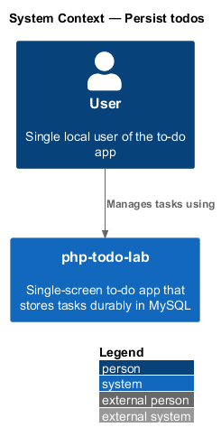
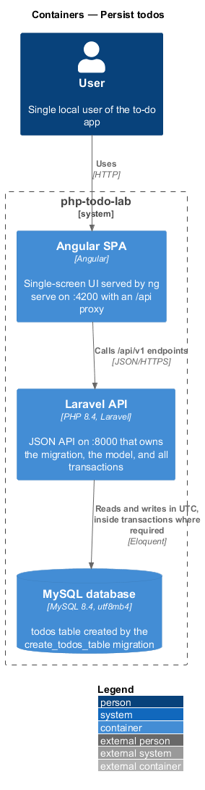
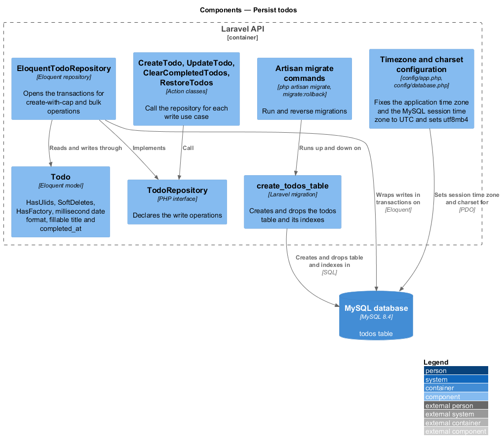
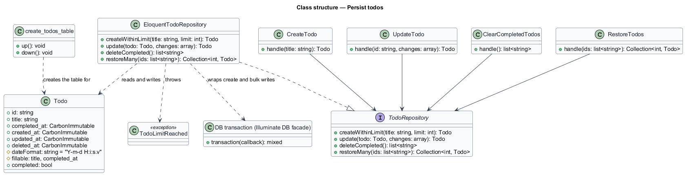
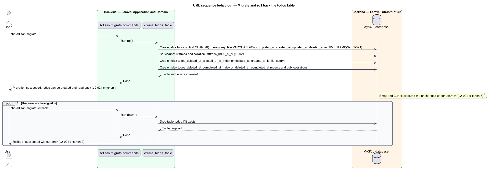
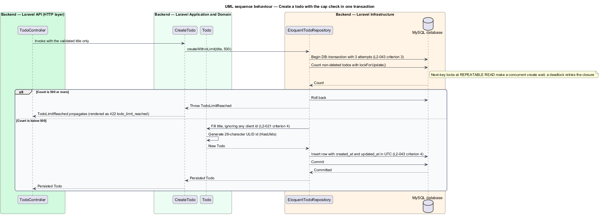
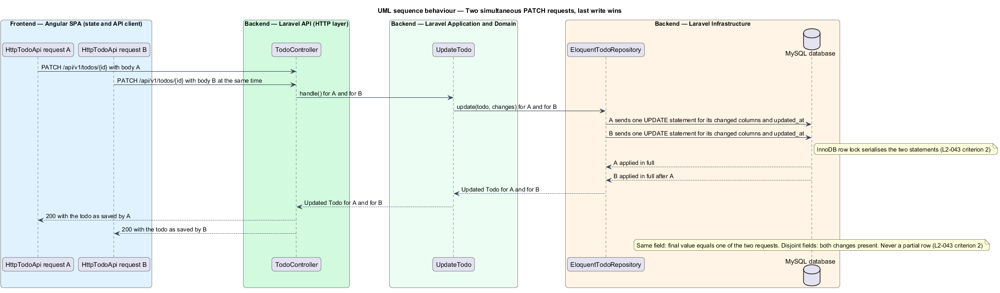
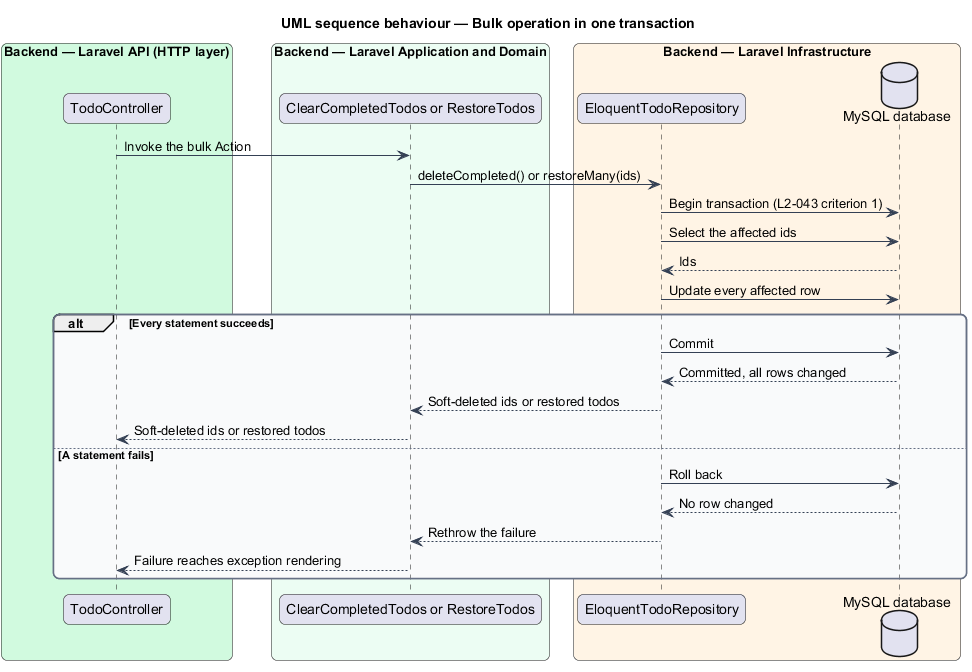

# Persist todos

## Overview

php-todo-lab is a single-screen to-do app for one local user. The Angular SPA calls a Laravel API, which stores tasks in MySQL 8.4. The API calls a task a *todo*, and the UI calls it a *task*.

**todos table** — single MySQL table that holds every todo, including soft-deleted rows

**migration** — versioned, reversible Laravel class that creates or changes part of the database schema

**ULID** — 26-character, time-sortable identifier that the API uses as the todo id

**transaction** — group of database statements that commit together or not at all

This feature covers the physical storage of todos: the schema and its migration, the time zone rule, and the transactions that keep concurrent writes consistent. Three rules shape the design.

- The `todos` table is created and dropped only by a migration.
- Every stored and returned timestamp is in UTC, even when the server runs in another time zone.
- A write that spans more than one row, or that checks a limit before inserting, runs inside one transaction.

The task limit itself (500 non-deleted todos), the update semantics, and the bulk endpoints belong to other features. This document covers only how the persistence layer keeps them consistent. The Eloquent model conventions belong to the backend layering design.

This document assumes no prior knowledge of the code base. The terms above are defined at first use, and the diagrams show where each part lives.

## Description

The feature is a backend-only slice in the Laravel API and the MySQL database.

- **`create_todos_table`** — migration that creates the `todos` table in `up()` and drops it in `down()`.
  - Columns: `id` CHAR(26) primary key, `title` VARCHAR(200), and `completed_at`, `created_at`, `updated_at`, `deleted_at`, each TIMESTAMP(3) with millisecond precision. `completed_at` and `deleted_at` are nullable.
  - Table options: charset `utf8mb4`, collation `utf8mb4_0900_ai_ci`.
  - Index on `(deleted_at, created_at, id)` serves the list query.
  - Index on `(deleted_at, completed_at)` serves counts and bulk operations.
  - The indexes are named `todos_deleted_at_created_at_id_index` and `todos_deleted_at_completed_at_index`.
- **Artisan migrate commands** — `php artisan migrate` runs `up()`. `php artisan migrate:rollback` runs `down()` and drops the table.
- **Timezone and charset configuration** — `config/app.php` fixes the application time zone to `UTC`, and the value does not come from the environment. The MySQL connection in `config/database.php` sets its session time zone to `+00:00` and uses `utf8mb4` with the collation above. PHP and MySQL therefore read and write the same instant regardless of the server time zone.
- **`Todo`** — Eloquent model for the table. It uses `HasUlids`, `SoftDeletes`, and `HasFactory`. Its date format includes milliseconds (`Y-m-d H:i:s.v`) so that Eloquent keeps the TIMESTAMP(3) precision. Its fillable attributes are `title` and `completed_at`. The list excludes `id`, so a client-supplied `id` never reaches the row, and `HasUlids` generates the id.
- **`TodoRepository`** — interface in `app/Repositories/TodoRepository.php` that declares the persistence operations. The write operations this feature covers are `createWithinLimit(string $title, int $limit): Todo`, `update(Todo $todo, array $changes): Todo`, `deleteCompleted(): list<string>`, and `restoreMany(list<string> $ids): Collection<int, Todo>`. `createWithinLimit` throws `TodoLimitReached` when the limit is reached. `deleteCompleted` returns the ids it soft-deleted.
- **`EloquentTodoRepository`** — implements the interface and owns every transaction, so the Action classes stay free of database calls.
  - Create: opens a transaction, counts non-deleted todos with a locking read, and inserts only when the count is below the limit passed by `CreateTodo`.
  - Bulk operations: `deleteCompleted` and `restoreMany` each wrap the id selection and the row updates in one transaction.
  - Update: sends one `UPDATE` statement for the changed columns.
- **`CreateTodo`, `UpdateTodo`, `ClearCompletedTodos`, `RestoreTodos`** — Action classes that call the repository. Each exposes a single public `handle(...)` method. The limit value 500 and the `todo_limit_reached` error belong to the add-task design.
- **`TodoResource`** — formats timestamps as ISO-8601 UTC strings ending in `Z`, as described in the REST API contract design (`docs/detailed-designs/api-platform/rest-api-contract`).

Concurrency decisions follow.

- **Concurrent creates.** The count and the insert share one transaction. A plain transaction at the default MySQL isolation level does not stop two transactions from both counting 499 and both inserting. `createWithinLimit` therefore runs inside `DB::transaction(fn, attempts: 3)`. Inside the transaction, the count of non-deleted todos uses `lockForUpdate()`. At the InnoDB default isolation level, REPEATABLE READ, the locking read takes next-key locks on the scanned index range. A second concurrent create waits on those locks until the first commits, then counts the new row. A deadlock between the two transactions causes Laravel to retry the closure, up to 3 attempts in total.
- **Concurrent PATCH.** Each request sends one `UPDATE` statement, and InnoDB locks the row for the duration of the statement. The statements run one after the other, and each applies in full. No version column exists, so the last statement applied wins, which matches the last-write-wins rule of `L2-014`. When two requests change different columns, the final row holds both changes. The design reads criterion 2 of `L2-043` as follows. Each request applies atomically and in full. When both requests change the same field, the final value equals the value from one of the two. When the requests change disjoint fields, both changes are present.
- **Bulk operations.** A failure on any statement rolls back the whole transaction, so either all rows change or none.

## Requirements

The feature realizes the following level-2 (L2) requirements. Each L2 requirement refines a level-1 (L1) requirement, cited by identifier.

| L2 ID | Refines (L1) | Requirement |
|-------|--------------|-------------|
| `L2-021` | `L1-006` | A single `todos` table shall be created by a reversible Laravel migration with the columns `id` CHAR(26) primary key (ULID), `title` VARCHAR(200), `completed_at` TIMESTAMP(3) NULL, `created_at` and `updated_at` TIMESTAMP(3), and `deleted_at` TIMESTAMP(3) NULL. The table shall use charset `utf8mb4` and collation `utf8mb4_0900_ai_ci`. An index on `(deleted_at, created_at, id)` shall serve the list query, and an index on `(deleted_at, completed_at)` shall serve counts and bulk operations. `php artisan migrate` shall succeed on an empty database, and `php artisan migrate:rollback` shall drop the table without error. A title with emoji and CJK characters shall round-trip unchanged. The server shall ignore an `id` in a `POST` body and return a server-generated 26-character ULID. |
| `L2-043` | `L1-012` | Each bulk operation (clear completed, restore many) shall run in one database transaction. Two simultaneous `PATCH` requests to the same todo shall both succeed, the final state shall equal one of the two requests, and the row shall never be partially updated. The 500-task cap check and the insert shall run in one transaction so that concurrent creates cannot exceed the cap. When the server time zone is not UTC, stored and returned timestamps shall still be UTC. |

## Diagrams

### System context

The User manages tasks through php-todo-lab, which stores them durably in MySQL.

### Containers

The Laravel API owns the schema, the model, and every transaction. MySQL holds the `todos` table.

### Components

Inside the Laravel API, the Artisan migrate commands run the `create_todos_table` migration. The Actions call `TodoRepository`, and `EloquentTodoRepository` opens the transactions.

### Class structure

The four write Actions depend on `TodoRepository`. `EloquentTodoRepository` implements it, wraps create and bulk writes in transactions, and reads and writes `Todo`.

### Behaviour — migrate and roll back

`migrate` creates the table, the charset, and both indexes (`L2-021`). `migrate:rollback` drops the table.

### Behaviour — create a todo with the cap check

The repository counts and inserts inside one transaction (`L2-043` criterion 3). The model ignores a client `id` and generates the ULID (`L2-021` criterion 4).

### Behaviour — concurrent PATCH

Two requests each send one `UPDATE` statement. InnoDB applies them one after the other, so the row is never partially updated (`L2-043` criterion 2).

### Behaviour — bulk operation in one transaction

Clear completed and restore many each select ids and update rows inside one transaction. A failed statement rolls everything back (`L2-043` criterion 1).

