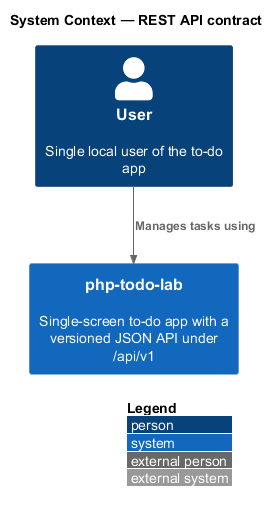
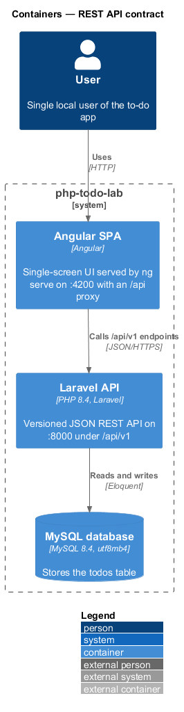
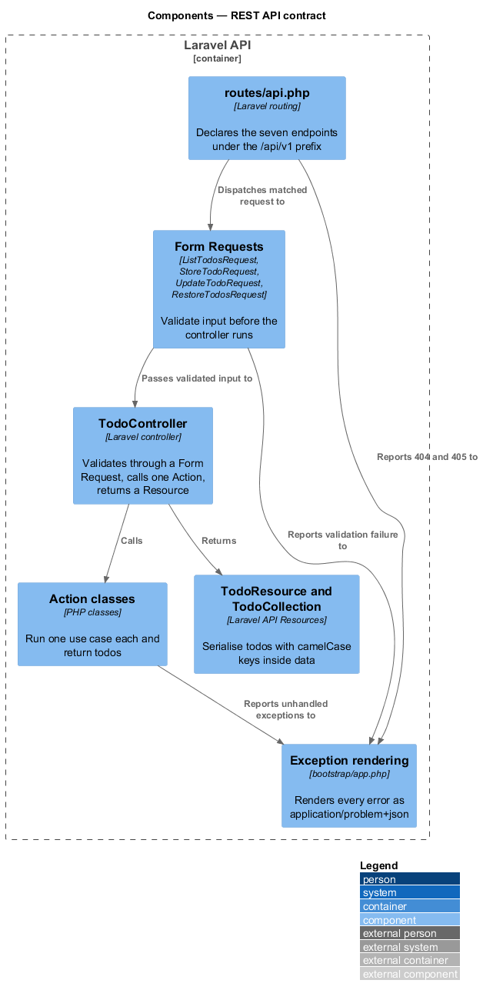
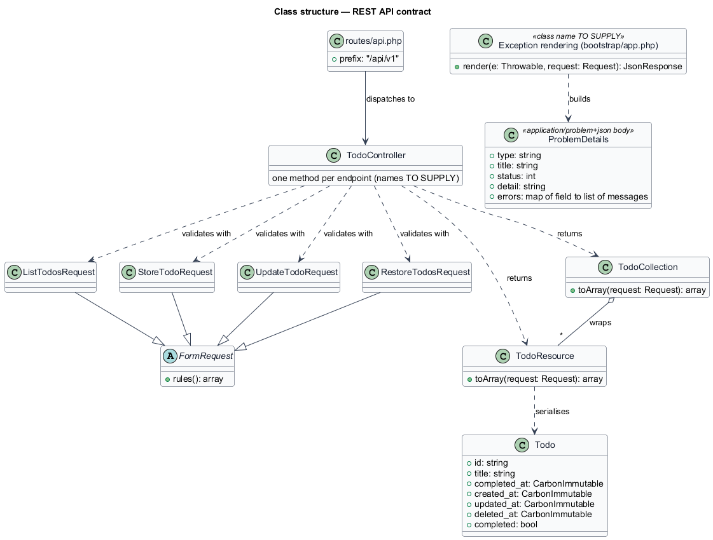
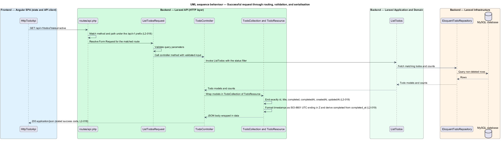
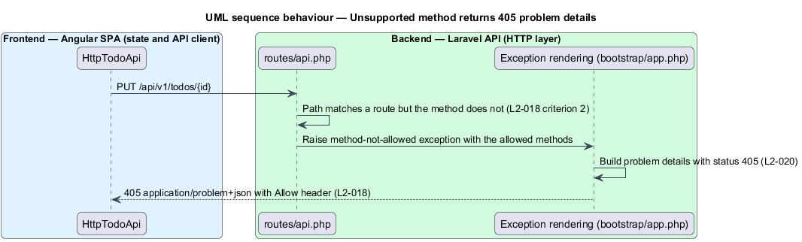
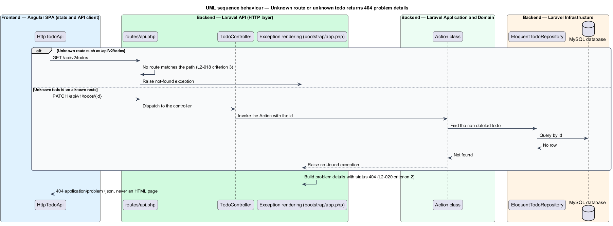
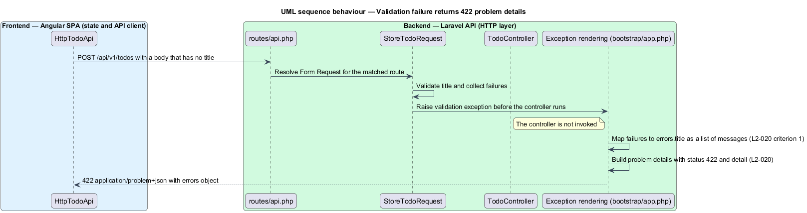
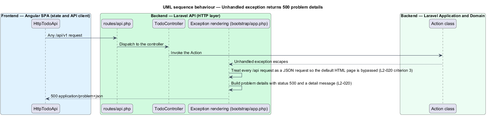

# REST API contract

## Overview

php-todo-lab is a single-screen to-do app for one local user. The Angular SPA calls a Laravel API, which stores tasks in MySQL. The API calls a task a *todo*, and the UI calls it a *task*.

**API contract** — set of endpoints, response shapes, and error shapes that the SPA relies on and that stays stable within one API version

This feature defines the contract of the Laravel API. It covers three parts: the seven endpoints under `/api/v1`, the JSON shape of a todo, and the shape of every error response.

**API Resource** — Laravel class that converts a model into the JSON array returned to the client

**problem details** — error body defined by RFC 9457, served as `application/problem+json` with the members `type`, `title`, `status`, and `detail`

The API serialises a todo through an API Resource, so that the database column names never leak into the contract. Every error response, including routing errors and crashes, uses problem details. The API never returns an HTML error page.

The behaviour of each endpoint, such as validation rules and the task limit, belongs to the feature that owns the endpoint. This document covers only what the endpoints share.

This document assumes no prior knowledge of the code base. The terms above are defined at first use, and the diagrams show where each part lives.

## Description

The feature is a backend-only slice in the Laravel API. The SPA takes part as the caller through `HttpTodoApi`, which is the only SPA class that sends HTTP requests.

The API exposes exactly the following endpoints. All endpoints accept and return JSON and sit under the `/api/v1` prefix.

| Method | Path | Purpose | Success |
|---|---|---|---|
| GET | `/todos` | List (supports `status`) | 200 |
| POST | `/todos` | Create | 201 |
| PATCH | `/todos/{id}` | Update title and/or completed | 200 |
| DELETE | `/todos/{id}` | Soft delete | 204 |
| POST | `/todos/{id}/restore` | Restore | 200 |
| DELETE | `/todos/completed` | Soft delete all completed | 200 |
| POST | `/todos/restore` | Restore by ids | 200 |

The components are as follows.

- **`routes/api.php`** — declares the seven routes under the `/api/v1` prefix. The static routes `DELETE /todos/completed` and `POST /todos/restore` are registered before the parameterised routes, so that `completed` and `restore` are not read as a todo `{id}`. A path that matches no route, such as `/api/v2/todos`, raises a not-found exception. A path that matches a route with a different method raises a method-not-allowed exception that carries the allowed methods.
- **`TodoController`** — thin controller for all todo endpoints. It calls one Action per endpoint and returns a Resource. Controller method names are `<TO SUPPLY>`.
- **`ListTodosRequest`, `StoreTodoRequest`, `UpdateTodoRequest`, `RestoreTodosRequest`** — Form Requests that validate input before the controller method runs. A failed validation raises a validation exception that carries a map of field names to message lists.
- **`TodoResource`** — API Resource that serialises one `Todo`. The array holds exactly the keys `id`, `title`, `completed`, `completedAt`, `createdAt`, and `updatedAt`. Names are camelCase. The resource formats each timestamp as an ISO-8601 UTC string that ends in `Z`, and emits `completedAt` as `null` when the todo is not complete. The resource reads `completed` from the `Todo` accessor, which derives it from `completed_at`. The resource never reads or emits `deleted_at`.
- **`TodoCollection`** — wraps a list of `TodoResource` objects. Laravel nests every resource response under `data`. The list response also carries the `meta` object defined by the list feature.
- **`Todo`** — Eloquent model that holds the data the resource reads. The persistence design describes the table.
- **Exception rendering** — a callback registered in `bootstrap/app.php`. The class or function name is `<TO SUPPLY>`. The callback converts every exception to problem details and sets the media type `application/problem+json`. The callback applies to every request whose path starts with `/api`, regardless of the `Accept` header, so that Laravel never selects its HTML error page.

The problem details body maps from the exception as follows.

| Cause | `status` | Extra members |
|---|---|---|
| Validation failure | `422` | `errors`, an object mapping each field name to an array of messages |
| Unknown route or unknown todo | `404` | none |
| Unsupported method | `405` | `Allow` response header lists the supported methods |
| Unhandled exception | `500` | `detail` carries a message |

The values of `type` and `title`, and the exact text of `detail` for each status, are `<TO SUPPLY>`. Whether the `500` `detail` exposes the exception message or a fixed sentence is `<TO SUPPLY>`.

## Requirements

The feature realizes the following level-2 (L2) requirements. Each L2 requirement refines a level-1 (L1) requirement, cited by identifier.

| L2 ID | Refines (L1) | Requirement |
|-------|--------------|-------------|
| `L2-018` | `L1-006` | The API shall expose exactly the seven JSON endpoints listed in the Description, all under `/api/v1`, and each shall return its stated success code for a valid request. An unsupported method on a route shall return `405` with an `Allow` header. A request to `/api/v2/todos` shall return `404`. |
| `L2-019` | `L1-006` | A Laravel API Resource shall serialise a todo with exactly the keys `id` (ULID string), `title` (string), `completed` (boolean), `completedAt` (ISO-8601 UTC string or null), `createdAt`, and `updatedAt` (ISO-8601 UTC strings), with camelCase names and no other field. Responses shall be wrapped in `data`. Timestamps shall match `^\d{4}-\d{2}-\d{2}T\d{2}:\d{2}:\d{2}(\.\d+)?Z$`. `completed` shall be `false` when `completed_at` is null and `true` otherwise, and shall be derived, not stored. `deletedAt` shall never be exposed. |
| `L2-020` | `L1-006` | All errors shall use RFC 9457 problem details (`application/problem+json`) with `type`, `title`, `status`, and `detail`, and validation errors shall add an `errors` object that maps field names to arrays of messages. A validation failure shall return `422` with `errors.title`. An unknown route or todo shall return `404` problem details, not an HTML page. An unhandled exception shall return `500` problem details with a `detail` message, never an HTML error page. |

## Diagrams

### System context

The User manages tasks through php-todo-lab. The API contract sits behind every interaction.

### Containers

The Angular SPA calls the Laravel API under `/api/v1`, and the API reads and writes MySQL. The contract governs the SPA-to-API boundary.

### Components

Inside the Laravel API, routing dispatches to Form Requests and the controller. The controller returns Resources, and exception rendering turns routing, validation, and runtime errors into problem details.

### Class structure

The controller depends on the Form Requests and returns `TodoResource` or `TodoCollection`. Exception rendering builds the problem details body.

### Behaviour — successful request

The route matches under the `/api/v1` prefix (`L2-018`). The Form Request validates the query, the Action returns models, and the Resource serialises them in the `L2-019` shape.

### Behaviour — unsupported method

A request whose path matches a route with another method raises a method-not-allowed exception. Exception rendering returns `405` problem details with an `Allow` header (`L2-018`, `L2-020`).

### Behaviour — unknown route or todo

A path under `/api/v2` and an unknown todo id both end in `404` problem details (`L2-018`, `L2-020`).

### Behaviour — validation failure

The Form Request raises a validation exception before the controller runs. Exception rendering returns `422` problem details with `errors.title` (`L2-020`).

### Behaviour — unhandled exception

An exception that escapes an Action reaches exception rendering, which returns `500` problem details with a `detail` message and never an HTML page (`L2-020`).

