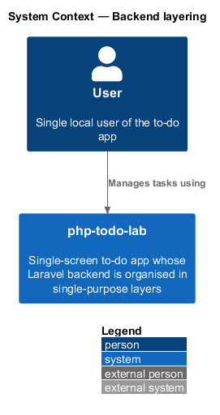
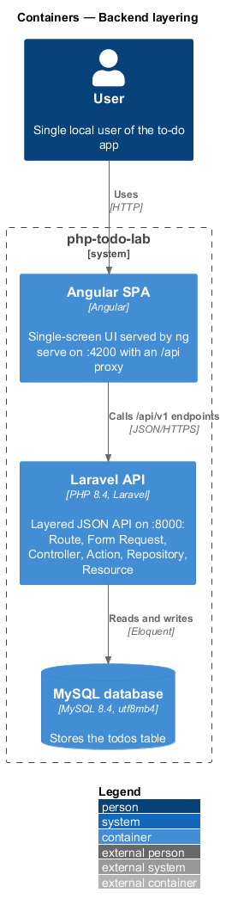
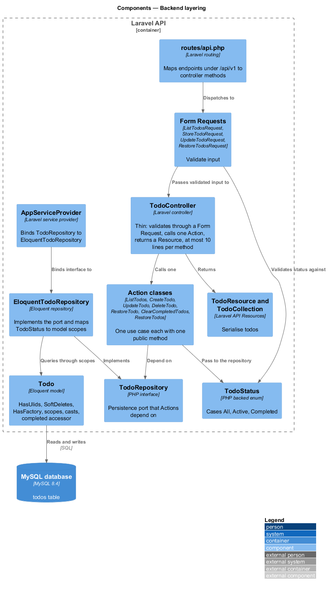
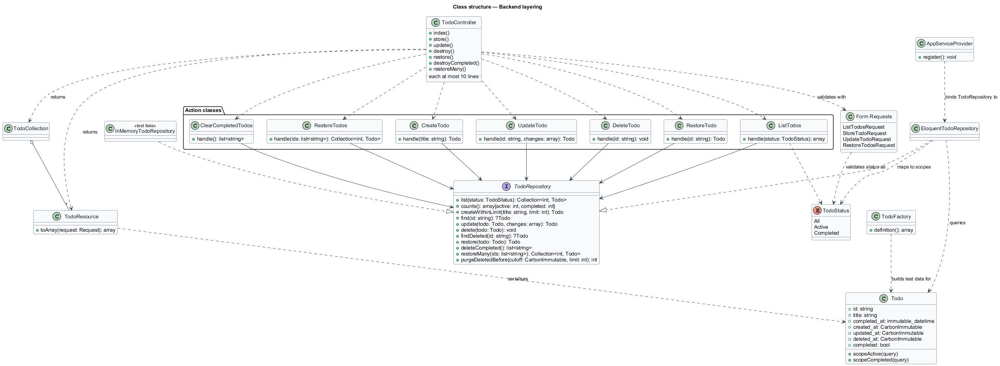
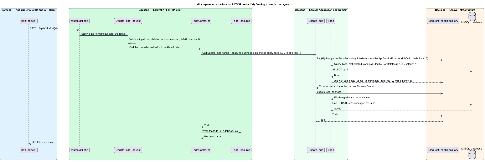
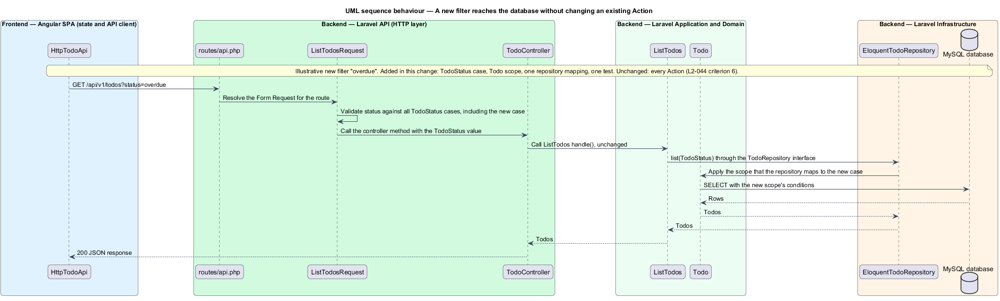

# Backend layering

## Overview

php-todo-lab is a single-screen to-do app for one local user. The Angular SPA calls a Laravel API, which stores tasks in MySQL. The API calls a task a *todo*, and the UI calls it a *task*.

**layer** — group of backend classes that share one responsibility and depend only on the layer below

**Action class** — class that implements one use case through a single public method

**repository** — interface that hides how todos are stored, so that callers depend on an abstraction

This feature describes how the Laravel API is organised, not a user-visible behaviour. A request passes through the layers in a fixed order: Route, Form Request, Controller, Action class, `TodoRepository` interface, `EloquentTodoRepository`, and API Resource. Each layer has one job, and each Action depends on the interface rather than on Eloquent. This arrangement follows the SOLID principles required by the maintainable-architecture requirement `L1-013`.

The requirements of this feature (`L2-044`, `L2-045`, and `L2-056`) describe the structure and formatting of the code. The specification states that the compiler, Larastan, Pint, and code review verify them, and that tests never verify them. Larastan runs at level 8, Pint uses the Laravel preset, and every file declares `strict_types=1`. The specification also lists ESLint, Prettier, and Stylelint, which apply to the frontend. No test shall inspect the shape, layout, or naming of the code. Tests prove behaviour only.

This document assumes no prior knowledge of the code base. The terms above are defined at first use, and the diagrams show where each part lives.

## Description

The feature is a structural slice of the Laravel API.

- **`routes/api.php`** — maps each endpoint under `/api/v1` to a controller method.
- **Form Requests** — `ListTodosRequest`, `StoreTodoRequest`, `UpdateTodoRequest`, and `RestoreTodosRequest`. Each validates the input of its endpoint before the controller runs.
- **`TodoController`** — thin controller for all todo endpoints. A method validates through a Form Request, calls exactly one Action, and returns a Resource. A method holds no business logic and no query call, and spans at most 10 lines.
- **Action classes** — `ListTodos`, `CreateTodo`, `UpdateTodo`, `DeleteTodo`, `RestoreTodo`, `ClearCompletedTodos`, and `RestoreTodos`. Each class has a single public method, `handle(...)`. Each class receives `TodoRepository` through its constructor, typed as the interface.
- **`TodoStatus`** — backed PHP enum with the cases `All`, `Active`, and `Completed`. The status filter uses this enum everywhere, so no string literal for a status appears in the code. `ListTodosRequest` validates the `status` parameter against the enum, and `ListTodos` passes the enum to the repository.
- **`TodoRepository`** — interface in `app/Repositories/TodoRepository.php` that declares the persistence operations the Actions need. Its signatures follow.
  - `list(TodoStatus $status): Collection<int, Todo>`
  - `counts(): array{active: int, completed: int}`
  - `createWithinLimit(string $title, int $limit): Todo`, which throws `TodoLimitReached` when the limit is reached
  - `find(string $id): ?Todo`
  - `update(Todo $todo, array $changes): Todo`
  - `delete(Todo $todo): void`
  - `findDeleted(string $id): ?Todo`
  - `restore(Todo $todo): Todo`
  - `deleteCompleted(): list<string>`, which returns the soft-deleted ids
  - `restoreMany(list<string> $ids): Collection<int, Todo>`
  - `purgeDeletedBefore(CarbonImmutable $cutoff, int $limit): int`
- **`TodoNotFound`, `TodoLimitReached`** — domain exceptions in `app/Exceptions`. An Action throws `TodoNotFound` when `find` or `findDeleted` returns `null`. `ProblemDetailsRenderer` maps `TodoNotFound` to `404` and `TodoLimitReached` to `422`.
- **`EloquentTodoRepository`** — implements `TodoRepository` with Eloquent. It maps each `TodoStatus` case to a model scope.
- **`InMemoryTodoRepository`** — test fake in `tests/Fakes` that implements `TodoRepository` without a database. Unit tests of the Actions use it.
- **`AppServiceProvider`** — binds `TodoRepository` to `EloquentTodoRepository`.
- **`Todo`** — Eloquent model that holds the persistence mapping.
  - Traits: `HasUlids`, `SoftDeletes`, and `HasFactory`.
  - Cast: `completed_at` is cast to `immutable_datetime`.
  - Accessor: `completed` is computed from `completed_at` and is not stored.
  - Scopes: the reusable filters are local query scopes, `active()` and `completed()`. Tests exercise each scope on its own.
- **`TodoFactory`** — model factory that creates all test data. No test writes SQL by hand.
- **`TodoResource` and `TodoCollection`** — API Resources that serialise todos. The REST API contract design describes their shape.
- **Migrations** — the only way to change the schema. Each change is a migration committed to the repository. The persistence design describes the first migration.
- **Laravel Pint** — the one PHP formatter, a pinned `require-dev` dependency of `/backend`. No other PHP formatter is present.
  - `pint.json` — sets `"preset": "laravel"` and the rules `declare_strict_types: true`, `ordered_imports` sorted alphabetically, `no_unused_imports: true`, and `fully_qualified_strict_types: true`. It excludes `bootstrap/cache`, `storage`, and `vendor`.
  - `composer.json` scripts — `format` runs `pint`, and `format:check` runs `pint --test`. `composer check` runs `format:check` first.
  - Line endings — the root `.gitattributes` (`* text=auto eol=lf`) and `.editorconfig` keep PHP files at LF and UTF-8 without a BOM, so the Pint `line_ending` rule does not fail because of `core.autocrlf`.
  - Commits — a commit that only reformats contains no behaviour change.

The open/closed rule has a concrete reading. A new filter, such as "overdue", needs these changes: a new `TodoStatus` case, a new scope on `Todo`, one new mapping in `EloquentTodoRepository`, and a test. No existing Action changes. The Form Request accepts the new case without change because it validates against the enum. Due dates are out of scope in the level-1 requirements, so "overdue" is an illustration taken from `L2-044` and not a planned filter.

## Requirements

The feature realizes the following level-2 (L2) requirements. Each L2 requirement refines a level-1 (L1) requirement, cited by identifier. The compiler, Larastan, Pint, and code review verify all three requirements. Tests shall not verify them.

| L2 ID | Refines (L1) | Requirement |
|-------|--------------|-------------|
| `L2-044` | `L1-013` | The backend shall process a request through Route, Form Request, thin Controller, Action class, `TodoRepository` interface, `EloquentTodoRepository`, and API Resource. A controller method shall contain no business logic and no query calls, shall validate through a Form Request, shall call one Action, shall return a Resource, and shall span at most 10 lines. Each Action class shall have a single public `__invoke` or `handle` method and shall depend on `TodoRepository` through its constructor, as the interface and not Eloquent. The service provider shall bind `TodoRepository` to `EloquentTodoRepository`, and unit tests for Actions shall use an in-memory fake without a database. The status filter shall be the backed PHP enum `TodoStatus`, not a string literal scattered across files. Larastan at level 8 and Pint with the Laravel preset shall pass with zero errors, and every file shall declare `strict_types=1`. Adding a new filter shall require adding code and a test and shall modify no existing Action. |
| `L2-045` | `L1-013` | Persistence shall use Eloquent, with the `Todo` model using `HasUlids`, `SoftDeletes`, and `HasFactory`. Reusable filters shall be local query scopes, `active()` and `completed()`, on the model, and tests shall exercise them independently. The `Todo` model shall cast `completed_at` to `immutable_datetime` and shall expose `completed` as a computed accessor. Test data shall be created through model factories and never through hand-written SQL. Schema changes shall be made only through migrations committed to the repository. |
| `L2-056` | `L1-013` | Laravel Pint shall be the one PHP formatter, a pinned `require-dev` dependency with no other PHP formatter present. `pint.json` shall set the `laravel` preset and the rules `declare_strict_types`, `ordered_imports`, `no_unused_imports`, and `fully_qualified_strict_types`, and shall exclude `bootstrap/cache`, `storage`, and `vendor`. `composer.json` shall define `format` and `format:check`, and `composer check` shall run `format:check` first. `composer format:check` shall report zero files needing changes for every committed PHP file. PHP files shall have LF line endings and UTF-8 encoding without a BOM, guaranteed by `.gitattributes` and `.editorconfig`. Formatting changes and behaviour changes shall be committed separately. |

## Diagrams

### System context

The User manages tasks through php-todo-lab. The layering is internal to the Laravel backend and has no external actor.

### Containers

The Laravel API container holds all the layers. The Angular SPA calls it, and it reads and writes MySQL.

### Components

The diagram shows the layers inside the Laravel API in request order. `AppServiceProvider` binds the repository interface to its Eloquent implementation.

### Class structure

The controller calls Actions, and each Action depends on `TodoRepository`. `EloquentTodoRepository` and `InMemoryTodoRepository` both implement the interface, and `Todo` holds the model conventions.

### Behaviour — PATCH through the layers

A `PATCH /api/v1/todos/{id}` request crosses the Form Request, controller, Action, repository, and model, and returns through a Resource (`L2-044`, `L2-045`).

### Behaviour — add a filter without changing an Action

A new filter reaches the database through a new enum case, a new scope, and one repository mapping. `ListTodos` stays unchanged (`L2-044` criterion 6).

