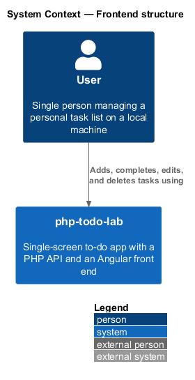
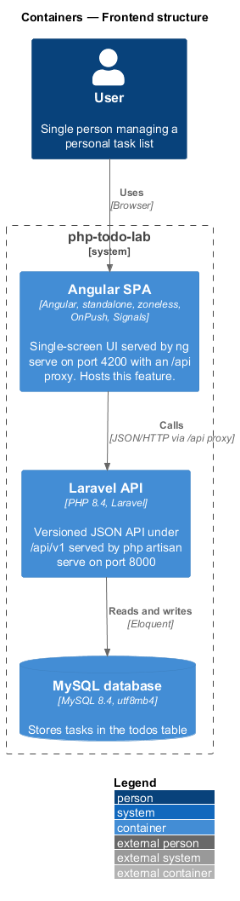
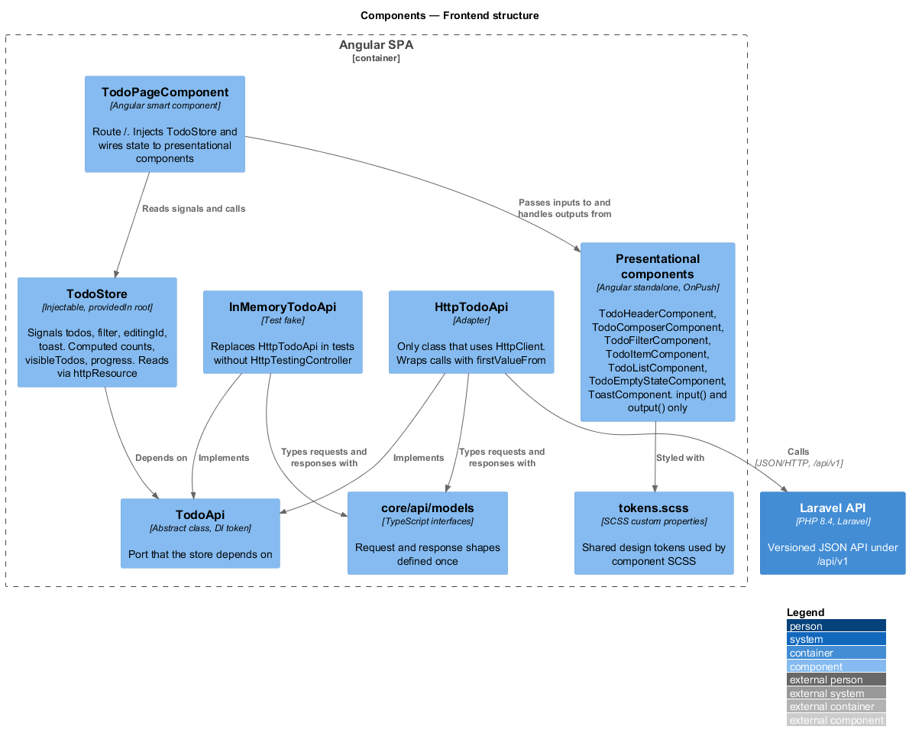
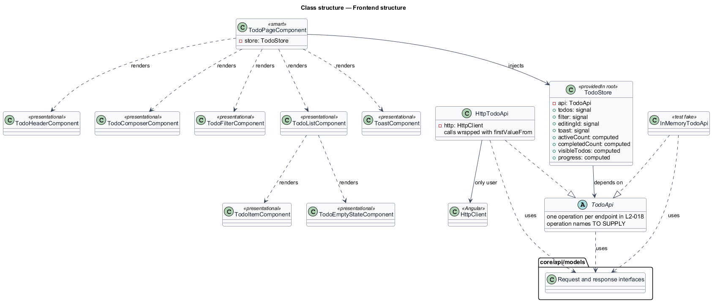
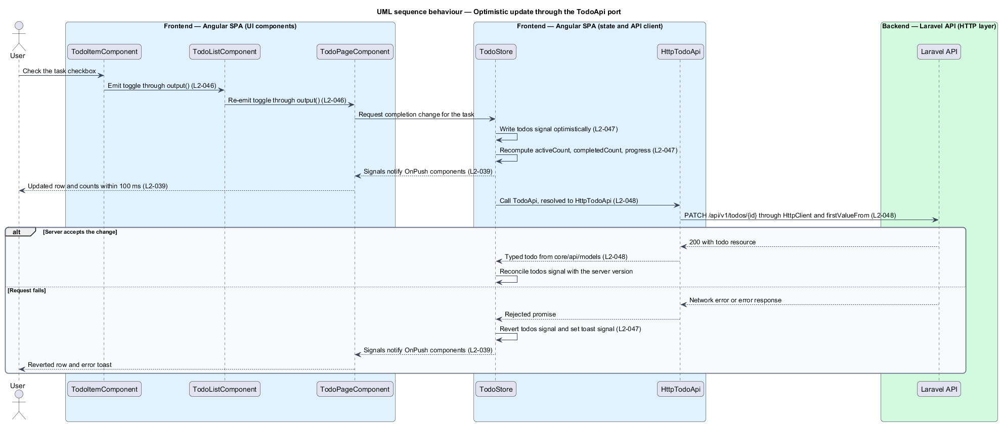
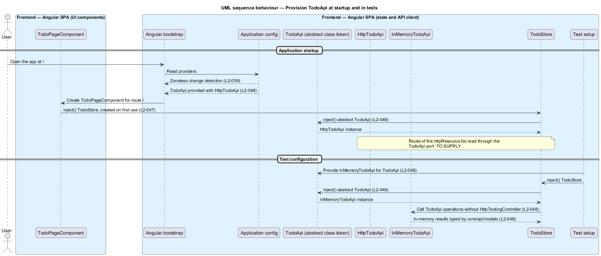

# Frontend structure

## Overview

`php-todo-lab` is a single-screen to-do app for learning PHP coding practices. The front end is an Angular single-page application (SPA) that talks to a Laravel API. This feature describes how the SPA is organised: which parts hold state, which parts draw the screen, and which part talks to the network.

A *smart component* is a component that injects state and coordinates other components. A *presentational component* is a component that receives data through `input()` and emits events through `output()` only. A *port* is an abstract class that the application depends on instead of a concrete service. An *adapter* is a class that implements a port against a real technology. A *pending task* is a task shown before the server confirms it, identified by a client-side temporary id until the server returns the real ULID.

The SPA keeps all task state in one `TodoStore`. The store never calls the network directly. It depends on the `TodoApi` port, and the `HttpTodoApi` adapter is the only class that uses `HttpClient`. Tests replace the adapter with `InMemoryTodoApi`.

The requirements in this feature are structural, with one exception noted below. L2-046, L2-047, L2-048, L2-049, and L2-055 describe how the code is organised. The compiler, ESLint, Prettier, Stylelint, and code review verify them. No test inspects the codebase for them, and the specification states that these requirements are never turned into tests. L2-039 mixes behaviour (feedback within 100 ms, fonts that fail safely) with structure (zoneless, `OnPush`, `@for` with `track todo.id`). Tests cover only the behavioural criteria.

## Description

The feature is a structural slice of the Angular SPA. It introduces the following parts.

- **`TodoPageComponent`** — smart component on route `/`. It injects `TodoStore`, passes signal values to presentational components, and handles their outputs by calling the store.
- **Presentational components** — `TodoHeaderComponent` (date and progress ring), `TodoComposerComponent`, `TodoFilterComponent`, `TodoItemComponent`, `TodoListComponent`, `TodoEmptyStateComponent`, and `ToastComponent`. Each receives data through `input()` and emits through `output()` only. None injects `TodoStore` or `TodoApi`.
- **`TodoStore`** — service provided in root. The signals `todos`, `filter`, `editingId`, and `toast` hold state. The computed values `activeCount`, `completedCount`, `visibleTodos`, and `progress` derive from them. List reads use `httpResource`. Local mutable copies use `linkedSignal` or `signal`. An `effect` is used only for side effects outside Angular, such as updating `document.title`.
- **`TodoApi`** — abstract class and dependency-injection token. It declares one operation per endpoint in L2-018. The operation names are `<TO SUPPLY>`.
- **`HttpTodoApi`** — adapter implementing `TodoApi`. It is the only class that uses `HttpClient`, and it wraps each call with `firstValueFrom`. RxJS is confined to the `core/api` folder.
- **`InMemoryTodoApi`** — test fake implementing `TodoApi`. Tests provide it instead of `HttpTodoApi`, so no test needs `HttpTestingController`.
- **`core/api/models`** — TypeScript interfaces for request and response shapes, defined once and shared by `HttpTodoApi` and `InMemoryTodoApi`. The interface names are `<TO SUPPLY>`.
- **Application config** — provides `TodoApi` with `HttpTodoApi`, enables zoneless change detection, and registers the router with component input binding so the `filter` signal binds to the `?filter=active|done` query parameter without an `Observable` subscription. The config file name is `<TO SUPPLY>`.
- **`tokens.scss`** — the single file of shared design tokens. Component SCSS uses BEM-style or scoped class names, and `::ng-deep` is not used.
- **Fonts** — the app loads at most two font files, as `woff2` with `font-display: swap`. The mock names the families `Bricolage Grotesque` and `Figtree` with `Segoe UI`, `system-ui`, and `sans-serif` as fallbacks, so text stays readable if the files fail to load. File hosting and subsetting are `<TO SUPPLY>`.

Open detail: `httpResource` issues its own request, while L2-048 routes all network access through `TodoApi`. How the list read reaches the network through the port, for example through a request factory owned by `TodoApi`, is `<TO SUPPLY>`.

**Component rules.** Every component is standalone and lives in its own folder with `name.component.ts`, `name.component.html`, and `name.component.scss`. The decorator uses `templateUrl` and `styleUrl`, and an ESLint rule flags `template:` and `styles:`. Components use `inject()`, native control flow (`@if`, `@for` with `track todo.id`), and `ChangeDetectionStrategy.OnPush`. Each component has one responsibility and under 150 lines of TypeScript. Templates read state by calling signals, such as `todos()`. Application code outside `core/api` does not use `BehaviorSubject`, `Subject`, the `async` pipe, `subscribe`, or `toSignal`, and an ESLint `no-restricted-imports` rule bans `rxjs` there.

**Tooling baseline.**

- TypeScript enables `strict`, `noImplicitOverride`, `noImplicitReturns`, `noUncheckedIndexedAccess`, and Angular `strictTemplates`.
- angular-eslint lints TypeScript and templates through the flat config `eslint.config.js`: `tseslint.configs.strictTypeChecked`, `angular.configs.tsRecommended`, `angular.configs.templateRecommended`, and `angular.configs.templateAccessibility`, with `eslint-config-prettier` last so that ESLint never rules on layout.
- ESLint reports these as errors: `any` (`@typescript-eslint/no-explicit-any`), inline templates and styles (`@angular-eslint/component-max-inline-declarations` at 0), a component without `OnPush`, a non-standalone component, structural directives in place of control flow, and `rxjs` imports outside `core/api` (`no-restricted-imports`). Warnings are not left in place.
- Prettier is the only formatter for `*.ts`, `*.html` (with the `angular` parser), `*.scss`, `*.json`, and `*.md`, configured once in `.prettierrc.json` (`printWidth: 100`, `singleQuote: true`). Prettier runs as its own step, not through ESLint.
- `package.json` defines `lint`, `format`, and `format:check`; `npm run check` runs `lint` and `format:check` before Vitest and the production build.
- Pint formats the back end (L2-056). Both formatter checks run in CI. The CI service and pipeline definition are `<TO SUPPLY>`.

**Repository layout.**

```
php-todo-lab/
├── backend/    Laravel API, with its own README (run, test, build)
└── frontend/   Angular SPA, with its own README (run, test, build)
```

## Requirements

The feature realizes the following level-2 (L2) requirements. Each L2 requirement refines a level-1 (L1) requirement, cited by identifier.

| L2 ID | Refines (L1) | Requirement |
|-------|--------------|-------------|
| `L2-039` | `L1-011` | The frontend shall give visible feedback within 100 ms of any user action. The app shall use zoneless change detection, `ChangeDetectionStrategy.OnPush` on every component, and `@for` with `track todo.id`. The app shall load at most two font files, as `woff2` with `font-display: swap`, and shall remain usable if they fail to load. |
| `L2-046` | `L1-013` | Every component shall be standalone, shall live in its own folder with `name.component.ts`, `name.component.html`, and `name.component.scss`, and shall use `templateUrl` and `styleUrl`. An ESLint rule shall flag any `@Component` that contains `template:` or `styles:`. The component set shall split into the smart `TodoPageComponent` and presentational components that use `input()` and `output()` only. Components shall use `inject()`, native control flow, and `OnPush`, shall have one responsibility and under 150 lines of TypeScript, and shall use shared tokens from one `tokens.scss` with no `::ng-deep`. |
| `L2-047` | `L1-013` | State shall live in a `TodoStore` service provided in root. Reads shall use `httpResource`, derived values shall use `computed`, and local mutable copies shall use `linkedSignal` or `signal`. The task list, filter, editing id, and toast shall be `signal`s. Counts, visible tasks, and progress shall be `computed`. The filter signal shall bind to the URL query parameter through router input binding with no `Observable` subscription. Outside `core/api`, application code shall not use `BehaviorSubject`, `Subject`, the `async` pipe, `subscribe`, or `toSignal`. Components shall read state by calling signals in templates. An effect shall be used only for side effects outside Angular. |
| `L2-048` | `L1-013` | Components and the store shall not import `HttpClient` and shall depend on an abstract `TodoApi` class token. The application config shall provide `TodoApi` with `HttpTodoApi`, which shall be the only class that uses `HttpClient` and wraps calls with `firstValueFrom`. Tests shall replace `TodoApi` with `InMemoryTodoApi` without `HttpTestingController`. Request and response shapes shall be defined once as TypeScript interfaces in `core/api/models` and shared by `HttpTodoApi` and the fake. |
| `L2-049` | `L1-013` | TypeScript shall enable `strict`, `noImplicitOverride`, `noImplicitReturns`, `noUncheckedIndexedAccess`, and Angular `strictTemplates`. The codebase shall not use `any`, and lint shall report it as an error. Prettier (frontend) and Pint (backend) shall enforce formatting in CI. The backend shall live in `/backend` and the frontend in `/frontend`, each with its own README describing run, test, and build commands. |
| `L2-055` | `L1-013` | Prettier shall be the only frontend formatter and angular-eslint the linter, through an ESLint flat config with `eslint-config-prettier` applied last. ESLint shall enforce no inline templates or styles, `OnPush`, standalone components, native control flow, no `any`, and no `rxjs` outside `core/api`. `npm run lint` and `npm run format:check` shall report zero errors, zero warnings, and no unformatted files; suppressions shall name the rule and give a reason. |

## Diagrams

### System context

The user manages tasks through `php-todo-lab`. This feature affects only how the front end of that system is organised.



### Containers

The Angular SPA calls the Laravel API, which stores tasks in the MySQL database. This feature lives entirely inside the Angular SPA.



### Components

Inside the SPA, `TodoPageComponent` coordinates presentational components and reads `TodoStore`. The store depends on the `TodoApi` port, which `HttpTodoApi` and `InMemoryTodoApi` implement.



### Class structure

`TodoStore` depends on the abstract `TodoApi`. `HttpTodoApi` is the only class that uses `HttpClient`, and both adapters use the shared interfaces in `core/api/models`.



### Behaviour — optimistic update through the TodoApi port

A checkbox change flows up through `output()` to `TodoPageComponent` and into `TodoStore`. The store updates its signals first, then calls `TodoApi`, which resolves to `HttpTodoApi`. On failure the store reverts the signals and sets the toast.



### Behaviour — provision TodoApi at startup and in tests

At startup the application config binds `TodoApi` to `HttpTodoApi` and enables zoneless change detection. In tests, the setup binds `TodoApi` to `InMemoryTodoApi`, and the same `TodoStore` code runs unchanged.


