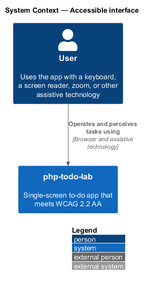
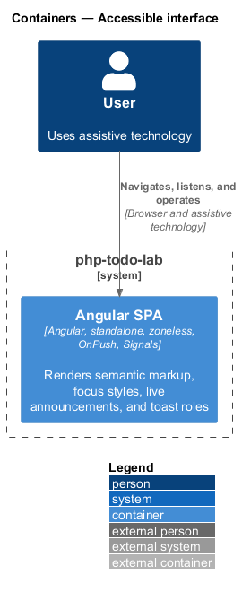
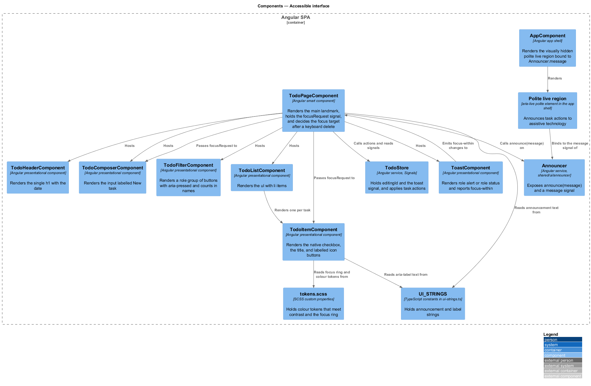
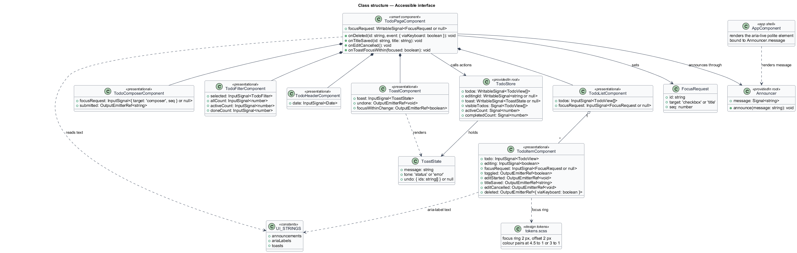
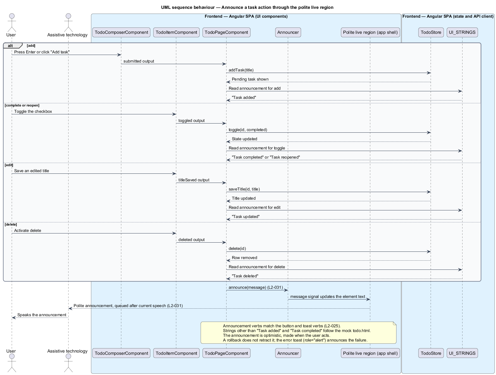
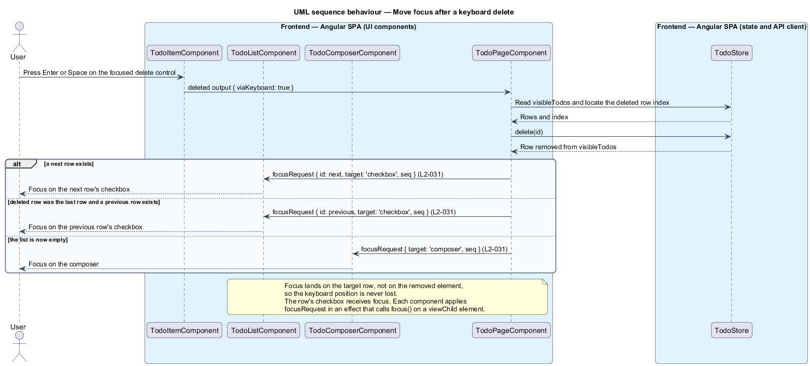
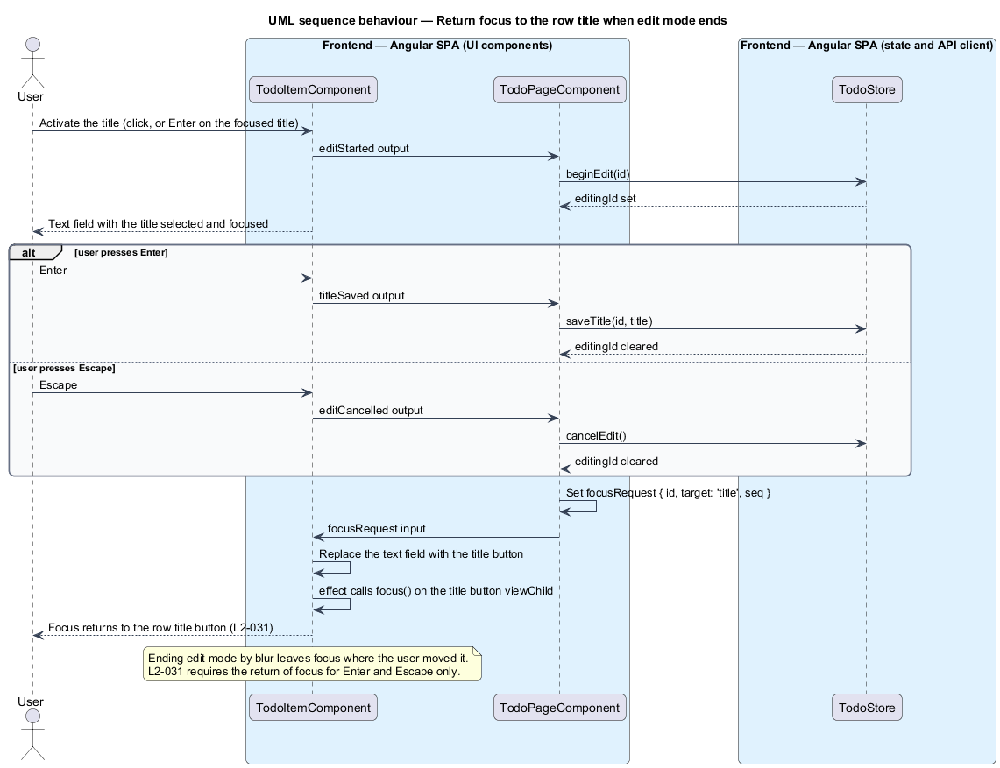
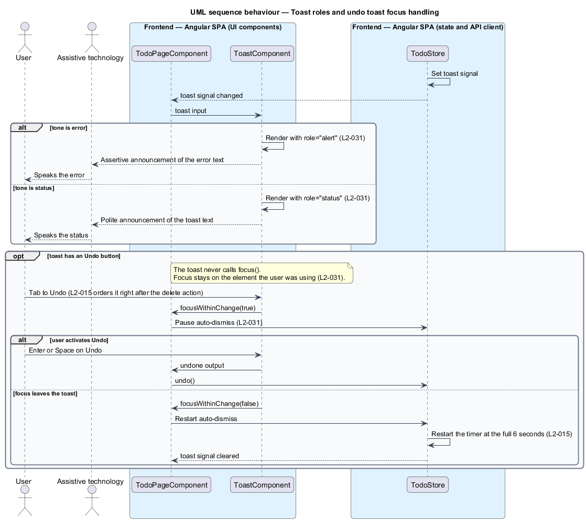

# Accessible interface

## Overview

php-todo-lab is a single-screen to-do app for one user. Its browser interface is an Angular single-page application (SPA). This feature makes that interface usable with a keyboard, a screen reader, browser zoom, and other assistive technology, to the level of WCAG 2.2 AA.

**assistive technology** — software or hardware that helps a person with a disability use a computer, such as a screen reader

**landmark** — page region that assistive technology can list and jump to, such as `main`

**accessible name** — text that assistive technology reads for a control

**polite live region** — page element whose text changes are spoken by a screen reader after the current speech ends, without moving focus

**focus ring** — visible outline around the element that has keyboard focus

**toast** — short message that appears over the page after an action and can carry an "Undo" button

The feature has three concerns. Semantics and labels give each element a correct role and name. Contrast, focus, and zoom keep content perceivable and operable at 200% zoom. Live announcements and focus management tell assistive technology what changed and keep the keyboard position stable. The visual reference is the mock `docs/mocks/todo.html`, which already carries a polite live region with `aria-live="polite"` and the labels listed below.

## Description

The feature is a frontend-only slice. It touches the Angular SPA container and no other container.

- **`TodoPageComponent`** — smart component at route `/`. It renders the `main` landmark. It handles the outputs of the presentational components, calls `TodoStore`, and passes announcement text to `Announcer`. After a keyboard delete it chooses the focus target. It holds the `focusRequest` signal that carries focus into the presentational components.
- **`Announcer`** — root service in `src/app/shared/ui/announcer/announcer.ts`. It exposes `announce(message)` and a `message` signal. It announces text from `UI_STRINGS`, such as "Task added" and "Task completed".
- **Polite live region** — visually hidden element with `aria-live="polite"`, rendered once by the app shell (`AppComponent`) and bound to `Announcer.message`. The mock uses a `div` with the id `live`.
- **`TodoHeaderComponent`** — presentational component. It renders the only `h1`, which contains the date.
- **`TodoComposerComponent`** — presentational component. Its input has the label "New task", visible or programmatically associated. The mock uses a visually hidden `label`.
- **`TodoFilterComponent`** — presentational component. It renders a `role="group"` of buttons with `aria-pressed`. The name of each button includes its count, for example "Active 2".
- **`TodoListComponent`** — presentational component. It renders a `ul` with one `li` per task.
- **`TodoItemComponent`** — presentational component for one row. Its checkbox is a native `input[type=checkbox]` whose accessible name equals the task title. Its icon-only buttons carry an `aria-label` that includes the title, such as "Delete Call mom". The title button carries the label "Edit <title>", such as "Edit Call mom", as the mock does. Its inputs are `todo`, `editing`, and `focusRequest`. Its outputs are `toggled`, `editStarted`, `titleSaved`, `editCancelled`, and `deleted`. The `deleted` output carries `{ viaKeyboard: boolean }`. After edit mode ends by Enter or Escape, it returns focus to the title button.
- **`ToastComponent`** — presentational component in `shared/ui/toast/`. It renders `role="alert"` for a toast whose `tone` is `'error'` and `role="status"` for a toast whose `tone` is `'status'`. It never takes focus. It emits `focusWithinChange` when focus enters or leaves the toast or its "Undo" button.
- **`TodoStore`** — root service. Signals `todos`, `filter`, `editingId`, and `toast` hold state. Computed values `activeCount`, `completedCount`, and `visibleTodos` supply the counts in filter names and the focus target list. The store pauses the toast dismiss timer while focus is inside the toast.
- **`ToastState`** — value held by the `toast` signal: `{ message: string; tone: 'status' | 'error'; undo: { ids: string[] } | null }`.
- **focus request** — value `{ id: string; target: 'checkbox' | 'title'; seq: number }` that names the row element to focus; the composer receives `{ target: 'composer', seq }` on its own `focusRequest` input
- **`UI_STRINGS`** — typed constants in `ui-strings.ts`. They hold announcement text and `aria-label` text.
- **`tokens.scss`** — design tokens as CSS custom properties. Light and dark sets under `prefers-color-scheme` satisfy the contrast ratios, and the focus ring is defined once.

Focus moves by input, not by direct calls. `TodoPageComponent` sets its `focusRequest` signal and passes it through `input()` to `TodoListComponent`, `TodoItemComponent`, and `TodoComposerComponent`. Each presentational component applies the request in an `effect` that calls `.focus()` on a `viewChild` element. DOM focus is a side effect outside Angular, which L2-047 permits. The `seq` counter makes a repeated request for the same element distinct.

After a keyboard delete, focus moves to the checkbox of the next row. If the deleted row was last, focus moves to the checkbox of the previous row. If the list is empty, focus moves to the composer input. A pointer delete sets `viaKeyboard` to `false` and does not move focus.

`TodoPageComponent` announces optimistically, when the user acts and before the server confirms. A rollback does not retract the announcement. The error toast, with `role="alert"`, announces the failure instead.

Announcement text for edit, reopen, and delete is not fixed by L2-031 beyond "Task added" and "Task completed". The design uses the mock's text: "Task updated", "Task reopened", and "Task deleted". These strings live in `UI_STRINGS.announcements`.

The undo toast lasts 6 seconds. The dismiss timer pauses while the toast or its "Undo" button has focus. When focus leaves the toast, the timer restarts at the full 6 seconds.

Contrast values are token-level decisions. Text meets 4.5:1 against its background, and text of 24 px or larger and UI component boundaries meet 3:1, in both themes. The focus ring is 2 px wide with at least 3:1 contrast and a 2 px offset. Completed tasks show a check and a strike-through in addition to the colour change. An automated axe-core scan of the loaded, empty, loading, error, editing, and toast-visible states reports zero violations.

## Requirements

The feature realizes the following level-2 (L2) requirements. Each L2 requirement refines a level-1 (L1) requirement, cited by identifier.

| L2 ID | Refines (L1) | Requirement |
|-------|--------------|-------------|
| `L2-029` | `L1-009` | The page shall have one `h1` (the date), a `main` landmark, and a task list that is a `ul` with `li` items. Each checkbox shall be a native `input[type=checkbox]` with an accessible name equal to the task title. The composer input shall have a visible or programmatically associated label "New task". The filter control shall be a `role="group"` of buttons with `aria-pressed`, or a radio group, and each option's name shall include its count. Icon-only buttons (delete, edit) shall each have an `aria-label` that includes the task title, for example "Delete Call mom". |
| `L2-030` | `L1-009` | Text contrast against its background shall be at least 4.5:1 (3:1 for text of 24 px or larger and for UI component boundaries) in both themes. Every interactive element that receives keyboard focus shall show a visible 2 px focus ring with at least 3:1 contrast and a 2 px offset. At 200% browser zoom all functionality shall remain available and no content shall be clipped. With text-spacing overrides (line height 1.5, letter spacing 0.12em) no content shall be lost or overlapped. An automated axe-core scan of every state (loaded, empty, loading, error, editing, toast visible) shall report zero violations. Colour shall never be the only indicator of state: completed tasks shall also show a check and a strike-through. |
| `L2-031` | `L1-009` | When a task is added, completed, reopened, edited, or deleted, a polite live region shall announce it ("Task added", "Task completed", and so on). An error toast shall be announced with `role="alert"`, and non-error toasts shall use `role="status"`. When a task is deleted by keyboard, focus shall move to the next row, or the previous row if the deleted row was last, or the composer if the list is empty. When edit mode ends by Enter or Escape, focus shall return to the row's title. The undo toast shall not steal focus and shall not auto-dismiss while it or its Undo button has focus. |

## Diagrams

### System context

The user reaches php-todo-lab through a browser and assistive technology. No external system takes part in this feature.

### Containers

Only the Angular SPA takes part, because semantics, focus, and announcements run in the browser. The Laravel API and the MySQL database are not involved. For this slice the container view and the context view carry near-identical information.

### Components

`TodoPageComponent` hosts the presentational components and calls `Announcer`. The app shell renders the polite live region. `TodoItemComponent` and `ToastComponent` carry most of the semantic and focus behaviour. `UI_STRINGS` and `tokens.scss` supply text and visual tokens.

### Class structure

`TodoPageComponent` composes the presentational components, calls `TodoStore`, and announces through `Announcer`. `TodoStore` holds the `ToastState` that `ToastComponent` renders.

### Behaviour — announce a task action

After an add, toggle, edit, or delete, `TodoPageComponent` reads the matching string from `UI_STRINGS` and passes it to `Announcer.announce()`. The app shell's polite live region speaks it, as `L2-031` requires.

### Behaviour — keyboard delete with focus movement

After a keyboard delete, `TodoPageComponent` moves focus to the next row's checkbox, else the previous row's checkbox, else the composer, per `L2-031`.

### Behaviour — edit mode ending returns focus to the title

When edit mode ends by Enter or Escape, `TodoItemComponent` replaces the text field with the title and returns focus to the title button, per `L2-031`.

### Behaviour — toast roles and undo toast focus

`ToastComponent` renders `role="alert"` for an error toast and `role="status"` otherwise. The undo toast never takes focus, and the store pauses auto-dismiss while focus is inside the toast. The timer restarts at 6 seconds when focus leaves.

