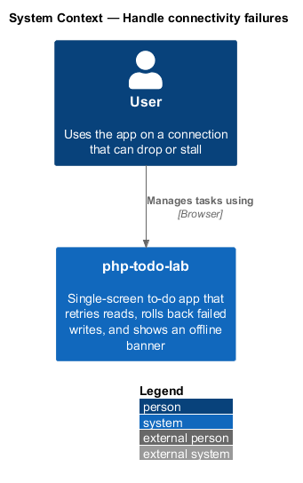
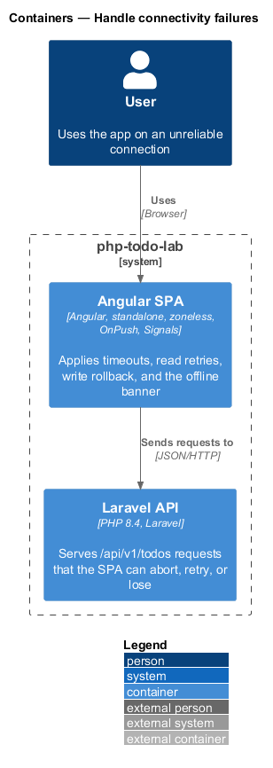
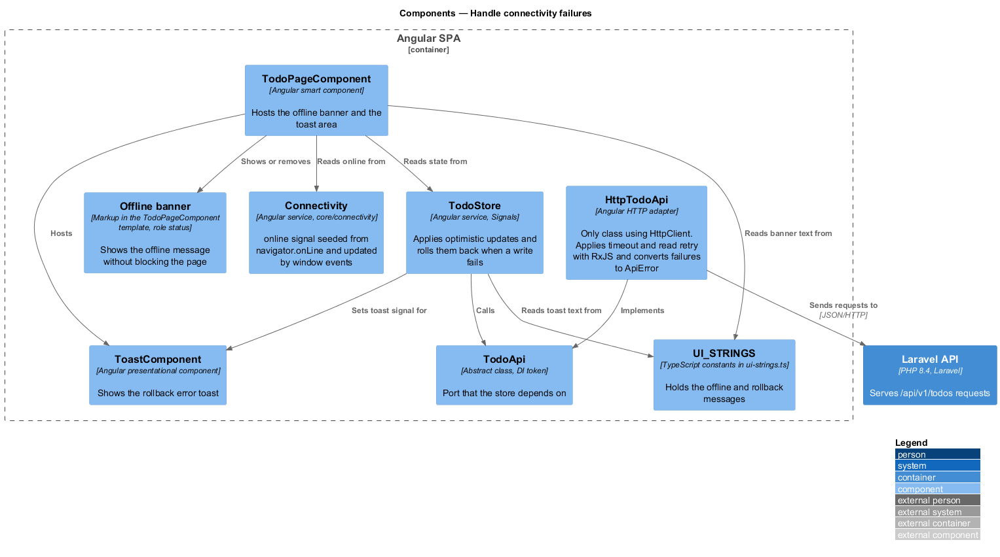
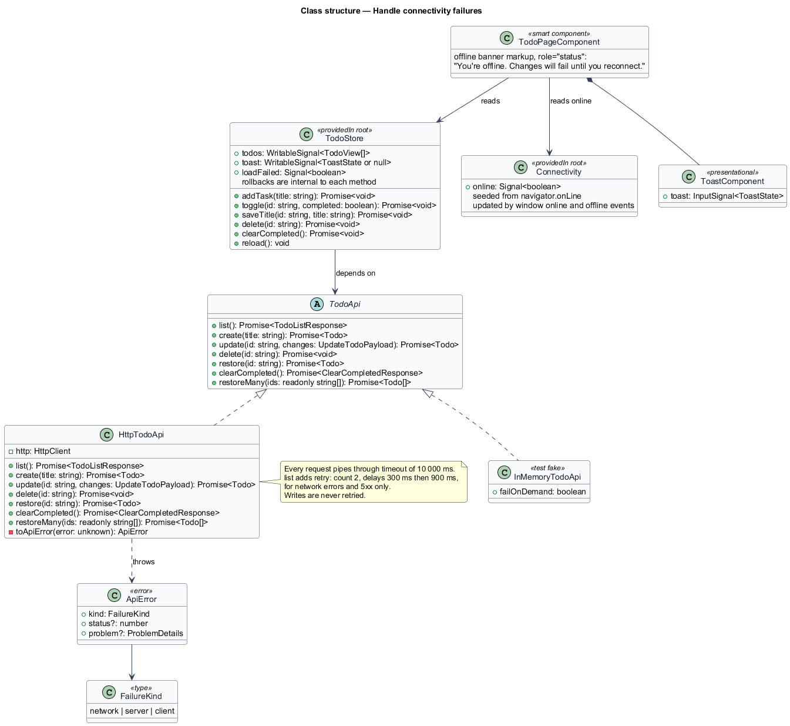
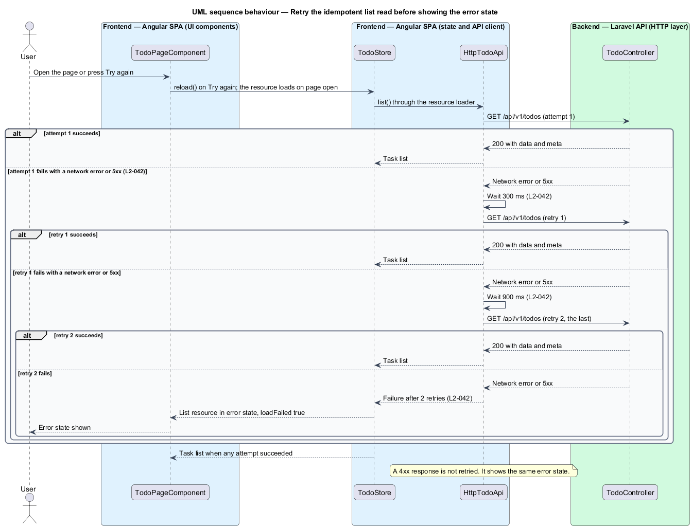
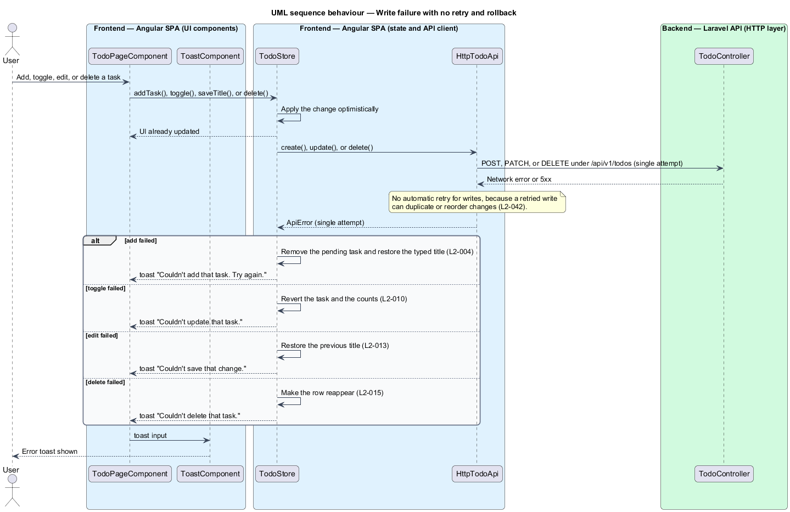
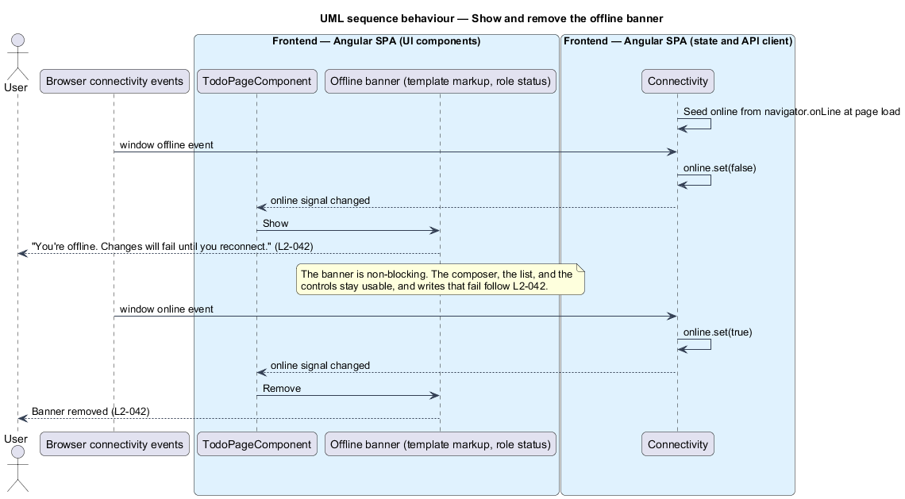
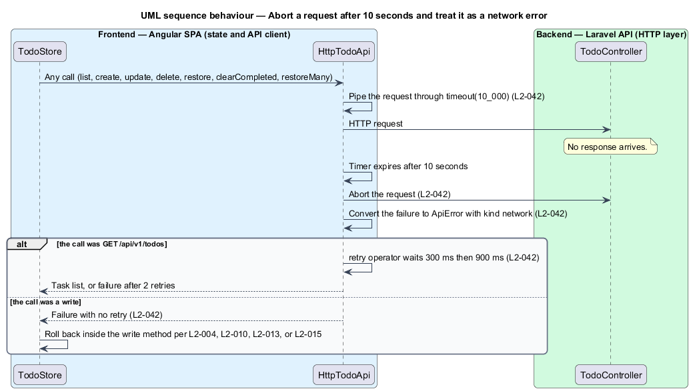

# Handle connectivity failures

## Overview

php-todo-lab is a single-screen to-do app for one user. An Angular single-page application (SPA) calls a Laravel API under `/api/v1`. This feature defines how the SPA behaves when the network drops, stalls, or the server fails.

**idempotent read** — request that returns data and changes none, so repeating it gives the same result. In this app it is `GET /api/v1/todos`.

**write** — request that changes stored tasks: create, update, delete, restore, clear completed, or restore many.

**optimistic update** — change shown in the UI before the server confirms it

**rollback** — reversal of an optimistic update after the server request fails

**network error** — failure in which no HTTP response arrives, such as a dropped connection or an aborted request

**offline banner** — non-blocking message shown while the browser reports that it has no connection

The policy has three parts. The client retries idempotent reads, because a repeated read cannot duplicate or reorder data. The client never retries writes automatically, because a repeated write can. A request that gets no response after 10 seconds is aborted and treated as a network error. The browser connectivity state also drives a banner. The visual reference is the mock `docs/mocks/todo.html`.

## Description

The feature is a frontend-only slice. The Laravel API is the remote end of the requests and is unchanged.

- **`TodoApi`** — abstract class in `src/app/core/api/todo-api.ts` that `TodoStore` depends on. It declares one operation for each endpoint, and each returns a `Promise`: `list(): Promise<TodoListResponse>`, `create(title: string): Promise<Todo>`, `update(id: string, changes: UpdateTodoPayload): Promise<Todo>`, `delete(id: string): Promise<void>`, `restore(id: string): Promise<Todo>`, `clearCompleted(): Promise<ClearCompletedResponse>`, and `restoreMany(ids: readonly string[]): Promise<Todo[]>`.
- **`HttpTodoApi`** — adapter and the only class that uses `HttpClient`. It wraps calls with `firstValueFrom`. It applies the 10-second timeout to every request. It converts each failure to an `ApiError`. It retries `GET /api/v1/todos` up to 2 more times after a network error or a `5xx` response, waiting 300 ms before the first retry and 900 ms before the second. It sends each write once.
- **Resilience policy** — the values that `HttpTodoApi` applies: 2 retries, delays of 300 ms then 900 ms, a 10-second timeout, and no write retries. `HttpTodoApi` expresses the policy with RxJS operators on each request, not with an HTTP interceptor. Every request pipes through `timeout(10_000)`, and a timeout counts as a network error. `list()` adds `retry({ count: 2, delay: (_, n) => timer(n === 1 ? 300 : 900) })`, and the delay function rethrows unless the failure is a network error or a `5xx` response. RxJS stays inside `core/api`.
- **`ApiError`** — error class in `core/api/models` with `kind`, an optional `status`, and an optional `problem` that holds the parsed RFC 9457 body. `kind` is a `FailureKind`: `'network'`, `'server'`, or `'client'`. The store reads `status` to recognise `404` and `422`.
- **`TodoStore`** — root service. It loads the list through `resource({ loader: () => this.api.list() })`, applies optimistic updates, and performs the rollback inside each write method when the write fails. After the read retries are exhausted, the list resource is in its error state and `loadFailed` is `true`.
- **`Connectivity`** — root service in `src/app/core/connectivity/connectivity.ts`. Its `online` signal starts from `navigator.onLine` and follows the window `online` and `offline` events.
- **`TodoPageComponent`** — smart component. It hosts the offline banner and the toast area, and shows the banner while `Connectivity.online` is `false`.
- **Offline banner** — markup in the `TodoPageComponent` template, not a separate component. It shows "You're offline. Changes will fail until you reconnect." with `role="status"`, as the mock `pages/page.offline.html` does, and does not block the page.
- **`ToastComponent`** — presentational component that shows the error toast after a rollback.
- **`UI_STRINGS`** — typed constants that hold the banner text and the rollback toast text.

Rollback for each write is specified by other requirements and is cited here, not redefined.

| Write | Rollback | Toast |
|-------|----------|-------|
| Add task (`L2-004`) | Remove the pending task and restore the typed title | "Couldn't add that task. Try again." |
| Toggle completion (`L2-010`) | Revert the task and the counts | "Couldn't update that task." |
| Edit title (`L2-013`) | Restore the previous title | "Couldn't save that change." |
| Delete task (`L2-015`) | Make the row reappear | "Couldn't delete that task." |
| Clear completed | Make the cleared rows reappear | "Couldn't clear completed tasks." |
| Restore one (undo of a delete) | Leave the task removed | "Couldn't restore that task." |
| Restore many (undo of clear completed) | Leave the tasks removed | "Couldn't restore those tasks." |

`TodoStore` reads the list through Angular `resource()` rather than `httpResource`. The loader calls `TodoApi.list()`, so `HttpTodoApi` stays the only class that uses `HttpClient` (L2-048), and the read keeps the port's retry and timeout policy.

A `4xx` response to `GET /api/v1/todos` is not retried, because a repeated request returns the same client error. It shows the same error state as an exhausted retry.

The initial online state comes from `navigator.onLine` at page load. The window `online` and `offline` events update the `Connectivity.online` signal afterwards.

Each attempt is a separate request, so the 10-second limit applies to each attempt. L2-042 does not state a total limit across retries, and none is defined here.

The bulk writes "Clear completed" and "Restore many" follow the write rule of one attempt. A failed clear makes the cleared rows reappear. A failed restore leaves the tasks removed. Each shows the error toast in the table above.

## Requirements

The feature realizes the following level-2 (L2) requirement. It refines a level-1 (L1) requirement, cited by identifier.

| L2 ID | Refines (L1) | Requirement |
|-------|--------------|-------------|
| `L2-042` | `L1-012` | The client shall not retry writes automatically, because retried writes can duplicate or reorder changes. The client shall retry idempotent reads. When `GET /todos` fails with a network error or `5xx`, the client shall retry up to 2 more times with 300 ms then 900 ms delays before showing the error state. When a write fails, no automatic retry shall occur and the rollback behaviour in `L2-004`, `L2-010`, `L2-013`, and `L2-015` shall apply. When the browser goes offline, a non-blocking banner "You're offline. Changes will fail until you reconnect." shall be shown and shall be removed when the connection returns. When a request has no response after 10 seconds, the client shall abort it and treat it as a network error. |

## Diagrams

### System context

The user manages tasks through php-todo-lab on a connection that can drop or stall. No external system takes part in this feature.

### Containers

The Angular SPA applies the policy and sends requests to the Laravel API. The MySQL database is not involved in this slice.

### Components

`TodoStore` calls the `TodoApi` port. `HttpTodoApi` implements it, applies the timeout and the read retries, and talks to the API. `TodoPageComponent` hosts the offline banner and the toast area.

### Class structure

`HttpTodoApi` applies the resilience policy and converts each failure to an `ApiError` whose `kind` is network, server, or client. `TodoStore` depends on `TodoApi` and rolls back optimistic updates.

### Behaviour — retry the list read

`HttpTodoApi` sends `GET /api/v1/todos` and, after a network error or `5xx`, retries after 300 ms and then after 900 ms. The error state follows only after the second retry fails, per `L2-042`.

### Behaviour — write failure with no retry

A failed write is sent once. `TodoStore` then rolls back as `L2-004`, `L2-010`, `L2-013`, or `L2-015` specifies and shows the matching error toast.

### Behaviour — offline banner

`Connectivity` updates its `online` signal on the browser `offline` and `online` events. `TodoPageComponent` shows the non-blocking offline banner while the signal is `false` and removes it when the signal returns to `true`, per `L2-042`.

### Behaviour — request timeout

`HttpTodoApi` aborts a request that has no response after 10 seconds and classifies it as a network error. A read then follows the retry path and a write follows the rollback path.

