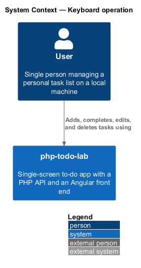
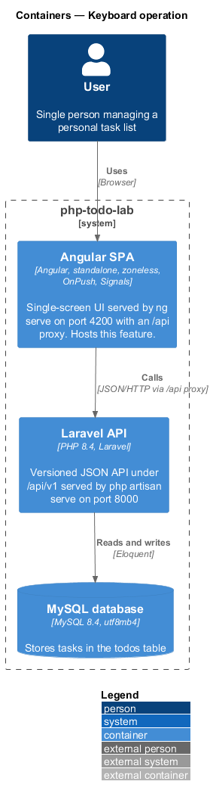
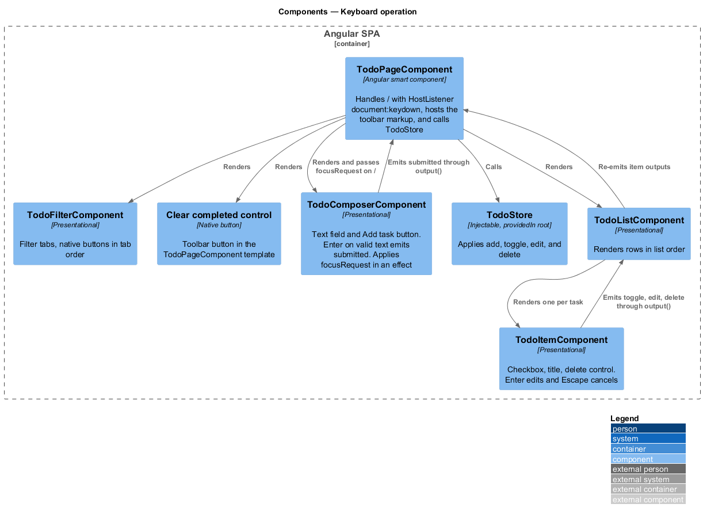
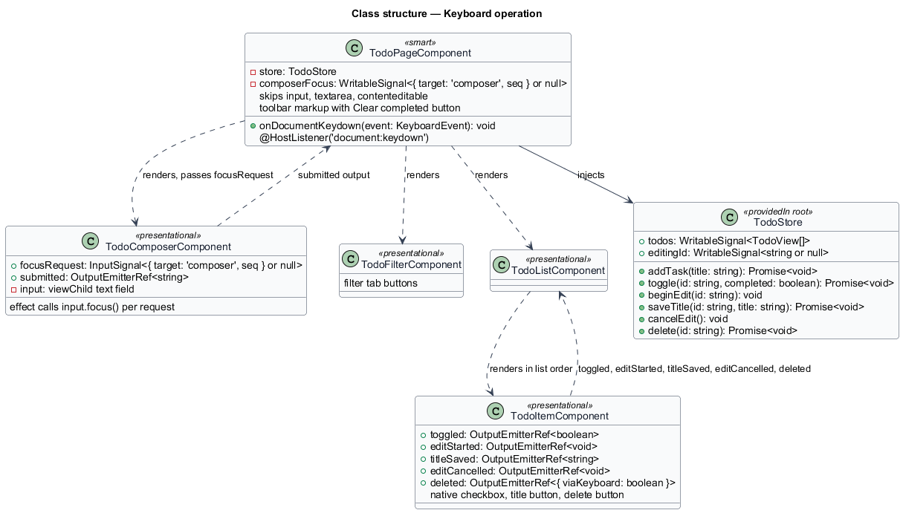
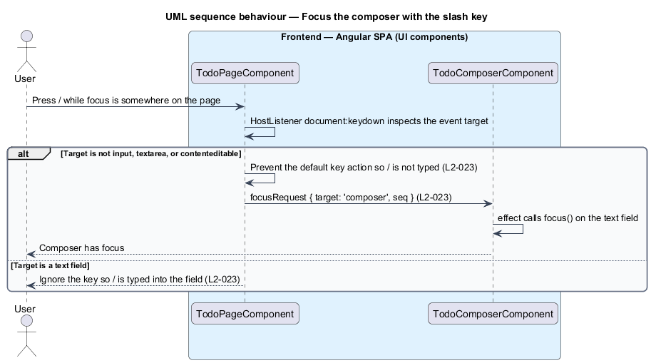
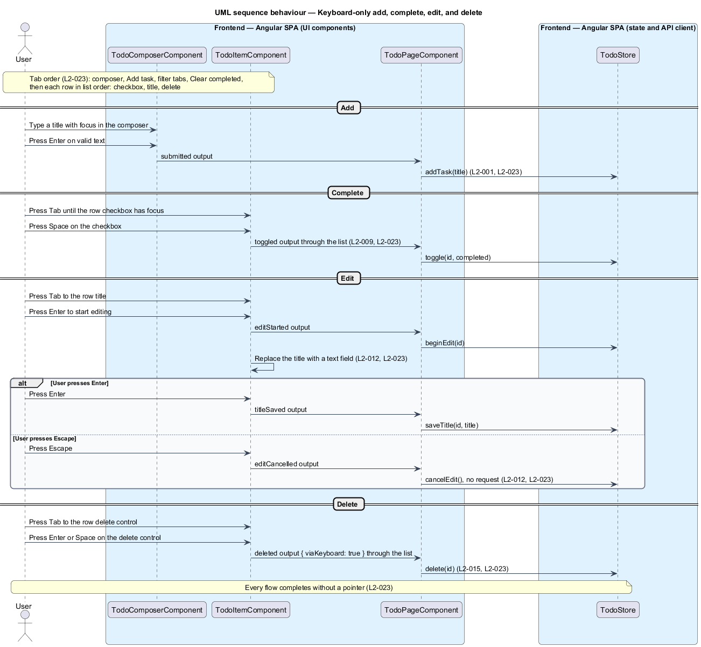

# Keyboard operation

## Overview

`php-todo-lab` is a single-screen to-do app, and its interface is designed to work fully from the keyboard. This feature covers the keyboard contract of that screen: a shortcut that moves focus to the composer, the keys that act on a task, and the order in which Tab visits controls.

The *composer* is the text field and "Add task" button at the top of the list, where a new task is typed. A *text field* is an `input` or `textarea` element that accepts typed characters. The *tab order* is the sequence in which the Tab key moves keyboard focus across interactive controls. A *row* is one task in the list, made of a checkbox, a title, and a delete control.

The feature adds no new task behaviour. It ties together behaviours defined elsewhere: adding a task (L2-001), toggling completion (L2-009), and editing a title (L2-012). It also guarantees that a user can add, complete, edit, and delete a task with no pointer. The visual reference is the mock `docs/mocks/todo.html`, a design artifact that this design cites without changing.

## Description

The slice lives entirely in the Angular SPA. It relies on native elements, so the browser supplies Tab, Enter, and Space behaviour. The design does not set positive `tabindex` values, and the tab order follows document order.

- **`TodoPageComponent`** — smart component. It handles the `/` shortcut with `@HostListener('document:keydown')`. When `/` is pressed and the event target is not a text field, the handler prevents the default key action and sets the composer focus request. The handler treats `input`, `textarea`, and `contenteditable` elements as text fields. The mock checks `input` and `textarea` only. When focus is in a text field, the handler ignores the key, so `/` is typed into the field. The page template also holds the toolbar markup.
- **`TodoComposerComponent`** — presentational component with the text field and the "Add task" button. Enter on valid text emits the `submitted` output, which the page forwards to `TodoStore.addTask()` (L2-001). A focus request reaches the component through its `focusRequest` input, `{ target: 'composer', seq }`. An `effect` applies the request by calling `.focus()` on the text field, held as a `viewChild`. The `seq` counter makes each `/` press a distinct request.
- **`TodoFilterComponent`** — presentational component whose tabs are native buttons.
- **Clear completed control** — native button in the toolbar. The `TodoPageComponent` template hosts it, next to `TodoFilterComponent`.
- **`TodoListComponent`** — presentational component that renders rows in list order.
- **`TodoItemComponent`** — presentational component for one row. It renders a native checkbox, the title, and the delete control in that order. Space on the focused checkbox toggles it (L2-009). Enter on the focused title starts editing, and Escape cancels the edit (L2-012). The title control is a native button in the mock.
- **`TodoStore`** — applies the add, toggle, edit, and delete changes that the page forwards, through `addTask`, `toggle`, `beginEdit`, `saveTitle`, `cancelEdit`, and `delete`.

The tab order is: composer, "Add task", filter tabs, "Clear completed", then each row in list order (checkbox, title, delete). Region order in the DOM (header, composer, toolbar, list) and row order give this sequence without extra attributes.

Ctrl or Cmd with Z for undo (L2-015), focus movement after delete (L2-031), and the visible focus ring (L2-030) belong to other features and are not specified here.

## Requirements

The feature realizes the following level-2 (L2) requirements. Each L2 requirement refines a level-1 (L1) requirement, cited by identifier.

| L2 ID | Refines (L1) | Requirement |
|-------|--------------|-------------|
| `L2-023` | `L1-007` | When focus is anywhere outside a text field and the user presses `/`, focus shall move to the composer. When the composer has focus and the user presses Enter on valid text, a task shall be added (L2-001). When a row title is focused, Enter shall start editing and Escape shall cancel (L2-012), and Space on the checkbox shall toggle it (L2-009). The tab order shall be composer, Add task, filter tabs, Clear completed, then each row (checkbox, title, delete) in list order. A user shall be able to add, complete, edit, and delete a task using only the keyboard, with every flow completable without a pointer. |

## Diagrams

### System context

The user operates `php-todo-lab` from the keyboard. This feature defines the keys and the tab order for that use.

### Containers

Keyboard handling lives in the Angular SPA. The Laravel API and the MySQL database persist the task changes that the keys trigger.

### Components

`TodoPageComponent` hosts the `/` shortcut handler and renders the composer, the toolbar, and the list. Presentational components emit outputs that the page forwards to `TodoStore`.

### Class structure

The page renders the composer, the filter, and the list. The list renders one `TodoItemComponent` per task, in list order, and each item exposes its checkbox, title, and delete control.

### Behaviour — focus the composer with the slash key

The page handler inspects the focused element. Outside a text field, it prevents the default action and focuses the composer. Inside a text field, it ignores the key.

### Behaviour — keyboard-only add, complete, edit, and delete

The user adds a task with Enter, toggles it with Space, edits the title with Enter and saves or cancels with Enter or Escape, and deletes it from the delete control. The tab order connects the steps.

