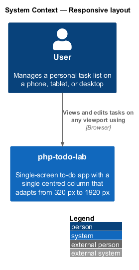
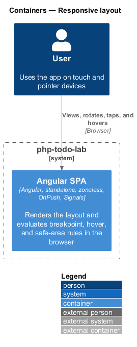
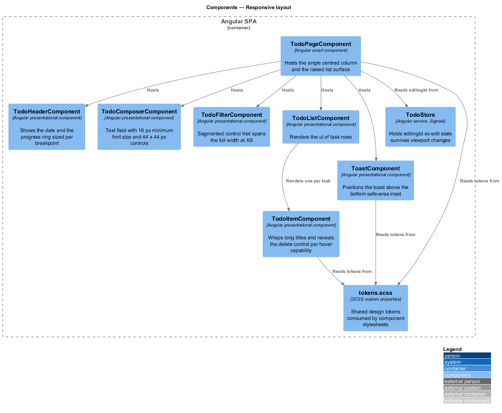
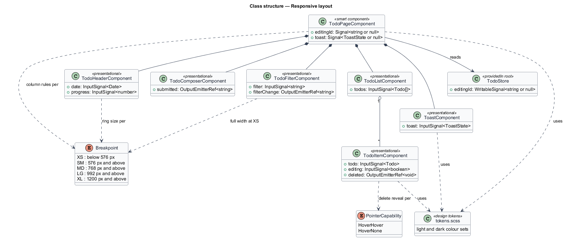
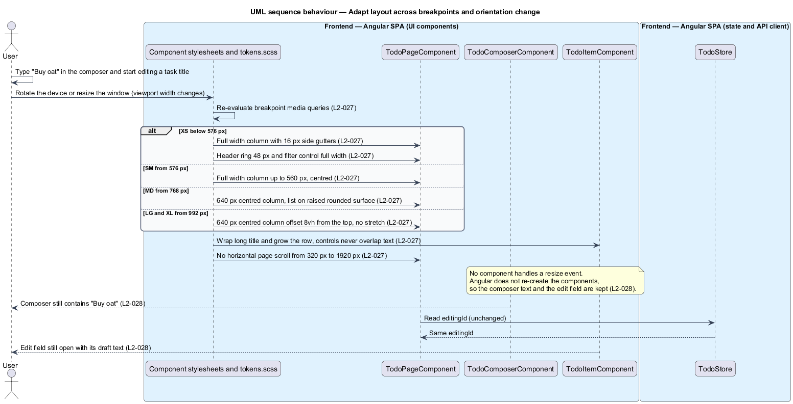
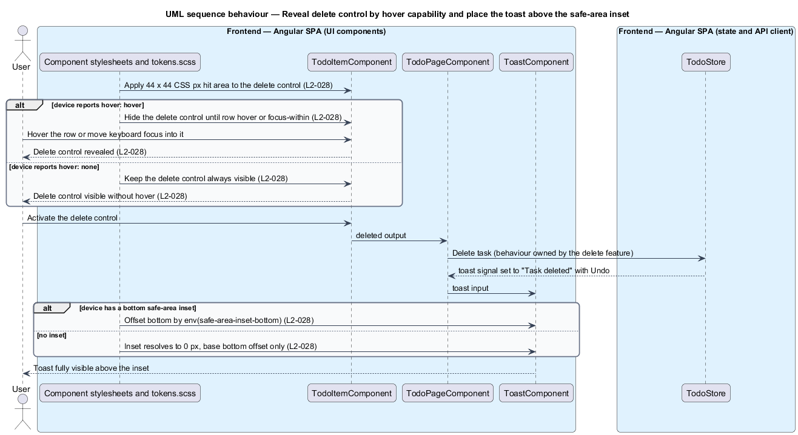

# Responsive layout

## Overview

php-todo-lab is a single-screen to-do app for one user. The browser interface is an Angular single-page application (SPA). This feature defines how that interface adapts to the size and input capabilities of the device that shows it, from a 320 px phone to a 1920 px desktop display.

**breakpoint** — viewport width at which a layout rule changes. The design uses five: XS below 576 px, SM from 576 px, MD from 768 px, LG from 992 px, and XL from 1200 px.

**column** — the single centred vertical strip that holds every region of the screen: header, composer, toolbar, list, and toast area.

**hover capability** — property of the primary input device, reported by the `hover` media feature. The value `hover: hover` means the device can hover over elements. The value `hover: none` means it cannot, as on a touch screen.

**safe-area inset** — space that the device reserves at a screen edge for hardware or system UI, such as a home indicator. The browser exposes it as `env(safe-area-inset-bottom)`.

**hit area** — region of the screen that a control accepts taps or clicks in, which can be larger than the visible glyph.

The layout is a stylesheet concern. No script reads the viewport size. Components keep their state when the viewport changes because the browser re-evaluates CSS rules in place and Angular does not re-create the components. The visual reference is the mock `docs/mocks/todo.html`.

## Description

The feature is a frontend-only slice. It touches the Angular SPA container and no other container.

- **`TodoPageComponent`** — smart component at route `/`. It hosts the column and the surface that holds the composer, toolbar, and list. Its stylesheet sets the column width, the side gutters, the top offset, and the raised rounded surface from MD upward.
- **`TodoHeaderComponent`** — presentational component for the date and the progress ring. The ring is 48 px at XS. The ring size from SM upward is `<TO SUPPLY>`; the mock shows 56 px.
- **`TodoComposerComponent`** — presentational component for the new-task field and the "Add task" button. The field computes to a font size of at least 16 px so iOS does not zoom on focus. The text stays in the field when the viewport changes.
- **`TodoFilterComponent`** — presentational component for the segmented control. It spans the full width at XS.
- **`TodoListComponent`** — presentational component that renders the `ul` of rows.
- **`TodoItemComponent`** — presentational component for one row. Its title wraps and the row grows, so controls never overlap the text at 320 px with a 200-character title. It reveals the delete control according to the hover capability.
- **`ToastComponent`** — presentational component for the toast. Its bottom offset includes `env(safe-area-inset-bottom)`. The mock adds a 16 px base offset.
- **`TodoStore`** — root service. Its `editingId` signal records which row is in edit mode. A viewport change does not write to it.
- **`tokens.scss`** — shared design tokens as CSS custom properties. Component stylesheets read them.

Every interactive control has a hit area of at least 44 x 44 CSS px. The mock applies this with a 44 px minimum size on the delete control, the toast button, and the banner button.

Breakpoint thresholds are fixed by L2-027. The mechanism that shares the threshold values between component stylesheets is `<TO SUPPLY>`, because media queries cannot read CSS custom properties.

The SM column is "full width up to 560 px". The side gutter at SM and above is `<TO SUPPLY>`; L2-027 fixes the 16 px gutter at XS only.

## Requirements

The feature realizes the following level-2 (L2) requirements. Each L2 requirement refines a level-1 (L1) requirement, cited by identifier.

| L2 ID | Refines (L1) | Requirement |
|-------|--------------|-------------|
| `L2-027` | `L1-008` | The layout shall be a single centred column with breakpoints XS below 576 px, SM from 576 px, MD from 768 px, LG from 992 px, and XL from 1200 px. At XS (320 to 575 px) the column shall be full width with 16 px side gutters, the header ring shall be 48 px, and the filter control shall span the full width. At SM (576 to 767 px) the column shall be full width up to 560 px, centred. At MD (768 px and above) the column shall be 640 px wide, centred, with the list on a raised surface with rounded corners. At LG and XL (992 px and above) the column shall remain 640 px wide, shall be offset from the top by 8vh, and shall not stretch. From 320 to 1920 px there shall be no horizontal page scroll. At 320 px with a 200-character title, the title shall wrap, the row shall grow, and controls shall not overlap the text. |
| `L2-028` | `L1-008` | Every interactive control shall have a hit area of at least 44 x 44 CSS px. On a device with `hover: none` the delete control shall always be visible. On `hover: hover` devices the delete control shall be revealed on row hover or focus-within. A focused text input on iOS shall have a computed font size of at least 16 px. When the viewport changes orientation, the layout shall adapt without losing the composer text or the edit state. When the device has a bottom safe-area inset, the toast shall respect `env(safe-area-inset-bottom)`. |

## Diagrams

### System context

The user views and edits tasks on phones, tablets, and desktops through one system, php-todo-lab. No external system takes part in this feature.

### Containers

Only the Angular SPA takes part. The Laravel API and the MySQL database are not involved, because layout rules run in the browser. For this slice the container view and the context view carry near-identical information.

### Components

`TodoPageComponent` hosts the presentational components and the column. `TodoItemComponent` and `ToastComponent` carry the hover and safe-area rules. `TodoStore` is read for `editingId` only, and `tokens.scss` supplies shared tokens.

### Class structure

The `Breakpoint` enumeration drives column, ring, and filter rules. The `PointerCapability` enumeration drives the delete reveal in `TodoItemComponent`. The page composes the presentational components, and the list renders one row per task.

### Behaviour — adapt layout across breakpoints and orientation change

When the viewport width changes, the browser re-evaluates the breakpoint rules from `L2-027`. The composer text and the open edit field remain, as `L2-028` requires, because no component handles the resize.

### Behaviour — delete control reveal and toast safe-area inset

Stylesheets keep the delete control visible on `hover: none` devices and reveal it on hover or focus-within on `hover: hover` devices. The toast is offset by the bottom safe-area inset, per `L2-028`.

