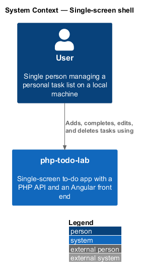
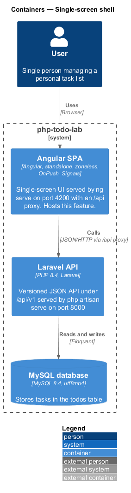
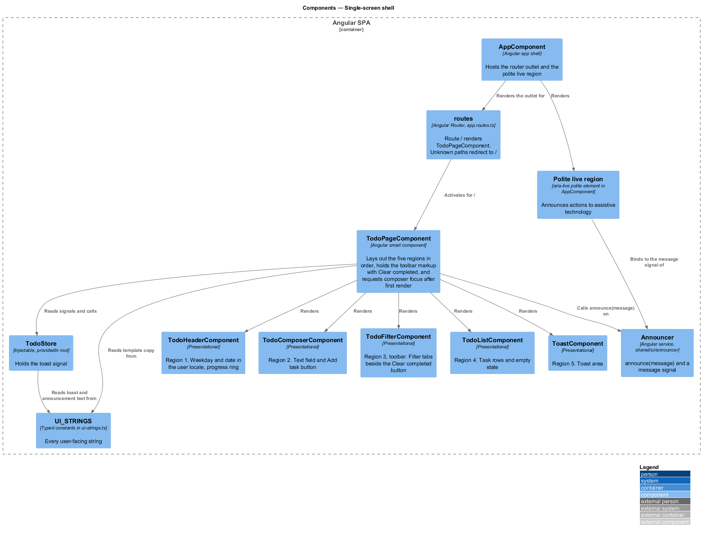
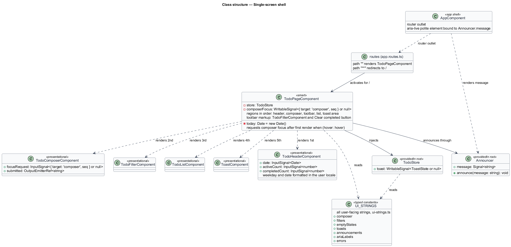
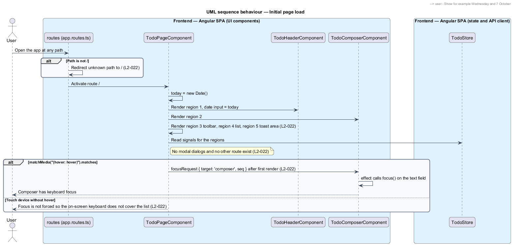
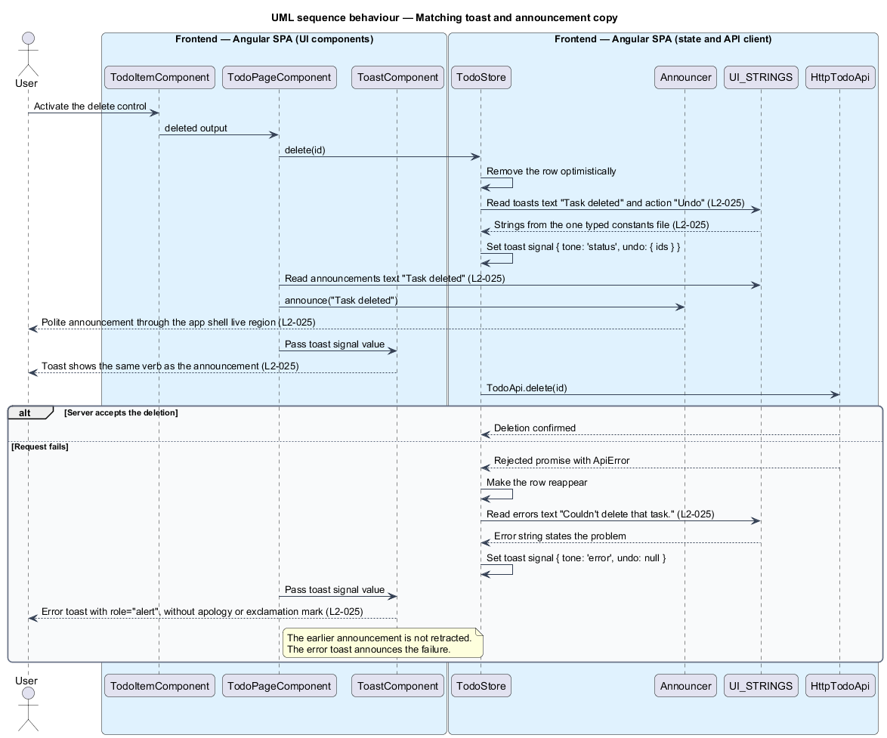

# Single-screen shell

## Overview

`php-todo-lab` is a single-screen to-do app. The Angular single-page application (SPA) shows the whole product on one route, `/`, with no navigation, no modal dialog, and no settings. This feature defines that shell: the order of the regions on the page, the redirect for unknown paths, the initial focus, the header date, and the rule that all copy comes from one place.

A *region* is a labelled band of the page. The five regions, in order, are the header (date and progress ring), the composer (field for a new task), the toolbar (filter tabs and "Clear completed"), the list, and the toast area. A *toast* is a short message that appears at the bottom of the screen after an action. A *polite live region* is a visually hidden element whose text changes are announced by assistive technology without interrupting the user. *UI_STRINGS* is the exported constant that holds every user-facing string in one typed file, `ui-strings.ts`.

The visual reference is the mock `docs/mocks/todo.html`, which is a design artifact. This design cites the mock and does not change it.

Copy follows one rule set. It is plain, active, and in sentence case. It uses one name for each thing: "task", "Add task", "Undo", "Clear completed". Errors state the problem and a next step, and never apologise. The same verb appears in the button, the toast, and the announcement for an action.

## Description

The slice lives entirely in the Angular SPA.

- **Route table** — the `routes` constant of type `Routes` in `src/app/app.routes.ts`. It maps `/` to `TodoPageComponent` and redirects every other path to `/`. `src/app/app.config.ts` provides it to the router.
- **`AppComponent`** — app shell. It hosts the router outlet and renders the polite live region.
- **`TodoPageComponent`** — smart component. It renders the five regions in the fixed order, owns the page layout, and requests composer focus after the first render. Its template holds the toolbar markup, which places `TodoFilterComponent` and the "Clear completed" button side by side. No other route, dialog, or settings view exists.
- **`TodoHeaderComponent`** — region 1. It shows the current weekday and date in the user's locale, for example "Wednesday" and "7 October". It formats its `date` input with `toLocaleDateString(undefined, { weekday: 'long' })` and `toLocaleDateString(undefined, { day: 'numeric', month: 'long' })`, as the mock does. The `undefined` locale selects the browser locale. `TodoPageComponent` creates the `Date` once, with `new Date()`, when the page is created, and passes it to the `date` input. The header also takes `activeCount` and `completedCount` for the progress ring.
- **`TodoComposerComponent`** — region 2. It exposes the text field that receives initial focus. The page sets the composer's `focusRequest` input to `{ target: 'composer', seq }`. An `effect` in the composer applies the request by calling `.focus()` on the text field, held as a `viewChild`.
- **`TodoFilterComponent`** — region 3, the toolbar, with the filter tabs. The "Clear completed" button sits beside it in the `TodoPageComponent` template, not inside the filter component.
- **`TodoListComponent`** — region 4. It renders task rows and the empty state.
- **`ToastComponent`** — region 5, the toast area.
- **`Announcer`** — root service in `src/app/shared/ui/announcer/announcer.ts`. It exposes `announce(message)` and a `message` signal. `TodoPageComponent` calls it when the user acts.
- **Polite live region** — visually hidden element with `aria-live="polite"`, rendered by `AppComponent` and bound to `Announcer.message`. The mock uses a `div` with the id `live`.
- **`TodoStore`** — holds the `toast` signal. It reads toast text from `UI_STRINGS` when an action starts or fails.
- **`UI_STRINGS`** — typed constants file. It holds every user-facing string so that a reviewer can check tone in one place and a later change can localise it. The file is `src/app/features/todos/ui-strings.ts`, and it exports `UI_STRINGS` with the groups `composer`, `filters`, `emptyStates`, `toasts`, `announcements`, `ariaLabels`, and `errors`.

Initial focus follows the mock. The page requests composer focus only when `matchMedia('(hover: hover)').matches` is `true`. A device whose primary input cannot hover counts as a touch device and does not receive forced focus, so the on-screen keyboard does not cover the list.

Unknown paths redirect to `/` through a wildcard route. The redirect is a route-table behaviour and involves no server round trip.

## Requirements

The feature realizes the following level-2 (L2) requirements. Each L2 requirement refines a level-1 (L1) requirement, cited by identifier.

| L2 ID | Refines (L1) | Requirement |
|-------|--------------|-------------|
| `L2-022` | `L1-007` | The product shall be a single route (`/`) with the regions header (date and progress ring), composer, toolbar (filters and "Clear completed"), list, and toast area, in that order. No navigation, modal, or settings shall exist. Unknown paths shall redirect to `/`. The page shall contain exactly the listed regions and no modal dialogs. After the page finishes loading, the composer shall have keyboard focus, except on touch devices where focus shall not be forced. The header shall display the current weekday and date in the user's locale. |
| `L2-025` | `L1-007` | Copy shall be plain, active, and in sentence case, and shall use one name for each thing: "task" in the UI, "Add task", "Undo", "Clear completed". Errors shall say what happened and what to do, and shall not apologise. No user-facing string shall contain an exclamation mark or "Oops". The same action shall use the same verb across button, toast, and announcement, for example the "Add task" button produces the announcement "Task added". Every error shall state the problem and a next step. All user-facing strings shall be held in one typed constants file for review and later localisation. |

## Diagrams

### System context

The user works with `php-todo-lab` as one screen. This feature defines the shell of that screen.

### Containers

The shell lives in the Angular SPA. The Laravel API and the MySQL database supply task data and are not changed by this feature.

### Components

The route table activates `TodoPageComponent`, which renders the five regions and reads copy from `UI_STRINGS` directly and through `TodoStore`.

### Class structure

`TodoPageComponent` renders five region components in a fixed order. Both the page and the store read `UI_STRINGS`. The page announces through `Announcer`, and `AppComponent` renders the polite live region.

### Behaviour — initial page load

An unknown path redirects to `/`. The page renders the regions in order, the header formats the date in the user locale, and the composer receives focus unless the device is a touch device.

### Behaviour — matching toast and announcement copy

On delete, the store sets the toast "Task deleted" and the page announces "Task deleted", both from `UI_STRINGS` under L2-025. Both use the same verb and appear when the user acts. On failure, the row reappears and the error toast states the problem without apology.

