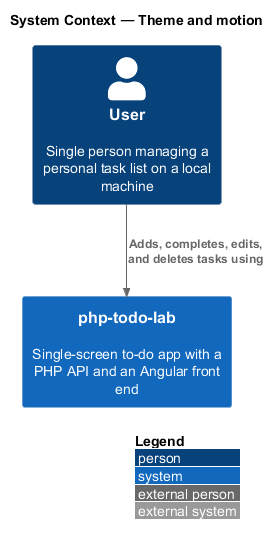
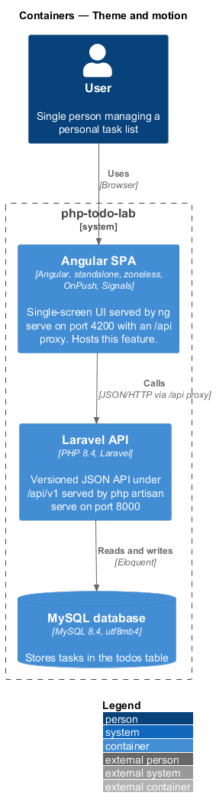
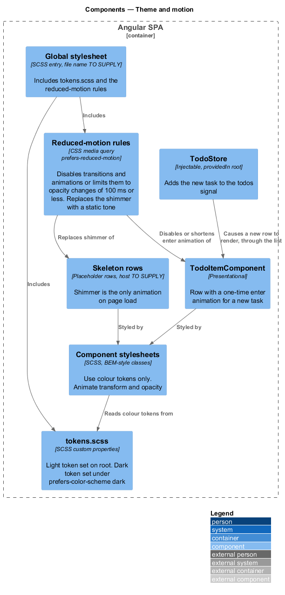
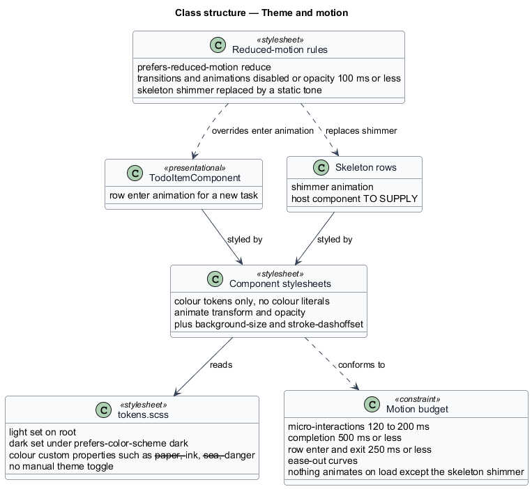
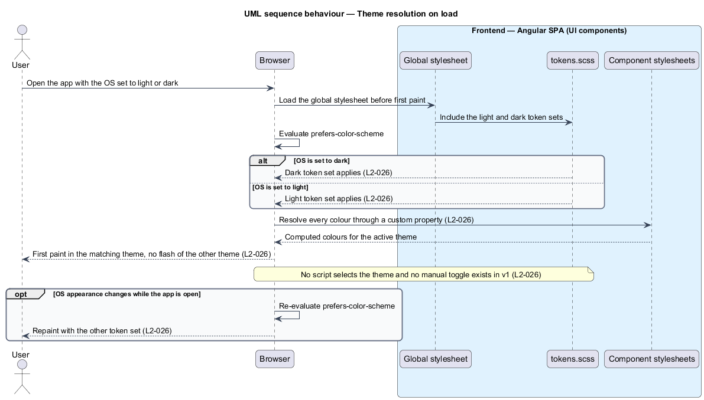
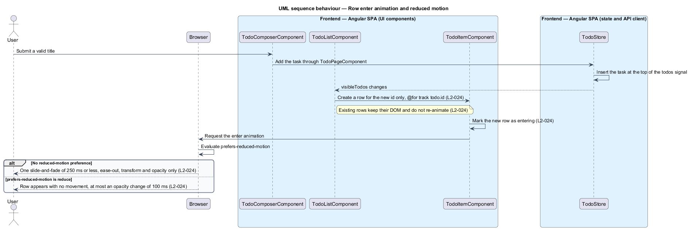

# Theme and motion

## Overview

`php-todo-lab` is a single-screen to-do app. This feature defines two visual behaviours of its Angular front end: which colour theme the screen uses, and how much it moves.

A *theme* is a complete set of colour values for the interface. The app has two themes, light and dark, and follows the operating-system setting through the `prefers-color-scheme` media query. No manual toggle exists in v1. A *design token* is a named CSS custom property that holds a value shared across components, such as a colour. A *flash of the wrong theme* is a first paint in one theme followed by a switch to the other.

*Motion* is any animation or transition. Motion exists only to confirm an action or show what changed. Nothing animates on page load except the skeleton shimmer, which is the moving highlight on placeholder rows shown while the list loads. The motion budget sets micro-interactions at 120 to 200 ms, completion at 500 ms or less, and row enter and exit at 250 ms or less, all with ease-out curves. A user who sets `prefers-reduced-motion: reduce` receives no movement: transitions and animations are disabled, or reduced to opacity changes of 100 ms or less, and the shimmer becomes a static tone.

Two criteria are structural: L2-024 criterion 3 (animations change only `transform` and `opacity`, plus `background-size` and `stroke-dashoffset` for the strike-through and check) and L2-026 criterion 4 (component stylesheets use colour tokens, not colour literals). Stylelint and code review enforce them. No test inspects the stylesheets for them.

The visual reference is the mock `docs/mocks/todo.html`, a design artifact that this design cites without changing.

## Description

The slice consists of stylesheets and the components they style. It runs entirely in the Angular SPA.

- **`tokens.scss`** — the one file of shared design tokens. The light set sits on the root. The dark set sits under `@media (prefers-color-scheme: dark)` and overrides the same property names. The mock defines tokens such as `--paper`, `--ink`, `--sea`, and `--danger`. Token names and values for the product are `<TO SUPPLY>` until the stylesheet exists.
- **Global stylesheet** — the SCSS entry that includes `tokens.scss` and the reduced-motion rules. The file name is `<TO SUPPLY>`.
- **Component stylesheets** — each component's SCSS file. They read colours only through `var(--token)` and use BEM-style or scoped class names. They animate `transform` and `opacity`, plus `background-size` and `stroke-dashoffset` for the strike-through and check.
- **Reduced-motion rules** — a `@media (prefers-reduced-motion: reduce)` block. It disables transitions and animations or limits them to opacity changes of 100 ms or less, and replaces the skeleton shimmer with a static tone. The mock shortens durations to `.001ms` and sets `animation: none` on the shimmer bars. The static tone token is `<TO SUPPLY>`.
- **`TodoItemComponent`** — renders a task row. A newly added task enters with one short slide-and-fade of 250 ms or less. The mock uses an `enter` animation of 250 ms with `ease-out`, moving 8 px and fading in.
- **`TodoListComponent`** — renders rows with `@for` and `track todo.id`, so only a row for a new id is created. Existing rows keep their DOM and do not animate again.
- **Skeleton rows** — placeholder rows shown while the list loads. Their shimmer is the only animation on page load. The component that hosts them is `<TO SUPPLY>`.
- **`TodoStore`** — inserts the pending task into the `todos` signal, which causes the new row to render.

**Theme resolution.** The theme is chosen by CSS alone. No script reads the OS setting, sets an attribute, or stores a preference. The browser evaluates `prefers-color-scheme` when it applies the stylesheet, so the first paint already uses the matching token set. The same evaluation repeats if the OS setting changes while the app is open. The Angular build option that delivers the global stylesheet before first paint, for example whether critical styles are inlined, is `<TO SUPPLY>`.

**Open detail.** A pending task carries a temporary id until the server returns the real ULID. If `track todo.id` sees the id change, the row could re-render and replay the enter animation. How reconciliation avoids a second animation is `<TO SUPPLY>`.

## Requirements

The feature realizes the following level-2 (L2) requirements. Each L2 requirement refines a level-1 (L1) requirement, cited by identifier.

| L2 ID | Refines (L1) | Requirement |
|-------|--------------|-------------|
| `L2-024` | `L1-007` | Motion shall exist only to confirm an action or show what changed. Nothing shall animate on page load except the skeleton shimmer. Micro-interactions shall last 120 to 200 ms, completion 500 ms or less, and row enter and exit 250 ms or less, with ease-out curves. Under `prefers-reduced-motion: reduce`, all transitions and animations shall be disabled or reduced to opacity changes of 100 ms or less, and the skeleton shimmer shall be replaced by a static tone. Any animation shall change only `transform` or `opacity`, plus `background-size` or `stroke-dashoffset` for the strike-through and check, and never layout properties on a frame loop. A newly added task row shall enter with a single short slide-and-fade, and existing rows shall not re-animate. |
| `L2-026` | `L1-007` | The UI shall use CSS custom properties for every colour and shall follow `prefers-color-scheme` with no manual toggle in v1. With the OS set to dark, the app shall render the dark token set with no flash of the light theme on load. With the OS set to light, the app shall render the light token set. Every text and control colour pair shall meet WCAG AA contrast in either theme (L2-030). Component stylesheets shall use colour tokens rather than colour literals, enforced by Stylelint. |

## Diagrams

### System context

The user views `php-todo-lab` in a light or dark theme with restrained motion. This feature defines both.

### Containers

Theme and motion live in the Angular SPA, which the browser styles. The Laravel API and the MySQL database take no part in this feature.

### Components

The global stylesheet includes `tokens.scss` and the reduced-motion rules. Component stylesheets read the tokens, and the reduced-motion rules override the row enter animation and the skeleton shimmer.

### Class structure

`tokens.scss` holds the light and dark sets. Component stylesheets read it and conform to the motion budget, while the reduced-motion rules override the row enter animation and the shimmer.

### Behaviour — theme resolution on load

The browser loads the global stylesheet, evaluates `prefers-color-scheme`, and applies the matching token set before first paint. No script takes part, so no flash of the other theme occurs.

### Behaviour — row enter animation and reduced motion

Adding a task renders one new row. The browser runs a single slide-and-fade, or under `prefers-reduced-motion: reduce` shows the row with no movement or with an opacity change of 100 ms or less.

