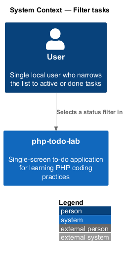
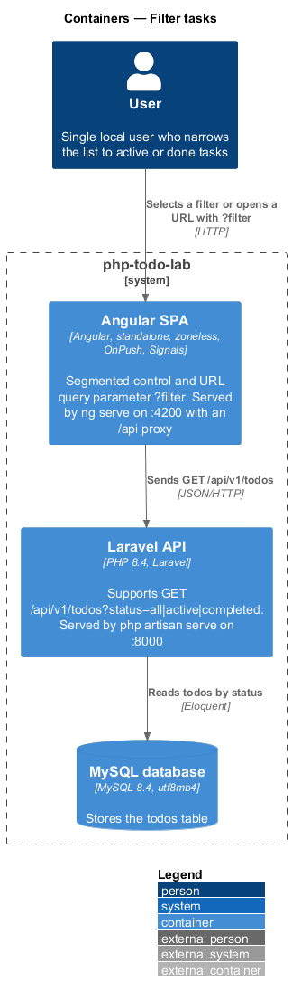
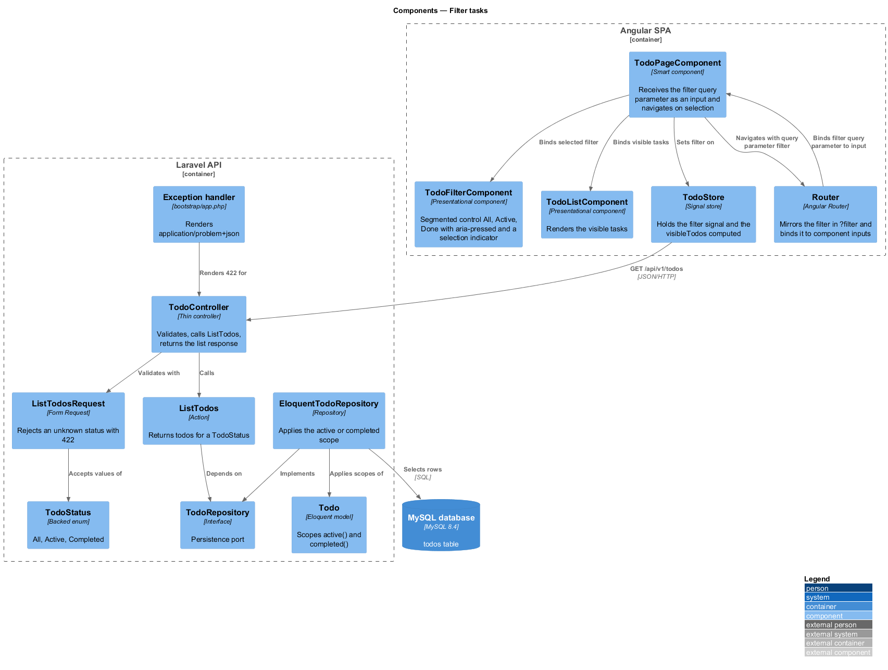
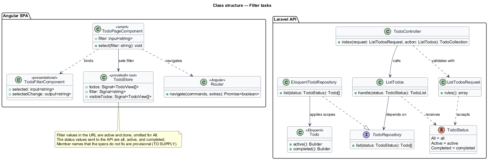
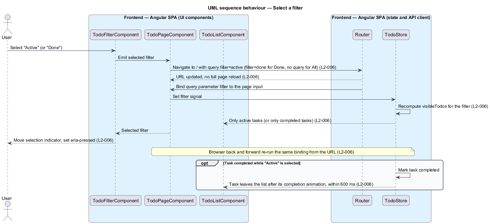
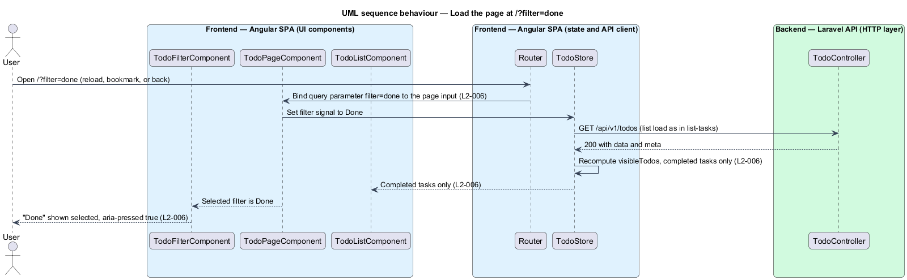
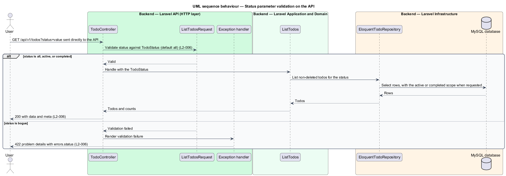

# Filter tasks

## Overview

php-todo-lab is a single-screen to-do application for one local user. It teaches PHP coding practices through a Laravel API and an Angular single-page application. This feature lets the user narrow the task list to active or completed tasks.

The following terms apply throughout the document.

**filter** — selection that decides which tasks the list shows; one of "All", "Active", or "Done"

**segmented control** — row of mutually exclusive buttons, here "All", "Active", and "Done", with an indicator that marks the selected button

**filter query parameter** — `filter` entry of the browser URL; `active` or `done`, omitted for "All"

**status parameter** — `status` entry of `GET /api/v1/todos`; `all`, `active`, or `completed`, defaulting to `all`

**router input binding** — Angular Router feature that passes a URL query parameter to a component `input()`

The user selects a filter in the segmented control. The selection updates the URL without a full page reload, so a reload or the browser back and forward buttons restore it. A page opened at `/?filter=done` starts with "Done" selected. The server also supports the `status` parameter and rejects unknown values with `422`.

The names differ between the layers. The user-facing label "Done" matches the URL value `done` and the API value `completed`. The visual reference is the mock `docs/mocks/todo.html`, which is a design artifact and is not changed by this feature.

## Description

The feature is a vertical slice from the segmented control to the `status` validation in the API. Names that the specs and the shared design contract do not fix are marked `<TO SUPPLY>`. The diagrams use provisional names for them.

Frontend, Angular SPA:

- **`TodoFilterComponent`** — presentational component built on `input()` and `output()`. It renders the buttons "All", "Active", and "Done" as a group. It sets `aria-pressed` on the selected button, moves the selection indicator to it, and emits the chosen filter. The counts shown on each button belong to the progress feature (L2-007).
- **`TodoPageComponent`** — smart component on route `/`. It receives the `filter` query parameter through router input binding, without an `Observable` subscription. On a selection event, it asks the Angular `Router` to navigate to `/` with the query parameter `filter=active` or `filter=done`. For "All" it omits the parameter.
- **`Router`** — Angular Router. It updates the URL without a page reload and binds the query parameter back to the page input. The binding runs on the first navigation, so `/?filter=done` selects "Done" at load. It also runs on browser back and forward navigation.
- **`TodoStore`** — root-provided signal store. The `filter` signal holds the selected filter. The `visibleTodos` computed derives the tasks the list shows from the `todos` and `filter` signals. The wiring from the bound page input to the `filter` signal is `<TO SUPPLY>`.
- **`TodoListComponent`** — presentational component that renders `visibleTodos`.

Backend, Laravel API:

- **`TodoController`** — thin controller that handles `GET /api/v1/todos`. It validates through `ListTodosRequest` and calls `ListTodos`.
- **`ListTodosRequest`** — Form Request. It accepts the `status` parameter only when the value is a `TodoStatus` value. For any other value it fails validation, and the exception handler answers `422` with a `status` entry in `errors`.
- **`TodoStatus`** — backed enum with the cases `All`, `Active`, and `Completed`, backed by `all`, `active`, and `completed`. It replaces string literals in the filter code.
- **`ListTodos`** — Action that receives a `TodoStatus` and asks `TodoRepository` for the matching non-deleted todos.
- **`TodoRepository`** — interface. **`EloquentTodoRepository`** implements it and applies the `Todo` scope `active()` or `completed()` for the status. **`InMemoryTodoRepository`** is the test fake.
- **`Todo`** — Eloquent model that provides the scopes `active()` and `completed()`.
- **Exception handler** — renders the validation failure as `application/problem+json`.

Behaviour notes:

- The SPA keeps all todos in the `todos` signal and filters them in the `visibleTodos` computed. The list request sends no `status` parameter. This follows the contract that the store derives `visibleTodos` and that the tab counts come from the same signals.
- When the user completes a task while "Active" is selected, the row leaves the list after its completion animation, no later than 600 ms after the change. The mechanism that delays removal until the animation ends is `<TO SUPPLY>`.

Open details:

- Whether the SPA ever sends the `status` parameter is `<TO SUPPLY>`. L2-006 defines the parameter for the API, and L2-007 requires counts from the task signal.
- The behaviour for an unknown `filter` query value such as `?filter=bogus` is `<TO SUPPLY>`. L2-006 does not define it.
- The type of the `filter` signal values is `<TO SUPPLY>`.

## Requirements

| L2 ID | Refines (L1) | Requirement |
|-------|--------------|-------------|
| `L2-006` | `L1-002` | A segmented control shall offer "All", "Active", and "Done". The server shall support `GET /api/v1/todos?status=all\|active\|completed`, with `all` as the default. The selected filter shall be mirrored in the browser URL as `?filter=active\|done`, omitted for "All", so that reload and back and forward preserve it. Selecting "Active" or "Done" shall show exactly the matching tasks. A page loaded at `/?filter=done` shall show "Done" selected and only completed tasks. An unknown `status` value shall return `422` with a `status` error. A selection shall move the indicator, update `aria-pressed`, and update the URL without a full page reload. A task completed while "Active" is selected shall leave the list after its completion animation, no later than 600 ms. |

## Diagrams

### System context

The user filters the task list in php-todo-lab. The system has no external systems.

### Containers

The Angular SPA holds the filter and the URL. The Laravel API validates the `status` parameter of the list endpoint.

### Components

In the SPA, the page, the filter control, the router, and the store carry the selection. In the API, `ListTodosRequest` validates `status` against `TodoStatus` before `ListTodos` runs.

### Class structure

`TodoPageComponent` sets the filter in `TodoStore` and navigates through `Router`. `ListTodosRequest` and `ListTodos` both rely on the `TodoStatus` enum.

### Behaviour — select a filter

The page navigates to the new URL, the router binds the query parameter back to the page, and the store recomputes the visible tasks. The control updates `aria-pressed` and moves the indicator (L2-006).

### Behaviour — load the page at /?filter=done

The router binds the query parameter to the page on first navigation. The store then shows only completed tasks and the control shows "Done" selected (L2-006).

### Behaviour — status validation on the API

The request class accepts `all`, `active`, and `completed`. Any other value ends in a `422` problem-details response with a `status` error (L2-006).

