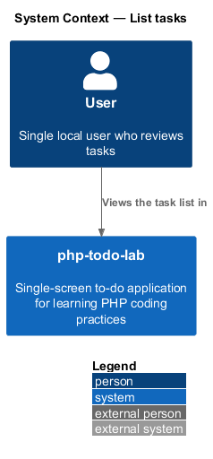
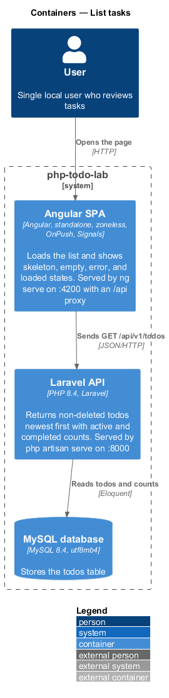
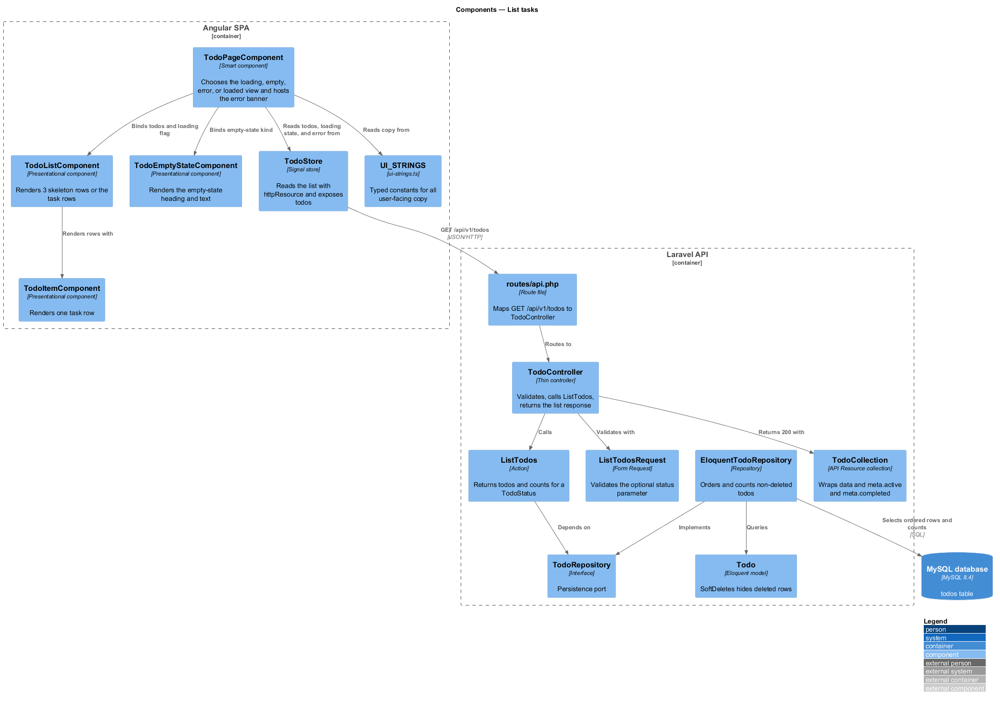
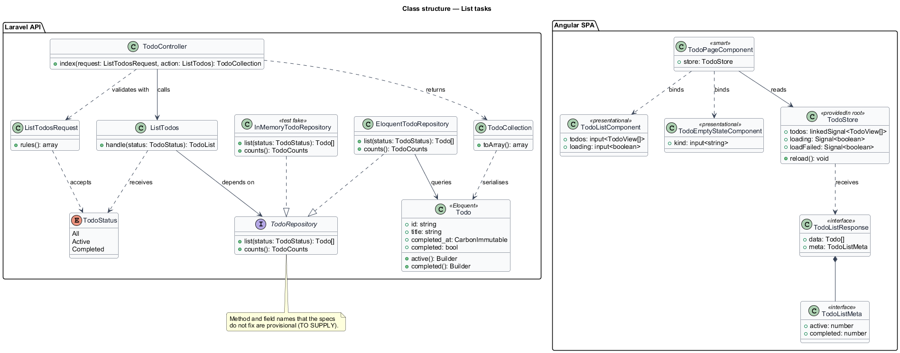
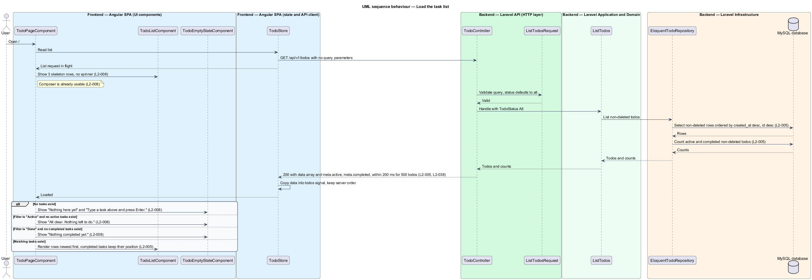
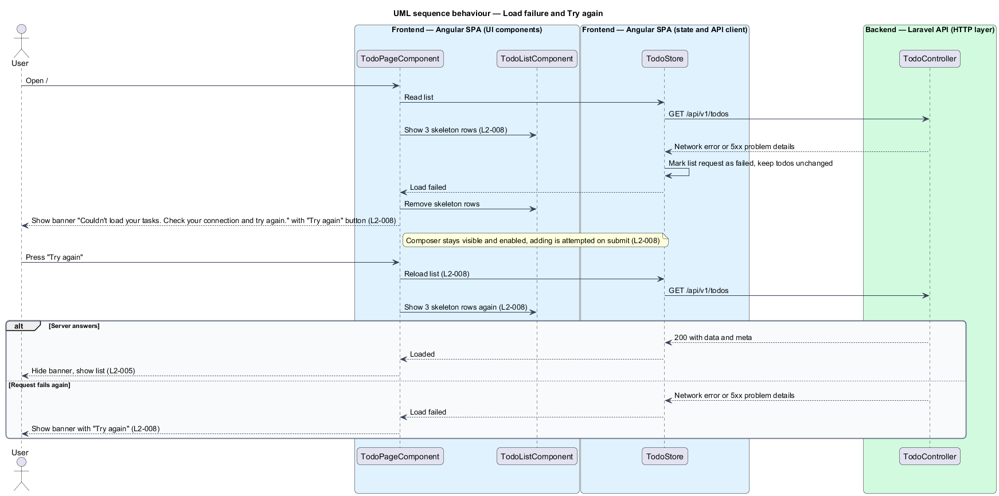

# List tasks

## Overview

php-todo-lab is a single-screen to-do application for one local user. It teaches PHP coding practices through a Laravel API and an Angular single-page application. This feature covers how the application loads the user's tasks and presents them in each data state.

The following terms apply throughout the document.

**task** — unit of work the user wants to remember; the API calls the same thing a *todo*

**active task** — task that is not completed

**completed task** — task whose `completedAt` value is not null

**soft-deleted todo** — todo that carries a `deletedAt` value and is hidden from every list

**list response** — body of `GET /api/v1/todos`, made of a `data` array of todos and a `meta` object with the integer counts `active` and `completed`

**skeleton row** — placeholder row, shown while the list request is in flight, that has the shape of a task row

**empty state** — heading and text shown in place of the list when no row matches

**error banner** — inline message with a "Try again" button, shown when the list request fails

The server returns every non-deleted todo, newest first. The `meta` counts cover all non-deleted todos, whatever filter the user selects. The SPA shows 3 skeleton rows while the request is in flight, an empty state when no task matches, and an error banner when the request fails. The composer stays usable in every state. The visual reference is the mock `docs/mocks/todo.html`, which is a design artifact and is not changed by this feature.

## Description

The feature is a vertical slice from the page to the `todos` table. Names that the specs and the shared design contract do not fix are marked `<TO SUPPLY>`. The diagrams use provisional names for them.

Frontend, Angular SPA:

- **`TodoPageComponent`** — smart component on route `/`. It chooses between the loading, empty, error, and loaded views. It renders the error banner, `<TO SUPPLY>` as part of its own template or as a separate component. It wires the "Try again" button to `TodoStore`.
- **`TodoListComponent`** — presentational component built on `input()` and `output()`. It renders 3 skeleton rows while the list is loading and the task rows otherwise.
- **`TodoItemComponent`** — presentational component that renders one task row.
- **`TodoEmptyStateComponent`** — presentational component that renders the empty-state heading and text for one of three kinds: no tasks at all, no active tasks, and no completed tasks.
- **`TodoStore`** — root-provided signal store. It reads the list through `httpResource`, so the store exposes the loading and error status of the request. The `todos` signal is a `linkedSignal` over the resource value, which keeps the server order and allows later optimistic changes to a local copy. Reloading calls the resource reload.
- **`ui-strings.ts`** — typed constants file that holds all copy as `UI_STRINGS`, including the empty-state, banner, and button strings.

Backend, Laravel API:

- **`routes/api.php`** — maps `GET /api/v1/todos` to `TodoController`.
- **`TodoController`** — thin controller. It validates through `ListTodosRequest`, calls `ListTodos`, and returns the list response.
- **`ListTodosRequest`** — Form Request that validates the optional `status` parameter. The filter feature owns that rule. With no parameter the status is `all`.
- **`ListTodos`** — Action with one public method (`__invoke` or `handle`, `<TO SUPPLY>`). It depends on `TodoRepository` and returns the todos with the active and completed counts.
- **`TodoStatus`** — backed enum with the cases `All`, `Active`, and `Completed`.
- **`TodoRepository`** — interface. **`EloquentTodoRepository`** implements it. **`InMemoryTodoRepository`** is the test fake. Method names are `<TO SUPPLY>`.
- **`EloquentTodoRepository` query** — selects non-deleted todos ordered by `created_at` descending, then `id` descending. The ULID `id` breaks ties between todos with equal `created_at` values. A second query counts active and completed non-deleted todos. The indexes that serve both queries belong to the `create_todos_table` migration (L2-021, owned by another feature).
- **`Todo`** — Eloquent model with `HasUlids`, `SoftDeletes`, and `HasFactory`. `SoftDeletes` excludes soft-deleted todos from every query. The scopes `active()` and `completed()` serve the counts.
- **`TodoCollection`** — list response. It wraps the serialised todos in `data` and adds `meta.active` and `meta.completed`.
- **Exception handler** — renders failures as `application/problem+json` in `bootstrap/app.php`.

Behaviour notes:

- The order is stable because it depends only on `createdAt` and `id`. Completing or editing a task changes neither value, so the row keeps its position.
- Completed tasks appear in the same order as active tasks.
- Retries of the failed read follow the client-resilience requirement (L2-042), which this feature does not own. The error banner appears after those retries finish.
- The composer remains visible and enabled when the list request fails. The add attempt happens on submit.

Open details:

- The list request sends no query parameters, and the SPA derives the visible tasks from the `filter` signal. Whether the SPA ever sends `status` to the server is `<TO SUPPLY>`.
- The use of the `meta` counts by the SPA is `<TO SUPPLY>`. L2-007 states that the SPA computes counts from the task signal.
- The endpoint latency budget has no stated measurement method beyond "developer laptop". The measurement tooling is `<TO SUPPLY>`.

## Requirements

| L2 ID | Refines (L1) | Requirement |
|-------|--------------|-------------|
| `L2-005` | `L1-002` | `GET /api/v1/todos` shall return all non-deleted todos ordered by `createdAt` descending, with ties broken by `id` descending. The order shall be stable, so completing or editing a task does not move it. With no query parameters, the response shall contain `data` (array of todos) and `meta` with `active` and `completed` integer counts for all non-deleted todos regardless of filter. Soft-deleted todos shall never be returned. |
| `L2-008` | `L1-002` | Each data state shall have a designed treatment with plain, actionable copy. While the list request is in flight, 3 skeleton rows shall show, with no spinner, and the composer shall be usable. With no tasks, the empty state shall show "Nothing here yet" and "Type a task above and press Enter.". With the "Active" filter and no matches, it shall show "All clear. Nothing left to do.". With the "Done" filter and no matches, it shall show "Nothing completed yet.". When the list request fails, an inline error banner with "Couldn't load your tasks. Check your connection and try again." and a "Try again" button shall show, and pressing the button shall reload the list. The composer shall remain visible without a disabled state. |
| `L2-038` | `L1-011` | With 500 todos on a developer laptop, every endpoint shall respond in under 200 ms. |

## Diagrams

### System context

The user views the task list through php-todo-lab. The system has no external systems.

### Containers

The Angular SPA requests the list from the Laravel API, which reads todos and counts from the MySQL database.

### Components

In the SPA, the page selects the view and the store reads the list. In the API, the controller calls `ListTodos`, which reads ordered todos and counts through the repository.

### Class structure

`ListTodos` depends on the `TodoRepository` interface and receives a `TodoStatus`. `TodoStore` receives the list response, which holds the todos and the `meta` counts.

### Behaviour — load the list

The page shows skeleton rows while the store requests the list. The server orders the rows and counts the todos, and the page then shows rows or the matching empty state (L2-005, L2-008, L2-038).

### Behaviour — load failure and Try again

A failed request replaces the skeleton rows with the error banner. Pressing "Try again" reloads the list and either restores the list or shows the banner again (L2-008).

