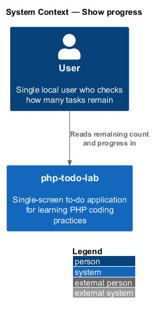
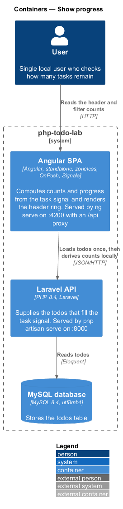
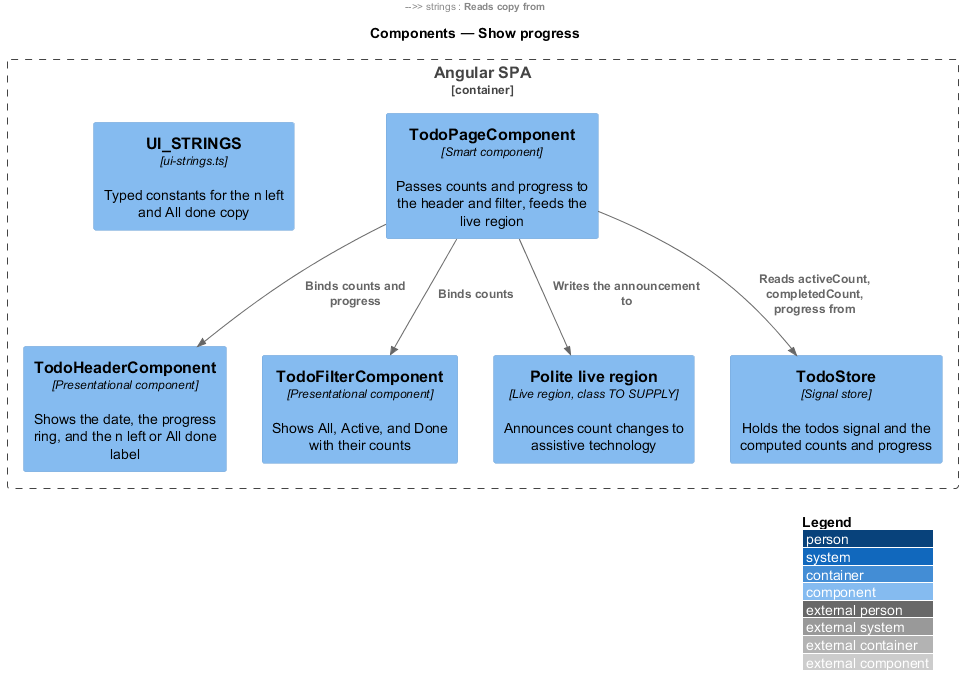
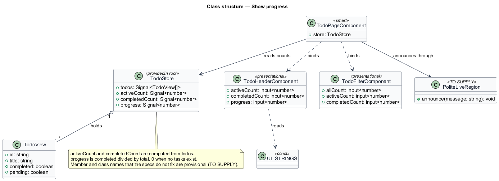
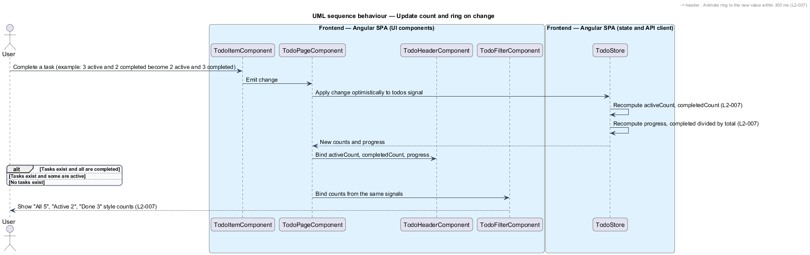
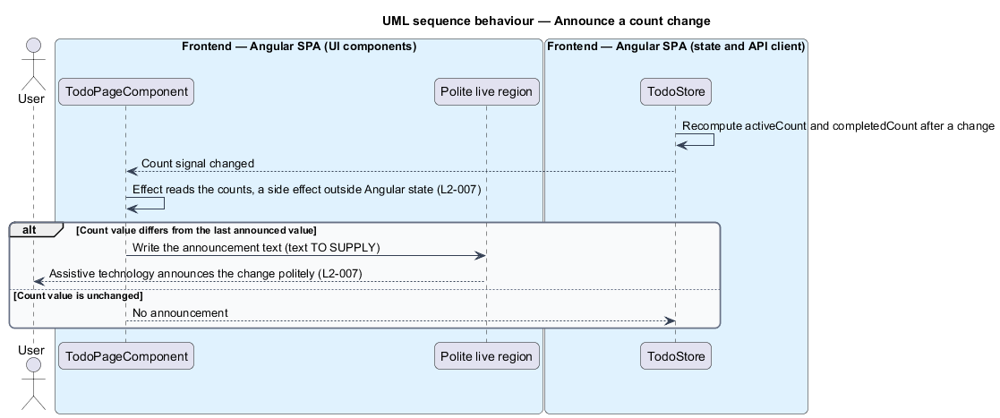

# Show progress

## Overview

php-todo-lab is a single-screen to-do application for one local user. It teaches PHP coding practices through a Laravel API and an Angular single-page application. This feature shows, at a glance, the number of tasks that remain and the share of the list that is done.

The following terms apply throughout the document.

**active task** — task that is not completed

**completed task** — task whose `completedAt` value is not null

**remaining count** — number of active tasks, shown in the header as "n left"

**progress ring** — circular indicator in the header that fills in proportion to completed tasks over total tasks

**progress** — completed tasks divided by total tasks, 0 when no task exists

**task signal** — Angular `signal` in `TodoStore` that holds the list of tasks

**polite live region** — page region whose text changes are announced by assistive technology without interrupting the user

**optimistic update** — change applied to the task signal before the server confirms it

The header shows the remaining count and the progress ring. The counts are `computed` values derived from the task signal. They update on every change, including optimistic changes, and do not wait for the server. The three filter buttons show their counts from the same signals. A polite live region announces count changes to assistive technology.

The visual reference is the mock `docs/mocks/todo.html`. It draws the ring as an SVG circle of radius 20 whose `stroke-dashoffset` follows the progress, with a 300 ms transition. The mock is a design artifact and is not changed by this feature.

## Description

The feature is frontend-only. The Laravel API and the database supply the todos through the list feature, and no endpoint belongs to this slice. Names that the specs and the shared design contract do not fix are marked `<TO SUPPLY>`. The diagrams use provisional names for them.

- **`TodoStore`** — root-provided signal store. The `todos` signal holds the tasks. The computed values `activeCount` and `completedCount` count the tasks by state. The computed value `progress` is the completed count divided by the total, and is 0 when no task exists.
- **`TodoHeaderComponent`** — presentational component built on `input()` and `output()`. It shows the weekday and date, the progress ring, and the label. The label reads "n left" when active tasks exist. It reads "All done" instead of a number when tasks exist and all are completed. It reads "0 left" with an empty ring when no tasks exist. The ring animates to a new value within 300 ms.
- **`TodoFilterComponent`** — presentational component. It shows each filter button with its count, for example "All 5", "Active 2", and "Done 3". The counts come from the same signals as the header.
- **`TodoPageComponent`** — smart component on route `/`. It reads the computed values from `TodoStore` and binds them to the header and the filter. It also feeds the polite live region.
- **Polite live region** — page element with `aria-live="polite"` that is visually hidden. The mock contains such an element. The Angular class that writes to it is `<TO SUPPLY>`. Angular CDK `LiveAnnouncer` is a candidate.
- **`ui-strings.ts`** — typed constants file that holds the label copy as `UI_STRINGS`.

Behaviour notes:

- With 2 active tasks and 3 completed tasks, the header reads "2 left" and the ring is 60% filled.
- Completing a task decrements the remaining count, and the ring animates to the new value within 300 ms.
- The announcement is triggered by an `effect` that reads the counts and writes to the live region. An `effect` is permitted because the write is a side effect outside Angular state.
- Motion limits under `prefers-reduced-motion` belong to the motion requirement (L2-024) and are outside this feature.

Open details:

- The announcement text for a count change is `<TO SUPPLY>`. L2-007 requires an announcement but does not give copy.
- Whether the initial list load announces the count is `<TO SUPPLY>`.
- Whether a pending task counts as active before the server confirms it is `<TO SUPPLY>`. L2-007 requires updates on every change, so the design counts it.
- The Angular class that writes to the live region is `<TO SUPPLY>`.

## Requirements

| L2 ID | Refines (L1) | Requirement |
|-------|--------------|-------------|
| `L2-007` | `L1-002` | The header shall show a progress ring with the number of active tasks ("n left"). The ring shall fill in proportion to completed over total tasks. Counts shall be `computed` from the task signal and shall update optimistically on every change. With 2 active and 3 completed tasks, the header shall read "2 left" and the ring shall be 60% filled. When a task is completed, the count shall decrement and the ring shall animate to the new value within 300 ms. When tasks exist and all are completed, the header shall read "All done" instead of a number. When no tasks exist, the ring shall be empty and the header shall read "0 left". A count change shall be announced to assistive technology through a polite live region. Each filter tab shall show its count ("All 5", "Active 2", "Done 3") from the same signals. |

## Diagrams

### System context

The user reads the remaining count and progress in php-todo-lab. The system has no external systems.

### Containers

The SPA derives counts and progress locally from the todos that the Laravel API supplies. The feature adds no API call.

### Components

The page reads the computed counts from the store and passes them to the header and the filter. It also writes announcements to the polite live region. The diagram shows only the SPA, because the feature is frontend-only.

### Class structure

`TodoStore` holds the tasks and computes the counts and the progress. The page binds them to the header and the filter and announces changes through the live region.

### Behaviour — update count and ring on change

A change to the task signal recomputes the counts and the progress. The header chooses between "n left", "All done", and "0 left", the ring animates, and the filter counts update (L2-007).

### Behaviour — announce a count change

An effect in the page watches the counts and writes the announcement to the polite live region when a count changes (L2-007).

