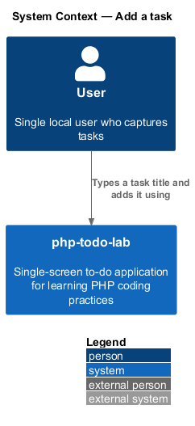
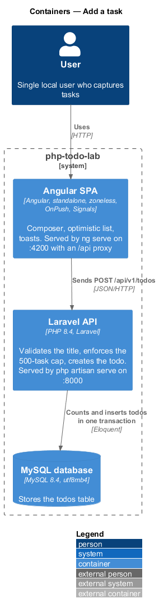
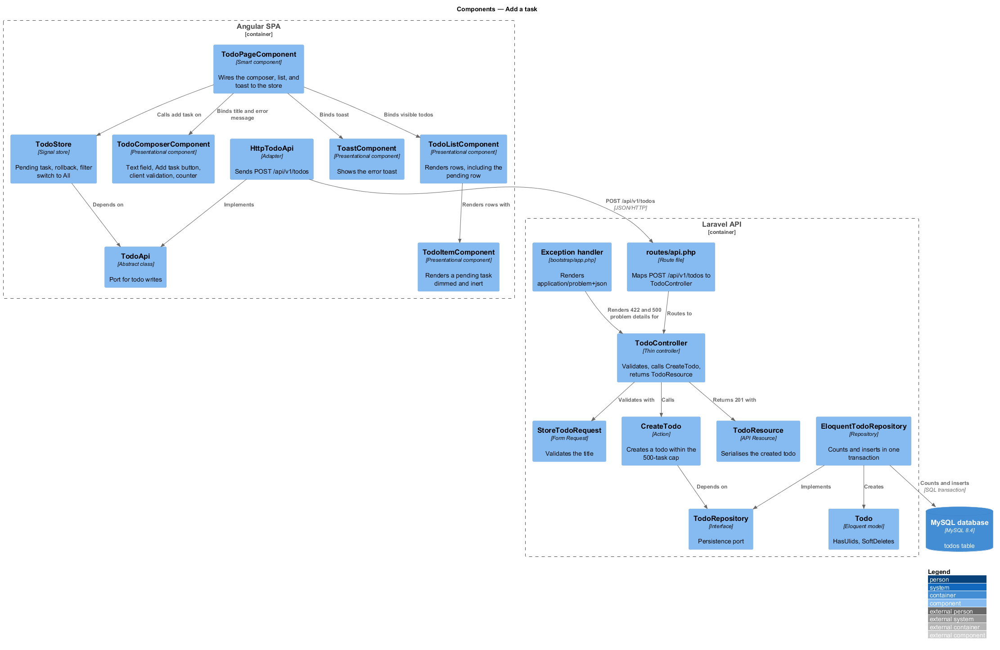
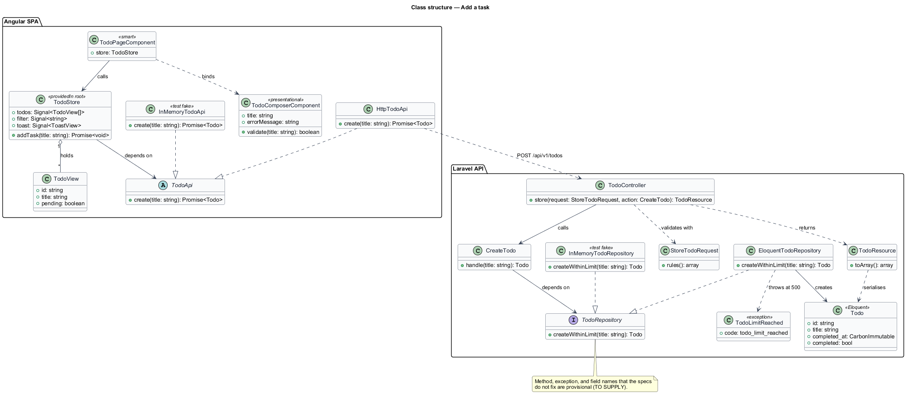
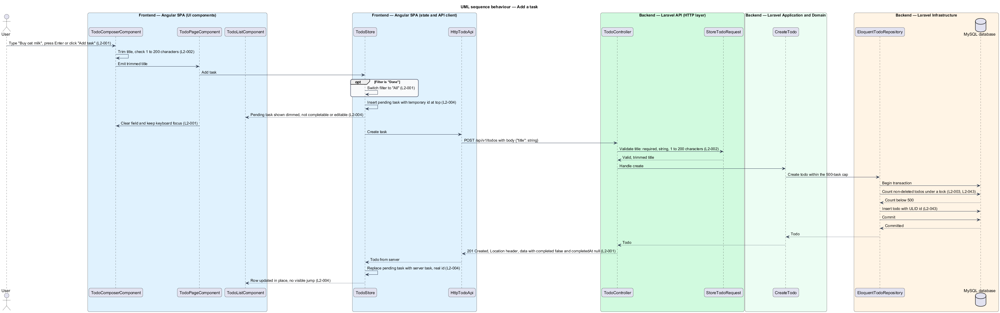
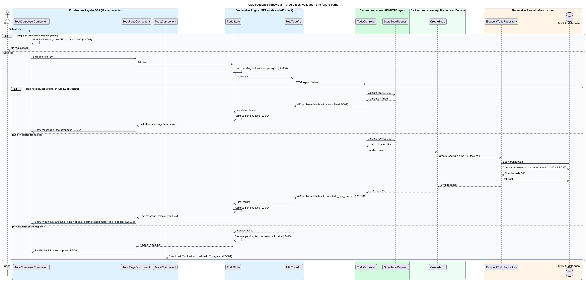

# Add a task

## Overview

php-todo-lab is a single-screen to-do application for one local user. It teaches PHP coding practices through a Laravel API and an Angular single-page application. This feature covers the first action a user performs: capturing a new task.

The following terms apply throughout the document.

**task** — unit of work the user wants to remember, named by a short title; the API calls the same thing a *todo*

**title** — text of a task, 1 to 200 Unicode characters after trimming leading and trailing whitespace

**composer** — single text field with an "Add task" button, at the top of the list, in which the user types a title

**pending task** — task shown in the list before the server confirms it, dimmed and neither completable nor editable

**temporary id** — client-side identifier a pending task carries until the server returns the real ULID

**task cap** — limit of 500 non-deleted todos that keeps the list bounded and glanceable

**rollback** — removal of a pending task, and restoration of the typed title, after a failed request

The user types a title and presses Enter or clicks "Add task". The task appears at the top of the list at once, as a pending task, while the SPA sends `POST /api/v1/todos`. When the server answers `201 Created`, the pending task becomes the server version. When the request fails, the SPA rolls the change back and reports the problem.

Validation runs twice. The client gives fast feedback, and the server is the authority. A server-side transaction checks the task cap and inserts the todo as one unit so that concurrent creates cannot exceed 500. The visual reference is the mock `docs/mocks/todo.html`, which is a design artifact and is not changed by this feature.

## Description

The feature is a vertical slice from the composer to the `todos` table. Names that the specs and the shared design contract do not fix are marked `<TO SUPPLY>`. The diagrams use provisional names for them.

Frontend, Angular SPA:

- **`TodoComposerComponent`** — presentational component built on `input()` and `output()`. It holds the text field and the "Add task" button. It trims the title, rejects an empty title with "Enter a task title.", limits typing to 200 characters, and shows the live counter "n/200" from 160 characters upward. It counts Unicode code points rather than bytes or UTF-16 units. The counting mechanism is `<TO SUPPLY>`.
- **`TodoPageComponent`** — smart component on route `/`. It passes the emitted title to `TodoStore`, clears the composer after submit, returns keyboard focus to it, and shows server or limit messages at the composer.
- **`TodoListComponent`** and **`TodoItemComponent`** — presentational components. They render the pending task at the top of the list, dimmed, with the checkbox and title editing disabled.
- **`ToastComponent`** — presentational component that shows the error toast "Couldn't add that task. Try again."
- **`TodoStore`** — root-provided signal store. On add, it switches the `filter` signal to "All" when the filter is "Done", inserts a pending task into the `todos` signal, and calls `TodoApi`. On success, it replaces the pending task with the server task in place. On failure, it removes the pending task, sets the `toast` signal when the failure is a network error or `5xx`, and hands the typed title back for restoration. The temporary id format is `<TO SUPPLY>`. The mechanism that avoids a visible jump when the id changes is `<TO SUPPLY>`.
- **`TodoApi`** — abstract class that is the port for todo writes. **`HttpTodoApi`** is the adapter and the only class that uses `HttpClient`, wrapped with `firstValueFrom`. **`InMemoryTodoApi`** is the test fake.
- **`ui-strings.ts`** — typed constants file that holds the user-facing copy as `UI_STRINGS`.

Backend, Laravel API:

- **`routes/api.php`** — maps `POST /api/v1/todos` to `TodoController`.
- **`TodoController`** — thin controller. It validates through `StoreTodoRequest`, calls `CreateTodo`, and returns a `TodoResource` with status `201` and a `Location` header. The `Location` target is `<TO SUPPLY>`, because the API in L2-018 has no endpoint that reads a single todo.
- **`StoreTodoRequest`** — Form Request. It requires `title` to be a string of 1 to 200 characters after trimming, and answers `422` with a `title` entry in `errors` otherwise.
- **`CreateTodo`** — Action with one public method (`__invoke` or `handle`, `<TO SUPPLY>`). It depends on `TodoRepository` and creates a todo within the task cap.
- **`TodoRepository`** — interface. **`EloquentTodoRepository`** implements it. **`InMemoryTodoRepository`** is the test fake. The repository operation that counts and inserts is named `<TO SUPPLY>`.
- **`EloquentTodoRepository` transaction** — opens one database transaction, takes a lock that serialises concurrent creates, counts non-deleted todos, and inserts the row only when the count is below 500. The lock strategy is `<TO SUPPLY>`. Soft-deleted todos do not count.
- **Limit exception** — raised when 500 non-deleted todos exist. Its class name is `<TO SUPPLY>`. The exception handler renders it as `422` problem details with the error code `todo_limit_reached`. The problem-details member that carries the code is `<TO SUPPLY>`.
- **`Todo`** — Eloquent model with `HasUlids`, `SoftDeletes`, and `HasFactory`. It derives `completed` from `completed_at`.
- **`TodoResource`** — API Resource. It returns `id`, `title`, `completed`, `completedAt`, `createdAt`, and `updatedAt` inside `data`. A new todo has `completed: false` and `completedAt: null`.
- **Exception handler** — renders errors as `application/problem+json` in `bootstrap/app.php`.

Open details:

- Whether the typed title returns to the composer after a `422` validation response is `<TO SUPPLY>`. L2-004 criterion 3 restores the title only for network and `5xx` failures, and L2-003 criterion 2 keeps it for the limit message.
- The placement of the limit message "You have 500 tasks. Finish or delete some to add more." is `<TO SUPPLY>`. L2-003 criterion 2 says the message is shown but not where.
- The "Task added" announcement belongs to the live-region requirements and is outside this feature.

## Requirements

L2-043 applies to more than one feature. This feature realises criterion 3 (the cap check and insert in one transaction) and applies criterion 4 (UTC timestamps) to the `createdAt` and `updatedAt` values of the new todo.

| L2 ID | Refines (L1) | Requirement |
|-------|--------------|-------------|
| `L2-001` | `L1-001` | The composer shall be a single text field with an "Add task" button at the top of the list. Submitting shall create a task through `POST /api/v1/todos` with body `{"title": string}`, and the server shall respond `201 Created` with the new todo resource and a `Location` header. After a task is added, the composer shall be cleared and keep keyboard focus. When the filter is "Done", adding a task shall switch the filter to "All". |
| `L2-002` | `L1-001` | A title shall be valid when, after trimming, it is 1 to 200 Unicode characters (code points, not bytes). The client shall validate for fast feedback and the server (a Laravel Form Request) shall validate as the authority. An empty or whitespace-only title shall send no request and show "Enter a task title.". A counter "n/200" shall show from 160 characters. A missing or non-string title shall return `422` with a `title` entry in `errors`. |
| `L2-003` | `L1-001` | The system shall hold at most 500 non-deleted todos. At 500, a new todo shall return `422` with error code `todo_limit_reached`, and the UI shall show "You have 500 tasks. Finish or delete some to add more." and keep the typed text. Soft-deleted todos shall not count toward the limit. |
| `L2-004` | `L1-001` | The UI shall show a new task immediately, before the server confirms, and reconcile afterwards. A pending task shall be slightly dimmed and neither completable nor editable. On `201` the pending task shall be replaced by the server version with no visible jump. On a network error or `5xx` the pending task shall be removed, the typed title restored, and the toast "Couldn't add that task. Try again." shown. On `422` the pending task shall be removed and the server field message shown at the composer. |
| `L2-043` | `L1-012` | Bulk operations shall each run in one database transaction. Two simultaneous `PATCH` requests to the same todo shall both succeed and never partially update the row. The 500-task cap check and insert shall run in one transaction so that concurrent creates cannot exceed the cap. Stored and returned timestamps shall be UTC when the server timezone is not UTC. |

## Diagrams

### System context

The user adds tasks through php-todo-lab. The system has no external systems.

### Containers

The Angular SPA sends the create request to the Laravel API, which counts and inserts todos in the MySQL database.

### Components

In the SPA, the page, composer, list, and store handle input and the pending task. In the API, the controller, Form Request, `CreateTodo`, and the repository validate, enforce the cap, and insert.

### Class structure

`TodoStore` depends on the `TodoApi` port. `CreateTodo` depends on the `TodoRepository` interface. `EloquentTodoRepository` creates `Todo` rows and raises the limit exception at 500.

### Behaviour — add a task

The composer validates and the store inserts a pending task before the request leaves. The server validates, checks the cap, and inserts in one transaction, then returns `201`, and the store reconciles (L2-001, L2-002, L2-003, L2-004, L2-043).

### Behaviour — validation and failure paths

Client validation sends no request. A server validation failure, the task cap, and a network or `5xx` failure each remove the pending task and report the problem differently (L2-002, L2-003, L2-004).

