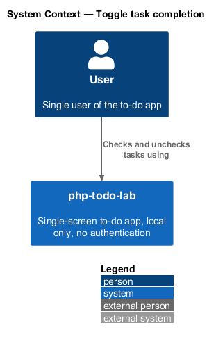
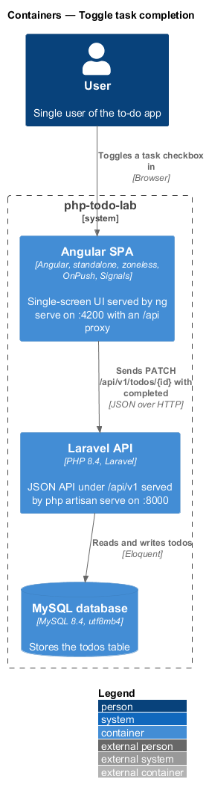
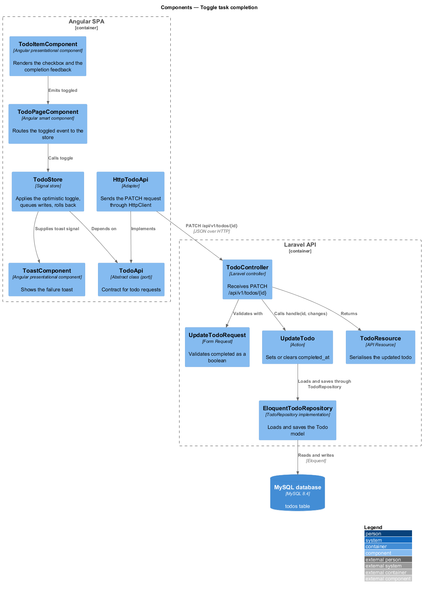
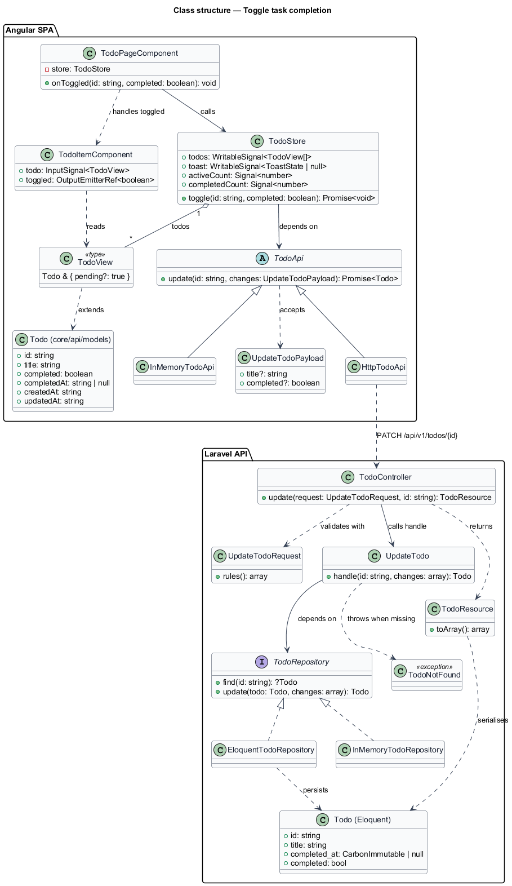
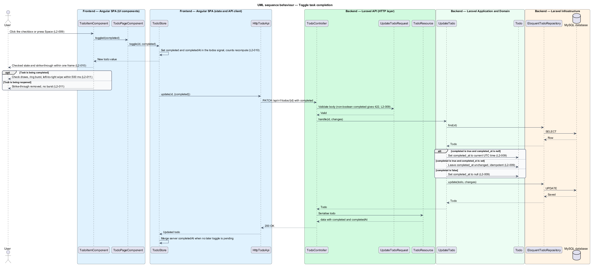
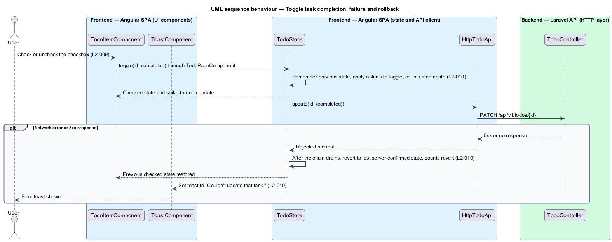
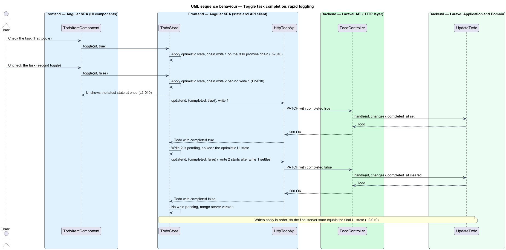

# Toggle task completion

## Overview

php-todo-lab is a single-screen to-do app for one local user. The user keeps a list of tasks and marks each one done or not done. This feature covers that marking: checking a task completes it, and unchecking a completed task reopens it.

Terms used in this document:

- **task** — item in the to-do list, called a todo in the API
- **completed task** — task whose `completedAt` timestamp is set
- **active task** — task whose `completedAt` timestamp is null
- **optimistic update** — change applied in the user interface before the server confirms it
- **rollback** — restoration of the previous state after the server rejects an optimistic update
- **completion feedback** — animation that confirms a task was completed

The feature exists so that completing a task feels immediate and rewarding. The checkbox responds within one frame. The server request follows in the background, and the interface returns to the previous state if the request fails.

The feature touches both tiers. The Angular SPA renders the checkbox, applies the optimistic update, and queues the write. The Laravel API validates the request, stores `completedAt`, and returns the updated todo.

## Description

The slice runs from the checkbox in a list row to the `todos` table.

Frontend (Angular SPA):

- **`TodoItemComponent`** — presentational component for one row. It renders the native checkbox, emits a `toggled` output when the checkbox changes, and plays the completion feedback: check draw, ring burst, and left-to-right strike-through wipe. It plays the burst only when `completed` changes from false to true after first render. Reopening removes the strike-through without the burst. Under `prefers-reduced-motion: reduce`, it skips the burst and the wipe and changes colour only. A completed title uses the muted text token `--slate` from `tokens.scss`, the same token the mock uses. The component receives the row as the `todo` input of type `TodoView` and emits `toggled: boolean`.
- **`TodoPageComponent`** — smart component. It handles `toggled` and calls `TodoStore.toggle(id, completed)`.
- **`TodoStore`** — signal store. It captures the previous state of the task, sets `completed` and `completedAt` optimistically in the `todos` signal, and lets `activeCount` and `completedCount` recompute. It keeps one promise chain per task, so a second `PATCH` starts only after the first settles. While a later write is pending for a task, the store keeps the optimistic state and does not overwrite it with an earlier server response. It records the last server-confirmed state of the task after each successful write. On failure, it waits until the chain drains, then reverts the task to the last server-confirmed state, and sets the `toast` signal. The rollback is internal to `toggle`; the store exposes no separate rollback method.
- **`ToastComponent`** — presentational component. It renders the error toast "Couldn't update that task." with `role="alert"`.
- **`TodoApi`** — abstract class that defines `update(id: string, changes: UpdateTodoPayload): Promise<Todo>`. **`HttpTodoApi`** is the only implementation that uses `HttpClient`. It applies `timeout(10_000)`, never retries a write, and converts failures to `ApiError` with the status and parsed problem body. **`InMemoryTodoApi`** is the test fake that can be set to fail on demand.
- **`UI_STRINGS`** in `src/app/features/todos/ui-strings.ts` — typed constants that hold the toast copy in the `toasts` group.

Backend (Laravel API):

- **`TodoController`** — thin controller for `PATCH /api/v1/todos/{id}` under `routes/api.php`. It validates through the form request, calls `UpdateTodo::handle`, and returns a resource. The `{todo}` route parameter uses `whereUlid`, so a malformed id is a `404` from routing.
- **`UpdateTodoRequest`** — form request. It rejects a non-boolean `completed` with `422` and an error entry for the field.
- **`UpdateTodo`** — action with a single public method, `handle(string $id, array $changes): Todo`. It loads the todo through `TodoRepository::find` and throws `TodoNotFound` when the todo is missing or soft-deleted. It sets `completed_at` to the current UTC time when completing. It sets `completed_at` to null when reopening. It leaves `completed_at` unchanged when the todo is already completed. It then calls `TodoRepository::update`, which issues one `UPDATE` statement.
- **`TodoRepository`** — interface that the action depends on. This feature uses `find(string $id): ?Todo` and `update(Todo $todo, array $changes): Todo`. **`EloquentTodoRepository`** implements it, and **`InMemoryTodoRepository`** is the unit-test fake.
- **`Todo`** — Eloquent model with a `completed_at` cast to `immutable_datetime` and a computed `completed` accessor.
- **`TodoResource`** — serialises the todo as `id`, `title`, `completed`, `completedAt`, `createdAt`, and `updatedAt`, wrapped in `data`.

The method names in the diagrams, `toggle`, `update`, `find`, and `handle`, are the settled names.

Further decisions:

- A failed write does not cancel later writes queued for the same task. The later writes still run in order. After the chain drains, the task reverts to the last server-confirmed state when any write in the chain failed, and the counts revert with it.
- A `404` response to a toggle follows `L2-014` criterion 5. The store removes the row from the `todos` signal and shows the error toast "That task no longer exists.".
- `TodoItemComponent` distinguishes a completion transition from the initial render in an `effect` over the `todo` input. The effect stores the `completed` value it last saw. The first run only records the value, and later runs play the burst when the value changes from false to true.

## Requirements

Acceptance criteria are cited by number in prose where the diagrams enforce them. The table is the requirement.

| L2 ID | Refines (L1) | Requirement |
|-------|--------------|-------------|
| `L2-009` | `L1-003` | Each row shall have a checkbox. Changing it shall call `PATCH /api/v1/todos/{id}` with `{"completed": boolean}`. The server shall set `completedAt` to the current UTC time when completing and to `null` when reopening. The operation shall be idempotent: completing a completed task shall leave `completedAt` unchanged. A non-boolean `completed` value shall return `422`. Pressing Space on the focused checkbox shall toggle it. |
| `L2-010` | `L1-003` | The checked state, strike-through, and counts shall update within one frame (target 16 ms, hard limit 100 ms) without waiting for the server. When the `PATCH` fails, the task and the counts shall revert and the toast "Couldn't update that task." shall be shown. When the user toggles the same task rapidly, requests shall be applied in order and the final server state shall equal the final UI state. |
| `L2-011` | `L1-003` | Completing a task shall draw the check, radiate a brief ring burst from the checkbox, and strike the title through with a left-to-right wipe, all within 500 ms. A completed title shall use the muted text token and shall keep a contrast of at least 4.5:1. Under `prefers-reduced-motion: reduce`, no burst or wipe shall run and the state shall change instantly with a colour change only. Reopening shall remove the strike-through without the burst. |

## Diagrams

### System context

The user checks and unchecks tasks in php-todo-lab. The system has no external systems.

### Containers

The Angular SPA sends the toggle as a `PATCH` to the Laravel API, which stores `completedAt` in the MySQL database.

### Components

In the SPA, the item emits `toggled` and the store applies the change and calls the `TodoApi` port. In the API, the controller validates through `UpdateTodoRequest` and calls `UpdateTodo::handle`, which persists through the repository.

### Class structure

`TodoStore` depends on the `TodoApi` abstraction, which `HttpTodoApi` and `InMemoryTodoApi` implement. `UpdateTodo` depends on the `TodoRepository` interface, which `EloquentTodoRepository` and `InMemoryTodoRepository` implement.

### Behaviour — toggle with success

The store updates the interface first, then sends the `PATCH`. The action applies the idempotent `completedAt` rule from `L2-009` and the response reconciles the task.

### Behaviour — toggle failure and rollback

When the request fails with a network error or a `5xx` response, the store restores the previous state and counts and shows the toast from `L2-010`. The client does not retry the write.

### Behaviour — rapid toggling

Two quick toggles update the interface at once and queue two writes in order. The first response does not overwrite the later optimistic state, so the final server state equals the final interface state (`L2-010`).

