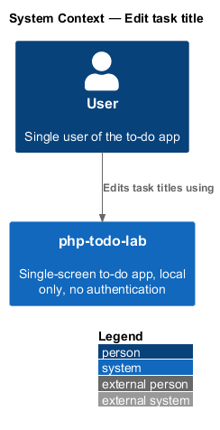
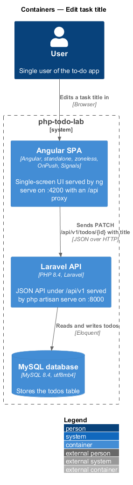
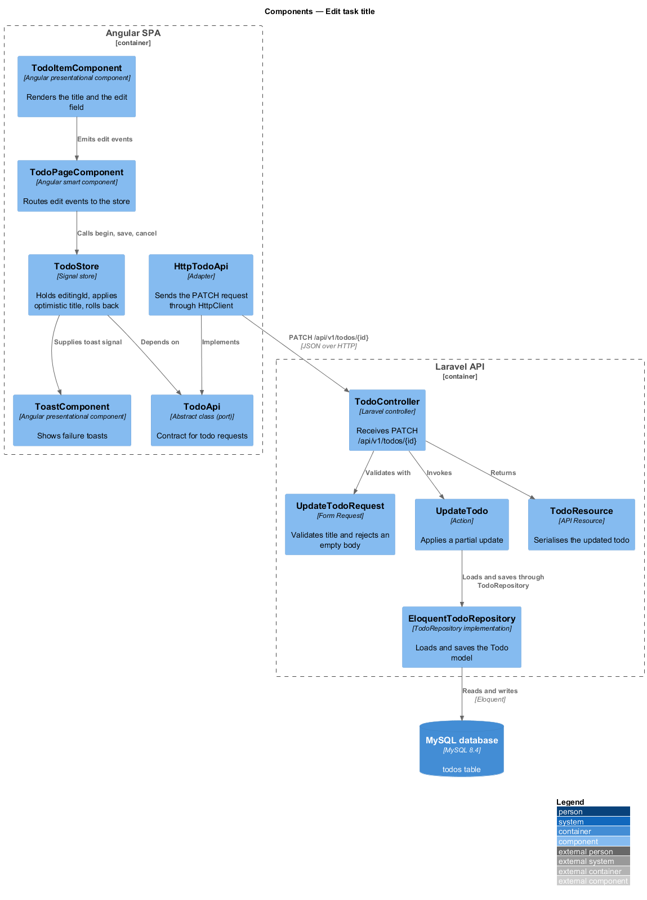
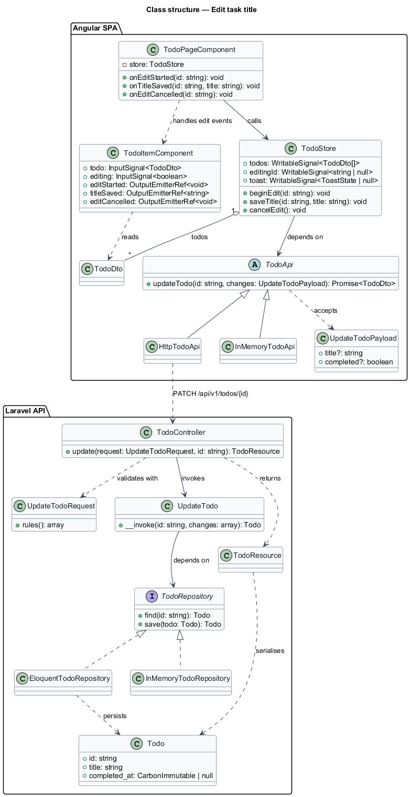
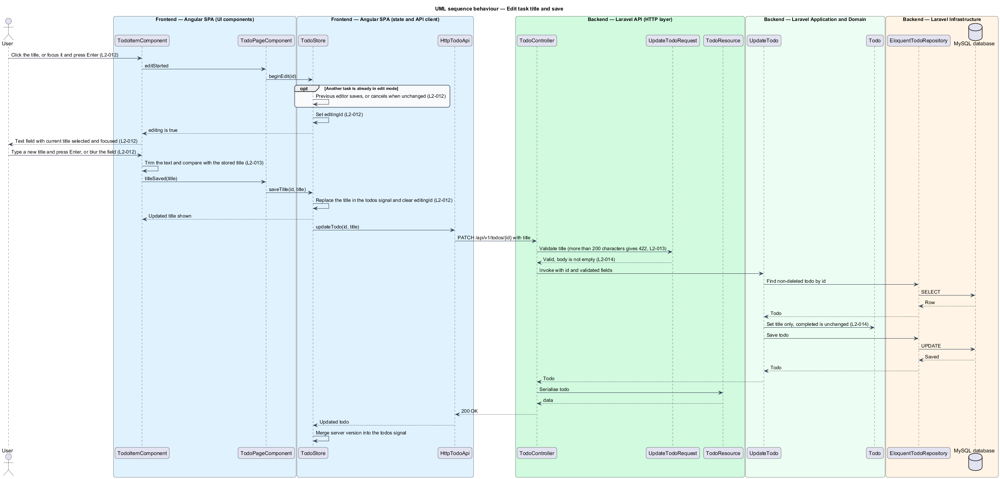
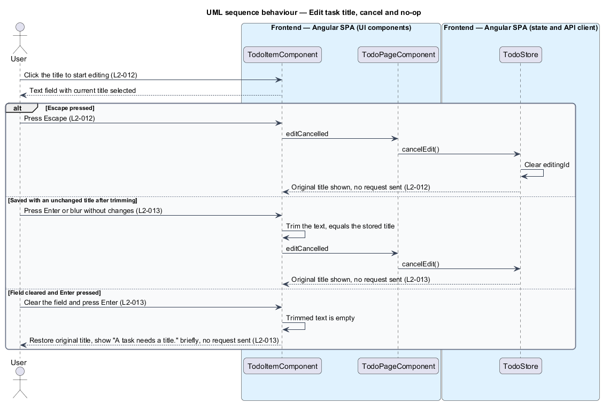
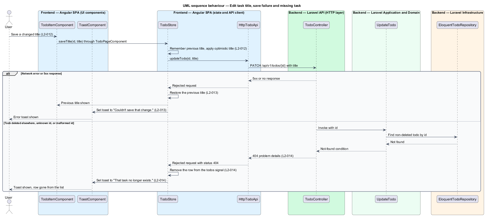

# Edit task title

## Overview

php-todo-lab is a single-screen to-do app for one local user. Each task in the list has a title. This feature lets the user correct a title in place, without leaving the list.

Terms used in this document:

- **task** — item in the to-do list, called a todo in the API
- **edit mode** — state in which a row shows a text field instead of the static title
- **optimistic update** — change applied in the user interface before the server confirms it
- **rollback** — restoration of the previous state after the server rejects an optimistic update
- **no-op save** — save in which the trimmed text equals the stored title

The user starts editing by clicking the title, or by focusing it and pressing Enter. Enter or blur saves, and Escape cancels. A completed task is also editable. Only one task is in edit mode at a time.

The save is optimistic. The new title shows at once and the `PATCH` follows. A failure restores the previous title. A `404`, which means the task was deleted elsewhere, removes the row.

On the server, the same `PATCH` endpoint accepts a partial update. A title-only body leaves `completed` unchanged.

## Description

The slice runs from the title in a row to the `todos` table.

Frontend (Angular SPA):

- **`TodoItemComponent`** — presentational component for one row. It renders the title and, in edit mode, a text field with the current value selected and focused. It trims the text on save and compares it with the stored title. It emits `editStarted`, `titleSaved` with the new title, or `editCancelled`. After it emits a save or a cancel, it ignores the blur that follows, so a single edit produces a single save. For an empty field, it restores the original title and shows "A task needs a title." briefly. The display duration is `<TO SUPPLY>`.
- **`TodoPageComponent`** — smart component. It maps the item events to store calls.
- **`TodoStore`** — signal store. It holds `editingId`, replaces the title in the `todos` signal optimistically, and keeps the previous title for rollback. On a rejection with status `404`, it removes the row. On any other rejection, it restores the title. In both cases it sets the `toast` signal.
- **`ToastComponent`** — presentational component. It renders the toasts "Couldn't save that change." and "That task no longer exists."
- **`TodoApi`**, **`HttpTodoApi`**, **`InMemoryTodoApi`** — the port, the `HttpClient` adapter, and the test fake. `HttpTodoApi` reports the HTTP status of a failure so that the store can recognise `404`. The error type is `<TO SUPPLY>`.
- **`UI_STRINGS`** in `ui-strings.ts` — typed constants that hold the copy.

Backend (Laravel API):

- **`TodoController`** — thin controller for `PATCH /api/v1/todos/{id}`.
- **`UpdateTodoRequest`** — form request. It validates `title` as a string of at most 200 characters, and it rejects an empty body `{}` with `422`. It exposes only `title` and `completed`, so `id`, `createdAt`, `deletedAt`, and unknown fields are ignored.
- **`UpdateTodo`** — action with a single `__invoke` method. It loads the non-deleted todo through `TodoRepository`, applies only the fields present, and saves. The last write wins. When no todo matches, it raises a not-found condition (type `<TO SUPPLY>`), which the exception handler renders as a `404` `application/problem+json` response.
- **`TodoRepository`**, **`EloquentTodoRepository`**, **`InMemoryTodoRepository`** — the interface, the Eloquent implementation, and the unit-test fake.
- **`Todo`** — Eloquent model with soft deletes, so a soft-deleted todo is not found.
- **`TodoResource`** — serialises the updated todo.

Method names shown in the diagrams, such as `beginEdit`, `saveTitle`, `updateTodo`, `find`, and `save`, are indicative. Final names are `<TO SUPPLY>`.

Open details:

- Whether edit mode ends after a rejected empty save, and the result of a blur on an empty field: `<TO SUPPLY>`.
- Mechanism that maps a malformed id to `404` (route constraint or lookup): `<TO SUPPLY>`.
- UI treatment of a `422` response to a title save: `<TO SUPPLY>`. The client limits the title to 200 characters, so the response arises only from a direct request.

## Requirements

Acceptance criteria are cited by number in prose where the diagrams enforce them. The table is the requirement.

| L2 ID | Refines (L1) | Requirement |
|-------|--------------|-------------|
| `L2-012` | `L1-004` | The user shall activate editing by clicking the title, or by focusing it and pressing Enter. The title shall become a text field with the current value selected. Enter or blur shall save and Escape shall cancel. Saving shall call `PATCH /api/v1/todos/{id}` with `{"title": string}`. The title shall update optimistically. A completed task shall also be editable. Only one task shall be in edit mode at a time, and beginning another edit shall save the first, or cancel it when unchanged. |
| `L2-013` | `L1-004` | Saving an unchanged title after trimming shall send no request. Clearing the field and pressing Enter shall restore the original title, show "A task needs a title." briefly, and send no request. The server shall return `422` for a 201-character title. When the `PATCH` fails, the previous title shall be restored and the toast "Couldn't save that change." shall be shown. |
| `L2-014` | `L1-004` | `PATCH` shall accept any non-empty subset of `title` and `completed`, ignore unknown fields, and apply the last write. A body `{"title": "X"}` shall leave `completed` unchanged. An empty body `{}` shall return `422`. An id that does not exist, is soft-deleted, or is not a valid ULID shall return `404` with a problem-details body. When the UI patches a task deleted elsewhere, it shall remove the row and show the toast "That task no longer exists." A body containing `id`, `createdAt`, or `deletedAt` shall leave those fields unchanged. |

## Diagrams

### System context

The user edits task titles in php-todo-lab. The system has no external systems.

### Containers

The Angular SPA sends the title change as a `PATCH` to the Laravel API, which stores it in the MySQL database.

### Components

In the SPA, the item emits edit events, the page forwards them, and the store applies the change through the `TodoApi` port. In the API, the controller validates through `UpdateTodoRequest` and invokes `UpdateTodo`.

### Class structure

`TodoItemComponent` emits edit events that `TodoPageComponent` passes to `TodoStore`. `UpdateTodo` depends on the `TodoRepository` interface rather than on Eloquent.

### Behaviour — edit and save

The user enters edit mode, changes the title, and presses Enter or blurs. The store updates the title at once. The server applies only `title` (`L2-014`) and the response reconciles the task.

### Behaviour — cancel, no-op, and empty title

Escape, an unchanged title, and an empty title all end without a request. The empty title also restores the original text and shows "A task needs a title." (`L2-013`).

### Behaviour — save failure and missing task

A network error or `5xx` response restores the previous title and shows "Couldn't save that change." A `404` response removes the row and shows "That task no longer exists."

