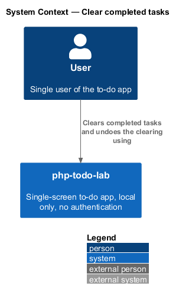
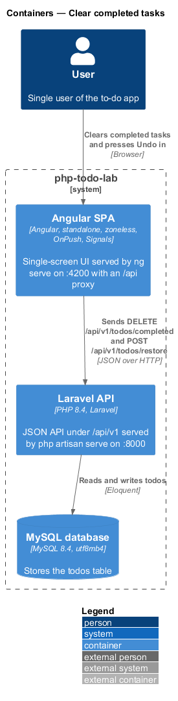
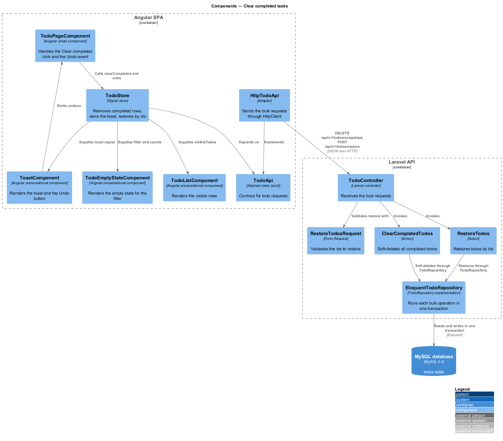
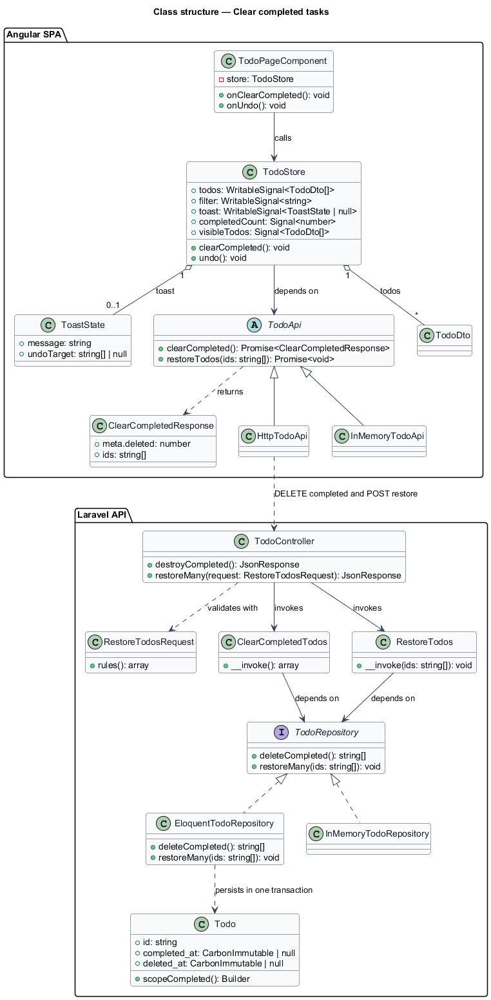
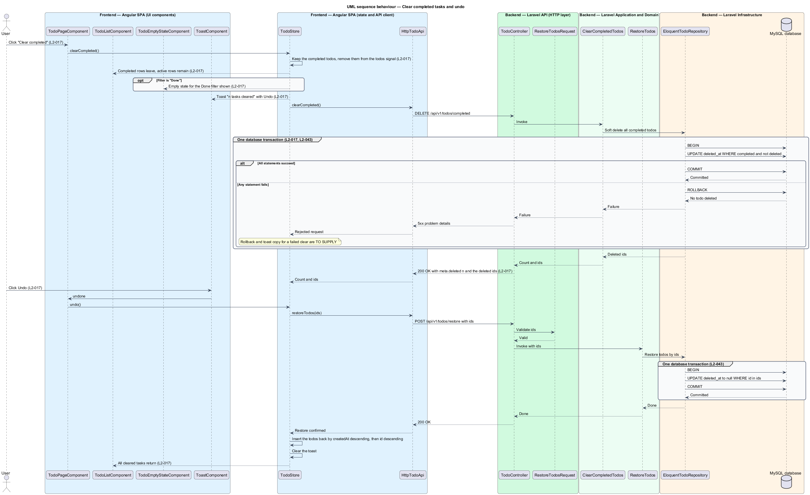
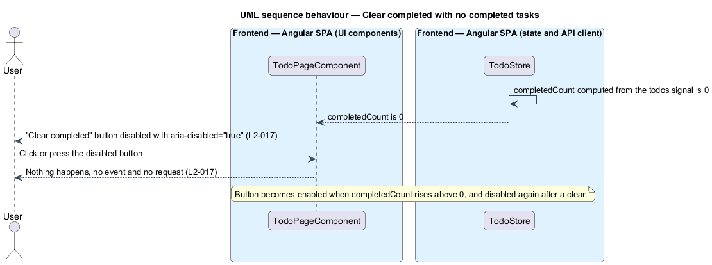

# Clear completed tasks

## Overview

php-todo-lab is a single-screen to-do app for one local user. This feature lets the user remove every finished task with one action and recover them shortly afterwards.

Terms used in this document:

- **task** — item in the to-do list, called a todo in the API
- **completed task** — task whose `completedAt` timestamp is set
- **soft delete** — deletion that sets a `deleted_at` timestamp and keeps the row, so the todo can be restored
- **bulk operation** — server operation that changes a set of todos in one request
- **database transaction** — group of statements that either all take effect or none does
- **toast** — transient message at the bottom of the screen, here with an "Undo" button

The list toolbar holds a "Clear completed" button. Pressing it soft-deletes all completed todos through one request. A toast "n tasks cleared" with an "Undo" button follows, where n is the number of cleared tasks. "Undo" restores the same todos by id through a second request.

Both bulk operations run in one database transaction, so either all affected todos change or none does. When no completed task exists, the button is disabled.

## Description

The slice runs from the toolbar button to the `todos` table.

Frontend (Angular SPA):

- **"Clear completed" button** — control in the toolbar region. It is disabled and carries `aria-disabled="true"` when `completedCount` is 0. The presentational component that renders it is `<TO SUPPLY>`.
- **`TodoPageComponent`** — smart component. It handles the click and the `undone` event from the toast and calls the store.
- **`TodoStore`** — signal store. `completedCount` is computed from the `todos` signal. On clear, it keeps the completed todos, removes them from the `todos` signal, and sets the `toast` signal to "n tasks cleared" with Undo. It uses the ids returned by the server for the restore request. On undo, it inserts the restored todos by `createdAt` descending, then `id` descending, and clears the toast.
- **`TodoListComponent`** — presentational component that renders `visibleTodos`.
- **`TodoEmptyStateComponent`** — presentational component. When the user clears on the "Done" filter, `visibleTodos` becomes empty and this component shows the empty state for that filter.
- **`ToastComponent`** — presentational component. It renders the message and the "Undo" button, and emits `undone`.
- **`TodoApi`**, **`HttpTodoApi`**, **`InMemoryTodoApi`** — the port, the `HttpClient` adapter, and the test fake.
- **`UI_STRINGS`** in `ui-strings.ts` — typed constants that hold the copy.

Backend (Laravel API):

- **`TodoController`** — thin controller for `DELETE /api/v1/todos/completed` and `POST /api/v1/todos/restore`.
- **`RestoreTodosRequest`** — form request that validates the ids to restore. The body key and the rules are `<TO SUPPLY>`.
- **`ClearCompletedTodos`** — action that soft-deletes all completed todos through `TodoRepository`. It returns the count and the deleted ids.
- **`RestoreTodos`** — action that restores the todos for the given ids through `TodoRepository`.
- **`TodoRepository`**, **`EloquentTodoRepository`**, **`InMemoryTodoRepository`** — the interface, the Eloquent implementation, and the unit-test fake. Each bulk method of `EloquentTodoRepository` runs in one database transaction, so the actions stay free of Eloquent. The `completed()` scope on `Todo` selects the completed todos.
- **`Todo`** — Eloquent model with `SoftDeletes`.

The `DELETE` response is `200` with `{"meta": {"deleted": n}}` and the deleted ids. The response key for the ids is `<TO SUPPLY>`. The body of the restore response is `<TO SUPPLY>`.

Method names shown in the diagrams, such as `clearCompleted`, `restoreTodos`, `deleteCompleted`, and `restoreMany`, are indicative. Final names are `<TO SUPPLY>`.

Open details:

- Plural and singular copy of the toast for n equal to 1: `<TO SUPPLY>`.
- Toast duration and whether Ctrl/Cmd+Z applies to this toast: `<TO SUPPLY>`. The 6 second duration and the shortcut are specified for single deletion only.
- UI treatment and toast copy when the clear request fails: `<TO SUPPLY>`.
- Outcome of a restore request that contains an id that no longer exists: `<TO SUPPLY>`.
- Order of the restore request when "Undo" is pressed before the clear response arrives: `<TO SUPPLY>`.

## Requirements

Acceptance criteria are cited by number in prose where the diagrams enforce them. The table is the requirement. For `L2-043`, only criterion 1 is in scope.

| L2 ID | Refines (L1) | Requirement |
|-------|--------------|-------------|
| `L2-017` | `L1-005` | A "Clear completed" button in the list toolbar shall soft-delete all completed todos through `DELETE /api/v1/todos/completed`, which returns `200` with `{"meta": {"deleted": n}}` and the deleted ids. A toast "n tasks cleared" with "Undo" shall appear, and "Undo" shall restore the todos through `POST /api/v1/todos/restore` with the ids. Clearing 3 completed among 5 tasks shall remove the 3 completed rows and keep the 2 active rows. With zero completed tasks, the button shall be disabled and shall have `aria-disabled="true"`. "Undo" shall return all cleared tasks. The bulk delete shall run in a single database transaction: either all complete or none. On the "Done" filter, clearing shall show the empty state for that filter. |
| `L2-043` | `L1-012` | The bulk operations (clear completed, restore many) shall each run in one database transaction. |

## Diagrams

### System context

The user clears completed tasks and undoes the clearing in php-todo-lab. The system has no external systems.

### Containers

The Angular SPA sends the bulk `DELETE` and restore requests to the Laravel API, which changes `deleted_at` in the MySQL database.

### Components

In the SPA, the page calls the store, which supplies the list, the empty state, and the toast. In the API, the controller invokes `ClearCompletedTodos` or `RestoreTodos`, and the repository runs each bulk operation in one transaction.

### Class structure

`TodoStore` depends on the `TodoApi` abstraction. `ClearCompletedTodos` and `RestoreTodos` depend on the `TodoRepository` interface, which declares the bulk operations.

### Behaviour — clear completed then undo

The store removes the completed rows and shows the toast, then the server soft-deletes the completed todos in one transaction (`L2-017`, `L2-043`). "Undo" sends the ids to the restore endpoint, which also runs in one transaction, and the todos return to the list.

### Behaviour — empty and disabled state

With no completed tasks, `completedCount` is 0 and the button is disabled with `aria-disabled="true"`. A click produces no event and no request.

