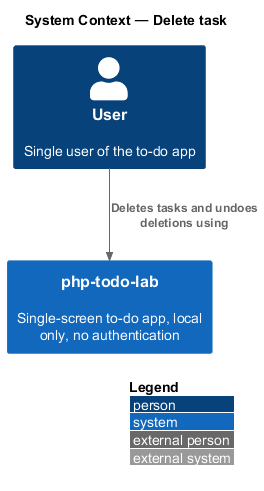
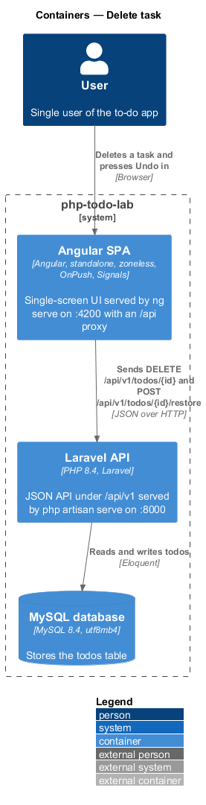
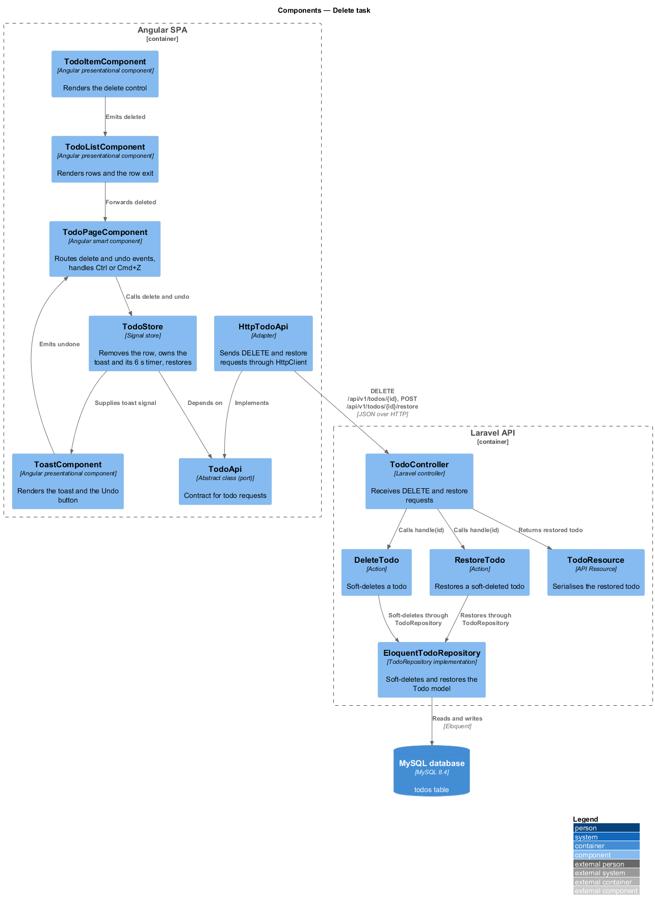
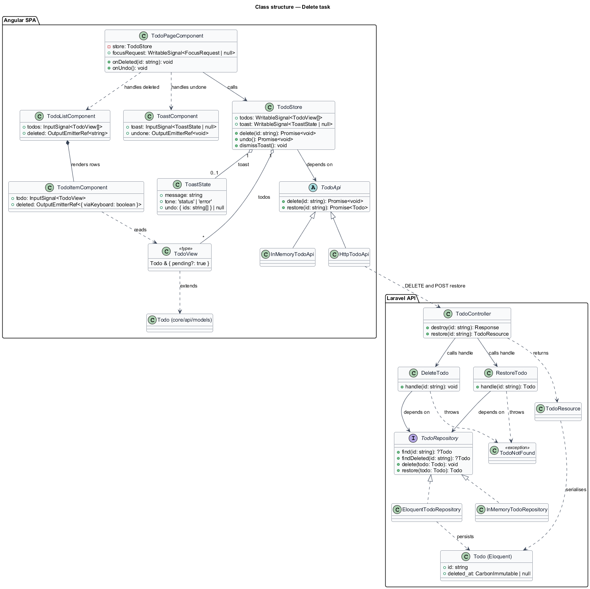
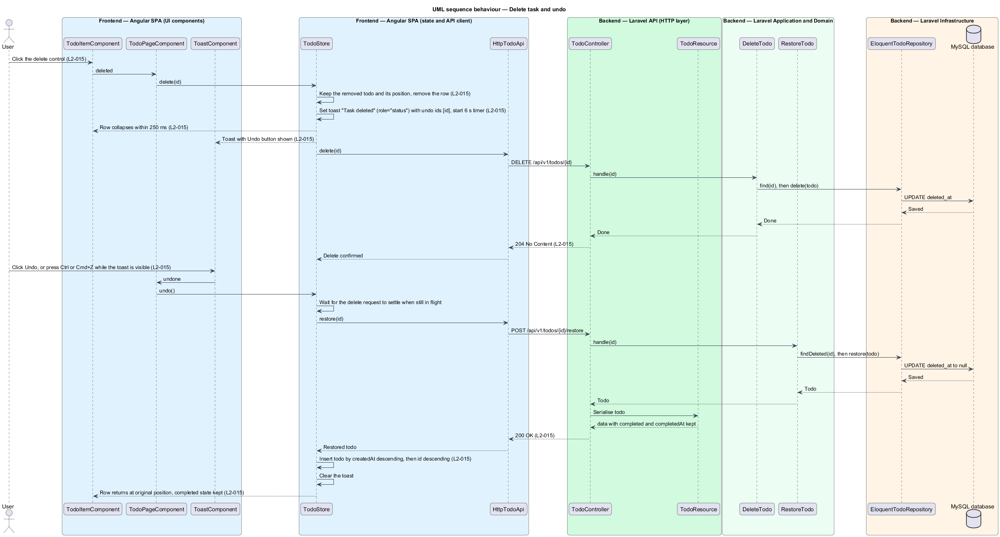
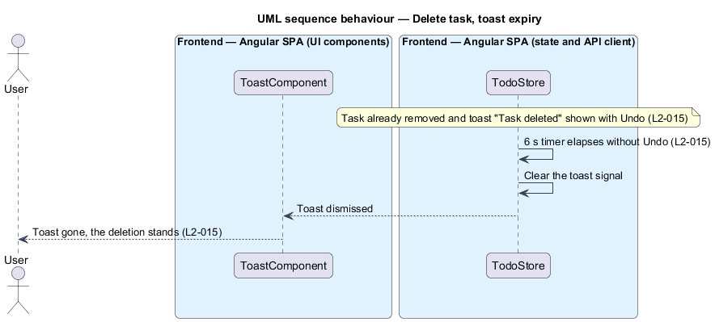
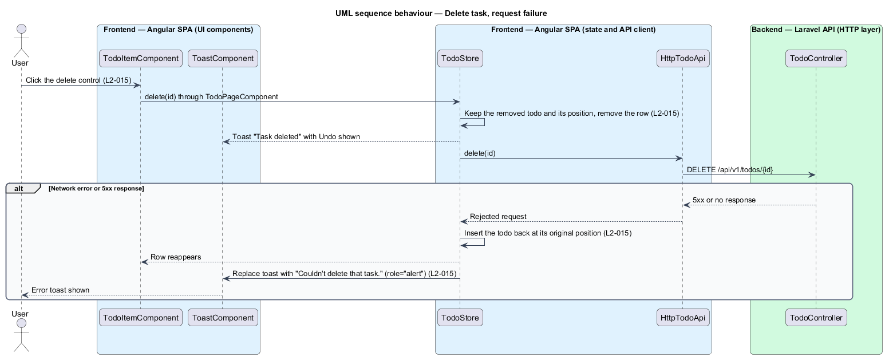
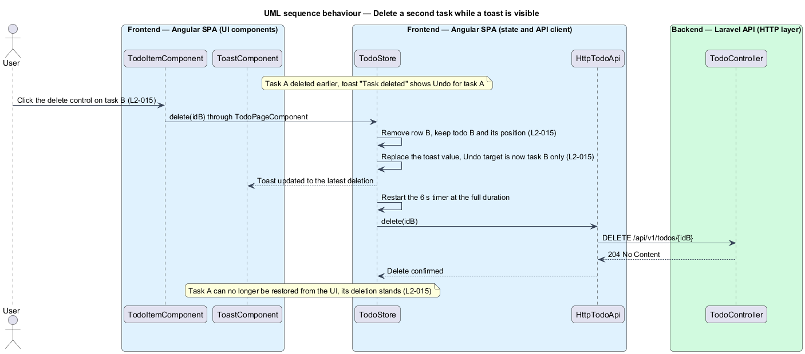
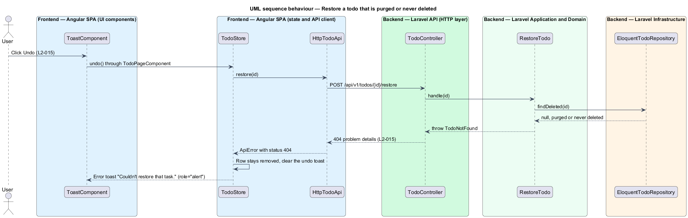

# Delete task

## Overview

php-todo-lab is a single-screen to-do app for one local user. This feature lets the user delete one task and recover from a mistake shortly afterwards.

Terms used in this document:

- **task** — item in the to-do list, called a todo in the API
- **soft delete** — deletion that sets a `deleted_at` timestamp and keeps the row, so the todo can be restored
- **restore** — reversal of a soft delete that returns the todo to the list
- **toast** — transient message at the bottom of the screen, here with an "Undo" button
- **optimistic update** — change applied in the user interface before the server confirms it
- **rollback** — restoration of the previous state after the server rejects an optimistic update

Deleting a task removes its row at once and shows the toast "Task deleted" with an "Undo" button for 6 seconds. The server soft-deletes the todo and returns `204`. When the user presses "Undo", the server restores the todo and the task returns at its original chronological position. It keeps its completed state and `completedAt`. When the toast expires, the deletion stands.

The scheduled purge of old soft-deleted todos belongs to another requirement and is outside this design.

## Description

The slice runs from the delete control in a row to the `todos` table.

Frontend (Angular SPA):

- **`TodoItemComponent`** — presentational component for one row. It renders the delete control with the `aria-label` "Delete <title>", as in the mock, and emits the `deleted` output with `{ viaKeyboard: boolean }`.
- **`TodoListComponent`** — presentational component that renders the rows and forwards `deleted`. It plays the row exit so that the row collapses within 250 ms. The exit uses Angular's native `animate.leave` binding with a CSS class whose transition collapses the row height and fades it out. Under `prefers-reduced-motion: reduce`, the class removes the row without motion.
- **`ToastComponent`** — presentational component. It renders the message and the "Undo" button, and emits `undone`. The undo toast uses `role="status"` and an error toast uses `role="alert"`. The toast is placed in the toast area, which is the last region of the page.
- **`TodoPageComponent`** — smart component. It maps `deleted` and `undone` to `delete(id)` and `undo()` on the store. It also handles Ctrl+Z and Cmd+Z while the undo toast is visible. After a keyboard delete, it sets its `focusRequest` signal so that focus moves to the next row's checkbox, else the previous row's checkbox, else the composer.
- **`TodoStore`** — signal store. On delete, it keeps the removed todo and its position, removes it from the `todos` signal, and sets the `toast` signal to a `ToastState` with the message "Task deleted", `tone: 'status'`, and `undo: { ids: [id] }`. It owns the 6 s timer. The timer pauses while the toast has focus and restarts at the full 6 s when focus leaves. A second deletion replaces the toast value, so Undo applies to the latest deletion only. On undo, it inserts the restored todo by `createdAt` descending, then `id` descending, which is the list order. On a failed delete, it reinserts the todo and replaces the toast with "Couldn't delete that task."
- **`TodoApi`**, **`HttpTodoApi`**, **`InMemoryTodoApi`** — the port, the `HttpClient` adapter, and the test fake. This feature uses `delete(id: string): Promise<void>` and `restore(id: string): Promise<Todo>`. `HttpTodoApi` converts failures to `ApiError`, and never retries a write.
- **`UI_STRINGS`** in `src/app/features/todos/ui-strings.ts` — typed constants that hold the copy in the `toasts`, `announcements`, and `ariaLabels` groups.

Backend (Laravel API):

- **`TodoController`** — thin controller. `destroy` serves `DELETE /api/v1/todos/{id}` and `restore` serves `POST /api/v1/todos/{id}/restore`. Both routes constrain `{todo}` with `whereUlid`, so a malformed id is a `404` from routing.
- **`DeleteTodo`** — action with one public method, `handle(string $id): void`. It finds a non-deleted todo through `TodoRepository::find` and soft-deletes it through `TodoRepository::delete`. When no non-deleted todo matches, it throws `TodoNotFound`.
- **`RestoreTodo`** — action with one public method, `handle(string $id): Todo`. It finds a soft-deleted todo through `TodoRepository::findDeleted` and restores it through `TodoRepository::restore`. When the todo was purged or was never deleted, it throws `TodoNotFound` from `app/Exceptions`. `ProblemDetailsRenderer` renders that exception as `404` problem details.
- **`TodoRepository`**, **`EloquentTodoRepository`**, **`InMemoryTodoRepository`** — the interface, the Eloquent implementation using `SoftDeletes`, and the unit-test fake.
- **`Todo`** — Eloquent model with `SoftDeletes`.
- **`TodoResource`** — serialises the restored todo.

The method names in the diagrams, `delete`, `undo`, `find`, `findDeleted`, `restore`, and `handle`, are the settled names.

Further decisions:

- A second deletion replaces the toast and restarts the 6 s timer at the full duration.
- A failed restore, including a `404` response, leaves the row removed. The store shows the error toast "Couldn't restore that task.".
- When the user presses "Undo" while the delete request is still in flight, the store waits for the delete request to settle, then sends the restore request.
- After a keyboard delete, `TodoPageComponent` arms a one-shot Tab handler while the undo toast is visible. The next Tab keypress moves focus to the "Undo" button. Any other key, or a focus change by pointer, disarms the handler. Shift+Tab is not intercepted.
- `DELETE /api/v1/todos/{id}` returns `404` problem details for an unknown or already deleted id.

## Requirements

Acceptance criteria are cited by number in prose where the diagrams enforce them. The table is the requirement.

| L2 ID | Refines (L1) | Requirement |
|-------|--------------|-------------|
| `L2-015` | `L1-005` | Each row shall have a delete control. Deleting shall call `DELETE /api/v1/todos/{id}`, which soft-deletes the todo and returns `204`. The row shall collapse within 250 ms and a toast "Task deleted" with an "Undo" button shall stay for 6 seconds. "Undo" shall call `POST /api/v1/todos/{id}/restore`, which returns `200` with the todo, and the task shall reappear in its original chronological position with its completed state and `completedAt`. When the toast is ignored for 6 seconds, it shall dismiss and the deletion shall stand. A restore request for a todo that was purged or never deleted shall return `404`. Deleting a second task while a toast is visible shall update the toast to the latest deletion, and Undo shall apply to that one only. For a keyboard user, "Undo" shall be reachable with Tab immediately after the delete action, and Ctrl/Cmd+Z shall trigger undo while the toast is visible. When the delete request fails, the row shall reappear and the toast "Couldn't delete that task." shall be shown. |

## Diagrams

### System context

The user deletes tasks and undoes deletions in php-todo-lab. The system has no external systems.

### Containers

The Angular SPA sends `DELETE` and restore requests to the Laravel API, which sets or clears `deleted_at` in the MySQL database.

### Components

In the SPA, the item and the toast raise events that the page routes to the store, which calls the `TodoApi` port. In the API, the controller calls `DeleteTodo` or `RestoreTodo`, which use the repository.

### Class structure

`TodoStore` holds the `todos` and the `ToastState`, and depends on the `TodoApi` abstraction. `DeleteTodo` and `RestoreTodo` depend on the `TodoRepository` interface.

### Behaviour — delete then undo

The store removes the row and shows the toast before the `DELETE` completes. "Undo" then restores the todo, and the store inserts it at its original position.

### Behaviour — toast expiry

After 6 seconds without "Undo", the store clears the toast and the deletion stands.

### Behaviour — delete failure

When the `DELETE` fails, the store reinserts the todo at its original position and replaces the toast with "Couldn't delete that task."

### Behaviour — second deletion replaces the toast

Deleting task B while the toast for task A is visible replaces the toast value. "Undo" then targets task B only.

### Behaviour — restore returns 404

A restore request for a todo that was purged or never deleted returns `404` problem details. The UI treatment of that failure is open.

