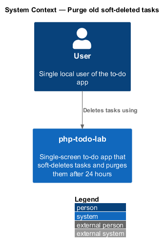
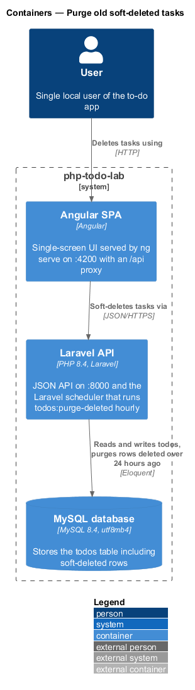
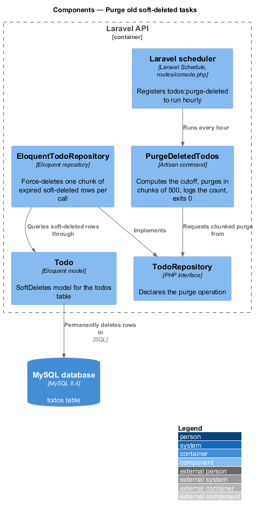
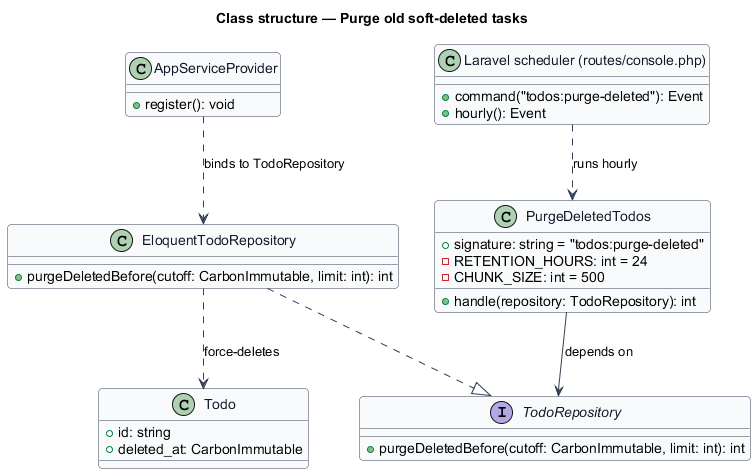
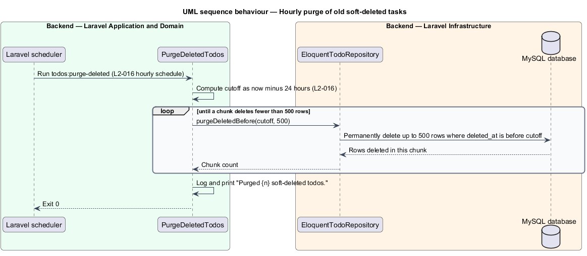
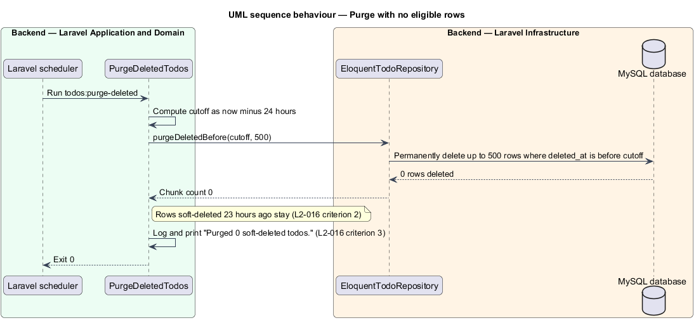

# Purge old soft-deleted tasks

## Overview

php-todo-lab is a single-screen to-do app for one local user. The Angular SPA shows tasks, and the Laravel API stores them in MySQL. The API calls a task a *todo*, and the UI calls it a *task*.

**soft deletion** — marking a todo as deleted by setting `deleted_at` while the row stays in the `todos` table

When the user deletes a task, the API soft-deletes the todo so that the user can undo the deletion. A soft-deleted todo is hidden from every list and does not count toward the task limit, but the row still occupies the table.

**purge** — permanent removal of a soft-deleted row from the `todos` table

This feature covers the purge. It is a backend-only behaviour with no screen, endpoint, or user action. The Laravel scheduler runs the Artisan command `todos:purge-deleted` hourly. The command removes each todo that was soft-deleted more than 24 hours earlier.

**Laravel scheduler** — Laravel component that runs registered commands on a fixed cadence

**chunk** — batch of at most 500 rows removed by one database statement

The command removes rows in chunks so that no single statement holds locks on a large number of rows. The command always exits `0`, including when no row is eligible.

This document assumes no prior knowledge of the code base. The diagrams show where each part lives.

## Description

The feature is a vertical slice that runs from the scheduler to the database. No Angular component takes part.

- **Laravel scheduler** — registers `todos:purge-deleted` in `routes/console.php` with an hourly frequency. The scheduler is a component inside the Laravel API container, not a separate container. During local development, `php artisan schedule:work` triggers the scheduler. The backend README documents that command.
- **`PurgeDeletedTodos`** — Artisan command with the signature `todos:purge-deleted`. Its `handle` method computes the cutoff as the current time minus 24 hours. It then calls the repository repeatedly, 500 rows at a time, until a call deletes fewer than 500 rows. It logs and prints the total count and returns exit code `0`. The constants `RETENTION_HOURS` (24) and `CHUNK_SIZE` (500) hold the two values from the requirement.
- **`TodoRepository`** — interface that declares the purge operation. The command depends on this interface, not on Eloquent. The operation is `purgeDeletedBefore(CarbonImmutable $cutoff, int $limit): int`.
- **`EloquentTodoRepository`** — implements the purge operation. Each call permanently deletes at most `limit` rows whose `deleted_at` is earlier than the cutoff and returns the number of rows deleted. One call issues one statement, so each chunk commits independently.
- **`Todo`** — Eloquent model with the `SoftDeletes` trait. The repository reaches soft-deleted rows through the model and force-deletes them.
- **`AppServiceProvider`** — binds `TodoRepository` to `EloquentTodoRepository`.
- **Log** — the command writes the message `Purged {n} soft-deleted todos.` at `info` level to the default application log channel. The command also prints the same message to the console. `{n}` is the total count, including `0`.

A todo soft-deleted exactly 24 hours ago is not older than 24 hours and remains. The query condition is a strict comparison of `deleted_at` with the cutoff. The index on `(deleted_at, created_at, id)` from the persistence design has `deleted_at` as its leading column and serves this condition.

## Requirements

The feature realizes the following level-2 (L2) requirement. Each L2 requirement refines a level-1 (L1) requirement, cited by identifier.

| L2 ID | Refines (L1) | Requirement |
|-------|--------------|-------------|
| `L2-016` | `L1-005` | A scheduled Artisan command `todos:purge-deleted` shall permanently remove each todo soft-deleted more than 24 hours earlier. The Laravel scheduler shall run the command hourly. The command shall leave a todo soft-deleted 23 hours earlier in place. When no row is eligible, the command shall exit `0` and log a count of 0. When more rows are eligible than fit in one chunk, the command shall delete them in chunks of 500 so that it does not hold long locks. |

## Diagrams

### System context

The User deletes tasks through php-todo-lab. The purge involves no user action and appears at this level only through the system that performs it.

### Containers

The SPA sends deletions to the Laravel API, which soft-deletes rows in MySQL. The Laravel API container also hosts the scheduler that purges those rows later.

### Components

Inside the Laravel API, the scheduler runs `PurgeDeletedTodos`, which calls `TodoRepository`. `EloquentTodoRepository` implements the interface and deletes rows through the `Todo` model.

### Class structure

`PurgeDeletedTodos` depends on the `TodoRepository` interface. `AppServiceProvider` binds the interface to `EloquentTodoRepository`, which force-deletes `Todo` rows.

### Behaviour — hourly purge

The scheduler starts the command each hour. The command loops over chunks of 500 rows until a chunk deletes fewer than 500, then logs the total and exits `0` (`L2-016`).

### Behaviour — no eligible rows

When no row is older than the cutoff, the first chunk deletes 0 rows. The command logs a count of 0 and exits `0` (`L2-016`, criterion 3).

